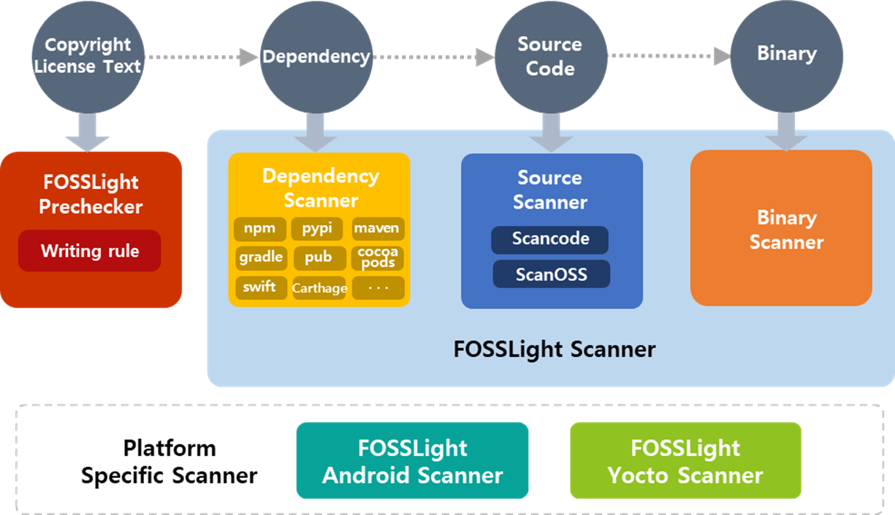

# FOSSLight

FOSSLight project consists of [FOSSLight Hub](#fosslight-hub), an integrated system that can manage all about open source, and [FOSSLight Scanner](#fosslight-scanner) that can analyze the open source.

## FOSSLight Hub
[FOSSLight Hub](https://github.com/fosslight/fosslight) is not only an integrated system that manages open source and licenses and processes sequentially open source compliance process, but also an all-in-one system that can manage security vulnerabilities, supply chain management, software BOM(Bill of Materials) and everything related to open source.    
This guide page describes the basic usage and tutorial of FOSSLight Hub and advanced features such as how to set up the development environment and maintenance tips. You can refer the [FOSSLight Hub contents](about) page.

## FOSSLight Scanner
[FOSSLight Scanner](scanner) is composed of four scanners: Prechecker, Dependency Scanner, Source Scanner, and Binary Scanner. FOSSLight Scanner can be used to generate integrated results of the four scanners.
  
{: width="80%" .center}
 
Please refer the guide on how to install and use each scanner on the FOSSLight Scanner sub-guide page.

#### FOSSLight Prechecker
[FOSSLight Prechecker](scanner/1_prechecker.md) is a tool that checks whether copyright and license rules are complied with in the source code and helps you easily add copyright and license information. The more you use it, the more you can prevent unnecessary open source scanning. For example, if you manage to clearly write the copyright, license, and download location information in the source code and open source code using FOSSLight Prechecker from the beginning of development, you can identify the open source without additional scanning.

#### FOSSLight Source Scanner
[FOSSLight Source Scanner](scanner/2_source.md) is a source code scanning tool. It uses ScanCode to detect copyright and license phrases by searching source code strings and also  uses scanoss to support code snippet scanning.

#### FOSSLight Dependency Scanner
[FOSSLight Dependency Scanner](scanner/3_dependency.md) is a tool that extracts open source information through analyzing dependencies on multiple package managers. It can generate report files with open source information. This tool performs to analyze the dependencies recursively, so all open source information can be extracted compared to the other dependency scanner tool that only analyzes primary dependencies.

#### FOSSLight Binary Scanner
[FOSSLight Binary Scanner](scanner/4_binary.md) is a tool that finds binary files and extracts the binary file list, and automatically outputs open source information if there is open source information of the detected binary in the database. Since this is not a method of analyzing the binary itself, please note that performance of binary analysis increases when there is a lot of database information.

#### FOSSLight Android Scanner
[FOSSLight Android Scanner](scanner/6_android.md) lists all binaries included in an Android model, checks whether Open Source is used in each binary, and verifies that the necessary OSS notices are properly included in the OSS notice file (e.g., NOTICE.html).

#### FOSSLight Yocto Scanner
[FOSSLight Yocto Scanner](scanner/5_yocto.md) is a Python script that outputs OSS information in FOSS Report format for packages included in the rootfs image when building based on the Yocto.
