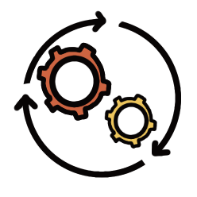
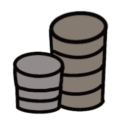

# FOSSLight
To develop and distribute software containing open source software, you need to follow the OSC(Open Source Compliance) process. FOSSLight system is an integrated system that can process four steps of the OSC process sequentially.

## Features

  

    

      

        Compliance Workflow
      

      

        
      

      

       It can process the open source compliance workflow.
      

    

  

  

    

      

        Compliance Hub
      

      

        
      

      

        You can manage everything about open source compliance such as license, oss, vulnerability and others.
      

    

  

  

    

      

        Scalability
      

      

        
      

      

        It can be used with additional features (including FOSSLight scanner or other plugins).
      

    

  

## Function

  

    

      

      
Project

      

        
OSC process management for each project

      

    

    

      

      
License / OSS

      

        
Open Source License / OSS information

      

    

    

      

      
Vulnerability

      

        
Open source vulnerability and monitoring by project

      

    
   
    

      

      
3rd Party

      

        
OSS management by software obtained from 3rd party

      

    
 
        

      

      
Self-Check

      

        
Pre-check function such as license for OSS to be reviewed, vulnerability, etc.

      

    
 
  

## License
FOSSLight is released under the Open Source License [AGPL-3.0][agpl].

[agpl]: https://github.com/fosslight/fosslight/blob/main/LICENSE
