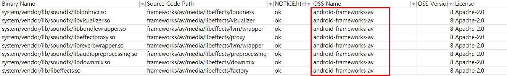

# FOSSLight Android Scanner

  <a href="https://github.com/fosslight/fosslight_android_scanner"></a> [](https://api.reuse.software/info/github.com/fosslight/fosslight_android_scanner)

[**FOSSLight Android Scanner**](https://github.com/fosslight/fosslight_android_scanner) identifies all binaries loaded on an Android-based model, checks whether open source is used for each binary, and verifies that the notices required by the respective licenses are properly included in the OSS notice (e.g., NOTICE.html).


## Prerequisites
{: .left-bar-title} 
- [**FOSSLight Android Scanner**](https://github.com/fosslight/fosslight_android_scanner) requires Python 3.10+.    
- To use the function that extracts OSS information (OSS Name, OSS Version, License) from Binary DB, refer to the [DB setup guide](etc/binary_db.md). 
- Build the Android model from a clean state to obtain the build output (/out directory) and build log (android.log).  
    ```
    (Android native source build example)
    $ source ./build/envsetup.sh
    $ make clean
    $ lunch aosp_hammerhead-user
    $ make -j4 2>&1 | tee android.log
    ```  

    {::options parse_block_html="true" /}
    <details>
    <summary markdown="span">For models based on Android 7.0 or earlier</summary>

    For models based on Android 7.0 or earlier, place the module-info.mk file under build/core/tasks/ before building. (This is to generate the module-info.json file during the build.)

    ```
    $ wget https://raw.githubusercontent.com/aosp-mirror/platform_build/android-cts-7.0_r33/core/tasks/module-info.mk
    $ mv ./module-info.mk ./build/core/tasks
    ```

    </details>  
<br><br>

## How to Install
{: .left-bar-title} 
1. Set up a [python 3.10 + virtualenv](../scanner/etc/guide_virtualenv.md) environment.
2. Install the Python package fosslight_android.
    ```
    $ pip3 install fosslight_android
    ```
<br><br>

## How to Run
{: .left-bar-title} 
The build output (/out directory) and build log file (android.log) must be present in the Android source path.  

```
(venv)$ fosslight_android  -s <android_source_path> -a <build_log_file>
```

- Options
```
    📖 Usage
    ────────────────────────────────────────────────────────────────────
    fosslight_android [options] <arguments>

    📝 Description
    ────────────────────────────────────────────────────────────────────
    FOSSLight Android Scanner lists all the binaries loaded on the
    Android-based model to check which open source is used for each
    binary, and to check whether the notices are included in the OSS
    notice (ex. NOTICE.html: OSS Notice for Android-based model).

    📚 Guide: https://fosslight.org/fosslight-guide-en/android

    ⚙️  General Options
    ────────────────────────────────────────────────────────────────────
    -h                     Show this help message
    -v                     Show version information

    🔍 Scanner-Specific Options
    ────────────────────────────────────────────────────────────────────
    -s <path>              Path to the Android source (default: current directory)
    -a <build_log_file>    Build log file name (the file must be located in the
                           Android source path)
    -m                     Analyze source code for paths where the license
                           could not be found
    -e <path1> <path2>     Paths to exclude from source analysis
                           ⚠️  IMPORTANT: Always wrap in quotes to avoid shell expansion
                           Example: fosslight_android -e "test/" "vendor/sample/"
    -p <path>              Check files that should not be included in the
                           packaging file (uses pkgConfig.json for filtering rules)
    -f                     Print result of find command for binaries that cannot
                           find a source code path
    -i                     Disable automatic OSS name conversion based on AOSP
    -r <result.txt>        result.txt file with a list of binaries to remove

    💡 Examples
    ────────────────────────────────────────────────────────────────────
    # Scan current directory with build log
    fosslight_android -s /path/to/android -a android_build.log

    # Scan with source analysis for unlicensed binaries
    fosslight_android -s /path/to/android -a build.log -m

    # Scan with exclusions
    fosslight_android -s /path/to/android -a build.log -e "test/" "vendor/sample/"

    # Check packaging files
    fosslight_android -p /path/to/packaging/root
``` 
<br><br>    

## Result
{: .left-bar-title} 

```
$ tree
.
├── fosslight_report_android_260406_1340.xlsx   
├── fosslight_log_android_260406_1340.txt   
├── notice_to_fosslight_hub_260406_1340.zip      
└── REMOVED_BIN_BY_DUPLICATION_260406_1340.txt
```

- fosslight_report_android_[datetime].xlsx : Android analysis result in FOSSLight Report format. (Checksum and TLSH values per binary are hidden by default in the report.)    
- fosslight_log_android_[datetime].txt : Execution log.
- notice_to_fosslight_hub_[datetime].zip : If there are two or more notice files, they are compressed into a .zip file.
   - notice_to_fosslight_hub_[datetime].{extension} : If there is only one notice file (e.g., NOTICE.html). 
- REMOVED_BIN_BY_DUPLICATION_[datetime].txt : Records the list of files deduplicated from the FOSSLight Report due to identical binary name and checksum in the output path. When the -r option is used, additionally removed entries are also included.


| Column           | Description                                                                                            |
|:-----------------|:----------------------------------------------------------------------------------------------|
| Binary Name      | List of binaries present in the out directory (binary, library, APK, font, etc.)                                |  
| Source Code Path | Path information of the source code that composes the binary.                                                |  
| Notice           | Indicates whether the binary information is shown in the NOTICE file. If the binary uses open source, this should be "ok."<br>&ensp;&ensp;- ok: The NOTICE file exists in the Source Path, and the binary is included in the final output NOTICE (e.g., NOTICE.html).<br>&ensp;&ensp;- ok(NA): The NOTICE file does not exist in the Source Path, but the binary is included in the final output NOTICE (e.g., NOTICE.html).<br>&ensp;&ensp;- nok: The NOTICE file does not exist in the Source Path, and the binary is not included in the final output NOTICE (e.g., NOTICE.html).<br>&ensp;&ensp;- nok(NA): Even though the NOTICE file exists in the Source Path, the binary is not included in the final output NOTICE (e.g., NOTICE.html).      |
| OSS Name         | Retrieves and displays the information of the matching binary from the Binary DB.     |
| OSS Version      | Retrieves and displays the information of the matching binary from the Binary DB.                               |
| License          | Displays the open source license extracted from the following sources:<br>&ensp;&ensp;- Information of the matching binary from Binary DB.<br>&ensp;&ensp;- Reads and displays the license from files such as "MODULE_LICENSE_xxxxxx" within the Source Code Path.<br>&ensp;&ensp;- Information found in {MODULE_NAME}.meta_lic from the output.    |
| Need Check       | If 'O', review is required.                                                                           |
| Comment          | Outputs items that require review:<br>&ensp;&ensp;- Fill in [Column Name]: Displays the column that needs to be filled in.<br>&ensp;&ensp;ex) Fill in OSS Name: The name of the OSS used must be entered in the 'OSS Name' column.<br>&ensp;&ensp;- Add NOTICE to path: Since there is no NOTICE file in the Source Code Path, a NOTICE file must be added to the Source Code Path of the corresponding binary.<br>&ensp;&ensp;However, if it is difficult to add a NOTICE file to the Source Code Path, or if adding it would not result in it being included in the final target NOTICE, the project should be reviewed via FOSSLight Hub. Afterward, download the NOTICE that needs to be added using the Supplement NOTICE.html feature, and supplement it using the "Add separately created NOTICE to OSS Notice" method under Android Model OSS Notice.|
| (TLSH)           | Prints the TLSH value of the binary.                                                            |
| (SHA1)           | Prints the checksum value of the binary.                                                            |

<br><br>

## Add-ons
{: .left-bar-title} 

### -p option: Check files to be excluded from packaging
{: .specific-title}
Checks file names, extensions, and directories that should not be included when collecting source code to be disclosed.  
#### Prerequisite
{: .under-bar-title}
1. Packaging Config File: Create a pkgConfig.json file in JSON format with the items to check.
Example: pkgConfig.json

```
    {
       "Prohibited_File_Names":[
          "key_file",
          "confidential_key"
       ],
       "Prohibited_File_Extensions":[
          "exe",
          "jar"
       ],
       "Prohibited_Path":[
          "confidential",
          ".git"
       ]
    }
```

2. Description per item: If there is more than one entry per item, separate them with a comma (',').
    - Prohibited_File_Names: File names to detect. 
    - Prohibited_File_Extensions: File extensions to detect. 
    - Prohibited_Path: File directories to detect.

3. Locate the directory or compressed file containing the source code to be disclosed.
    - If the directory or compressed file contains additional compressed files, they will be decompressed and searched.
    - Supported decompression extensions: tar, tar.gz, zip
        - If there are compressed files with extensions other than tar, tar.gz, or zip, they must be manually decompressed beforehand.
    
#### How to Run  
{: .under-bar-title}
1. Prepare the Packaging Config File as pkgConfig.json (JSON format).
2. Run with the -p option. (-p: Path or compressed file containing the source code to be disclosed.)
    ```
    (venv)$ fosslight_android -p [A path or compressed file containing the source code to be disclosed]
     
    ex
    (venv)$ fosslight_android -p /home/test/sourceCodeToBeDisclosed.tar.gz
    ```   

#### Result 
{: .under-bar-title}
1. The extracted list is displayed for each detected item.
2. Result example:       

    ```
        (venv)$ fosslight_android  -p /home/test/sourceCodeToBeDisclosed.tar.gz
        1. Prohibited file names : 1
        sourceCode/executable/LgeOscClient/confidential_key
        2. Prohibited file extension : 4
        sourceCode/executable/Report_Jenkins_ubuntu.exe
        sourceCode/executable/ReportTool_v3.03_181128U.jar
        sourceCode/executable/Protex_Create_Upload_Analyze_v3.03_181128U.jar
        sourceCode/executable/ReportTool_CLI_v3.03_181128U.jar
        3. Prohibited Path : 2
        sourceCode/.git
        sourceCode/executable/LgeOscClient/confidential
        4. Fail to read : 0
    ```
   
    - Prohibited file names: Printed when the file name of the source code to be disclosed contains any value from Prohibited_File_Names in pkgConfig.json.
    - Prohibited file extension: Printed when the file extension of the source code to be disclosed matches any value from Prohibited_File_Extensions in pkgConfig.json.
    - Prohibited Path: Printed when the file path of the source code to be disclosed contains any value from Prohibited_Path in pkgConfig.json.
    - Fail to read: Prints a list of files that failed to decompress.
<br><br>

### -f option: Find command results for binaries whose Source Code Path could not be found
{: .specific-title}
For binaries whose Source Code Path could not be found, prints the result of executing the find command for each folder within Android's Source Path. The out directory and hidden directories starting with '.' are excluded.    

#### How to Run
{: .under-bar-title}
1. Run with the -f option.
    ```commandline
    (venv)$ fosslight_android  -s [android source path] -a [build log file name] -f
     
    ex
    (venv)$ fosslight_android  -s /home/soim/android/source -a android.log -f
    ```

#### Result 
{: .under-bar-title}       
1. The find command results for each binary whose Source Code Path could not be found are generated as a 'FIND_RESULT_OF_BINARIES_[datetime].txt' file.
2. If there are no binaries with an unresolved Source Code Path, the file will not be created.
<br><br>


### -i option: Disable OSS Name auto-completion
{: .specific-title}
When OSS information cannot be found or the OSS Name corresponds to the [Android Native](https://android.googlesource.com/platform) repository, FOSSLight Android automatically outputs the OSS Name. Use this option to disable that feature.  

#### How to Run
{: .under-bar-title} 
1. Run with the -i option.
    ```commandline
    (venv)$ fosslight_android -s [android source path] -a [build log file name] -i
 
    ex
    (venv)$ fosslight_android -s /home/soim/android/source -a android.log -i
    ```

#### Result
{: .under-bar-title}         
1. Analysis result with the -i option enabled: 
   {: .styled-image}
2. Analysis result without the -i option: 
   {: .styled-image} 
<br><br>

### -r option: Deduplicate specific binaries in FOSSLight Report
{: .specific-title}
This option is used only when the Android native and vendor loaded on a single model are generated as separate outputs. When running FOSSLight Android for vendor, use the -r option to deduplicate binaries that are also included in Android native.
    - Deduplication conditions: Binary name is the same and checksum is the same, OR binary name is the same and TLSH value difference is 120 or less.
    - Deduplicated binaries are recorded in REMOVED_BIN_BY_DUPLICATION.txt.  

#### How to Run
{: .under-bar-title} 
1. Add the -r option when running FOSSLight Android analysis.
    ```commandline
    (venv)$ fosslight_android -s [vendor_source_path] -a [android_build_log_file] -r [android_native_result.txt]
 
    ex
    (venv)$ fosslight_android -s [vendor_source_path] -a android.log -r android_native_result.txt
    ```

#### Result 
{: .under-bar-title}        
1. Binaries duplicated with android_native_result.txt are removed from fosslight_report_android_[datetime].xlsx and recorded in REMOVED_BIN_BY_DUPLICATION_[datetime].txt.
<br><br>

### -m option: Extract license by analyzing source code
{: .specific-title}
Only for binaries where license information could not be found, FOSSLight Source Scanner is used to analyze the source code, and the result is output in the License column of the FOSSLight Report.        

#### How to Run
{: .under-bar-title} 
1. Add the -m option.
    ```commandline
    (venv)$ fosslight_android -s [vendor_source_path] -a [android_build_log_file] -m
     
    ex
    (venv)$ fosslight_android -s [vendor_source_path] -a android.log -m
    ```

#### Result 
{: .under-bar-title}         
1. The analysis results are populated in the License column of the FOSSLight Report.              
2. Additionally, analysis results per source code are generated in the source_analyzed_[datetime] folder.       
