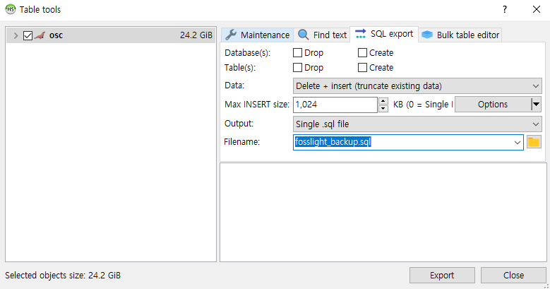

# Maintenance
```note
A useful guide to operating the FOSSLight Hub.
```

## DB backup and recovery
### 1. Backup 
#### Option 1. Full DB backup    
mysqldump -u[id] -p[password] [database_name] > [backup_file_name].sql
```
$ mysqldump -ufosslight -pfosslight fosslight > fosslight_backup.sql
```

#### Option 2. DB backup for updating to the latest version of FOSSLight (data only)
1. Download DBMS. (Recommended DBMS: HeidiSQL https://github.com/HeidiSQL/HeidiSQL)
2. After connecting to the DB, click 'Export database as SQL'.
3. Extract data with DELETE + INSERT.
    

### 2. Recovery    
mysql -u[id] -p[password] [database_name] < [backup_file_name].sql
```
$ mysql -ufosslight -pfosslight fosslight < fosslight_backup.sql
```

## Upgrading the DB version
How to upgrade DB version using [MyBatis Migrations](https://mybatis.org/migrations/migrate.html) (It is provided from the version that migrates from v1.5.0.)

1. Modify DB connection information in migration/migration/environments/development.properties file.
    ```
    $ cd migration/migration
    $ cat environments/development.properties
    ## Base time zone to ensure times are consistent across machines
    time_zone=GMT+0:00

    ## The character set that scripts are encoded with
    # script_char_set=UTF-8

    ## JDBC connection properties.
    driver=org.mariadb.jdbc.Driver
    url=jdbc:mysql://localhost:3306/fosslight
    username=fosslight
    password=fosslight
    ```
2. Export the fosslight/migration/mybatis-migrations-3.3.11 folder to MIGRATIONS_HOME.
    ```
    $ cd fosslight
    $ pwd
    $ /home/test/fosslight
    $ export MIGRATIONS_HOME=/home/test/fosslight/migration/mybatis-migrations-3.3.11
    $ export MIGRATIONS=$MIGRATIONS_HOME/bin
    $ export PATH=$MIGRATIONS:$PATH
    ```
3. Upgrade after checking the migrate status.
    ```
    $ cd /home/test/fosslight/migration/migration
    $ migrate status
    ------------------------------------------------------------------------
    -- MyBatis Migrations - status
    ------------------------------------------------------------------------
    ID             Applied At          Description
    ================================================================================
    20230322085317    ...pending...    create changelog
    20230322091138    ...pending...    update v1.4.9
    20230322092534    ...pending...    update v1.5.0

    ------------------------------------------------------------------------
    -- MyBatis Migrations SUCCESS
    -- Total time: 0s
    -- Finished at: Wed Mar 22 20:12:07 KST 2023
    -- Final Memory: 7M/500M

    $ migrate up
    ```
4. Check if the version up has been applied.
    ```
    $ migrate status
    ------------------------------------------------------------------------
    -- MyBatis Migrations - status
    ------------------------------------------------------------------------
    ID             Applied At          Description
    ================================================================================
    20230322085317 2023-03-22 20:12:35 create changelog
    20230322091138 2023-03-22 20:12:35 update v1.4.9
    20230322092534 2023-03-22 20:12:36 update v1.5.0

    ------------------------------------------------------------------------
    -- MyBatis Migrations SUCCESS
    -- Total time: 0s
    -- Finished at: Wed Mar 22 20:12:39 KST 2023
    -- Final Memory: 7M/500M
    ------------------------------------------------------------------------

    ```

✏️Note. How to apply only a specific version: Enter the `migrate version [ID]`.
- ex. If v1.4.9 is already applied and you want to apply only v1.5.0
    ```
    $ cd /home/test/fosslight/migration/migration
    $ migrate status
    ------------------------------------------------------------------------
    -- MyBatis Migrations - status
    ------------------------------------------------------------------------
    ID             Applied At          Description
    ================================================================================
    20230322085317    2023-03-22 20:12:35    create changelog
    20230322091138    2023-03-22 20:12:35    update v1.4.9
    20230322092534    ...pending...          update v1.5.0

    ------------------------------------------------------------------------
    -- MyBatis Migrations SUCCESS
    -- Total time: 0s
    -- Finished at: Wed Mar 22 20:12:07 KST 2023
    -- Final Memory: 7M/500M

    $ migrate version 20230322092534
    ```

## Download NVD Data from 2002
FOSSLight Hub downloads [NVD Data Feeds](https://nvd.nist.gov/vuln/data-feeds) provided from NVD(NATIONAL VULNERABILITY DATABASE) once a day and stores them in the database, and the stored NVD data is viewed in the [Vulnerability List](../started/2_try/7_vulnerability.md).    
At this time, when downloading NVD data from 2002 data, set as follows.      
(If you set it only once for the first time, there is no need to set it additionally because the data will be accumulated afterwards.)           
        
**Change the setting value in DB**    
```
UPDATE T2_CODE_DTL SET CD_DTL_NM = 'Y' WHERE CD_NO = '990' AND CD_DTL_NO = '100';
```
The default value of NVD Data Feed initialize flag Code is set to “N”, and if you change it to “Y” directly as above, all NVD data is cleaned during the next NVD schedule operation, and registration is processed sequentially from the 2002 data file.     
The value is changed to the default value ("N") regardless of whether there is an error when performing NVD Data initialization.     
