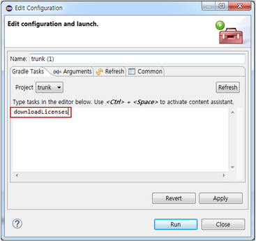
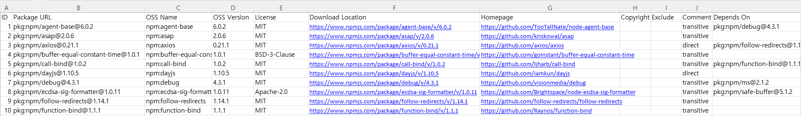

# FOSSLight Dependency Scanner

<a href="https://github.com/fosslight/fosslight_dependency_scanner/blob/main/LICENSE"></a> <a href="https://pypi.org/project/fosslight-dependency/"></a>  <a href="https://github.com/fosslight/fosslight_dependency_scanner"></a> <a href="https://api.reuse.software/info/github.com/fosslight/fosslight_dependency_scanner"></a>
    
[**FOSSLight Dependency Scanner**](https://github.com/fosslight/fosslight_dependency_scanner) is a tool that supports dependency analysis for multiple package managers. It automatically detects manifest files of package managers and analyzes dependencies using open source tools. Then, it generates a report file containing OSS information of dependencies.

{::options parse_block_html="true" /}
<details>
<summary markdown="span">Supported Package Managers</summary>
- [Gradle](https://gradle.org/) (Java/Android)
- [Maven](http://maven.apache.org/) (Java)
- [NPM](https://www.npmjs.com/) (Node.js)
- [PNPM](https://pnpm.io/) (Node.js)
- [Yarn](https://yarnpkg.com/) (Node.js)
- [PyPi](https://pip.pypa.io/) (Python)
- [Pub](https://pub.dev/) (Dart with flutter)
- [Cocoapods](https://cocoapods.org/) (Swift/Obj-C)
- [Swift](https://swift.org/package-manager/) (Swift)
- [Carthage](https://github.com/Carthage/Carthage) (Carthage)
- [Go](https://pkg.go.dev/) (Go)
- [Nuget](https://www.nuget.org/) (.NET)
- [Helm](https://helm.sh/) (Kubernetes)
- [Unity](https://unity.com/) (Unity)
- [Cargo](https://crates.io/) (Rust)
</details>
{::options parse_block_html="false" /}
<br><br>

## Installation
{: .left-bar-title}  
### Install from Bee (LGE Only)  
{: .specific-title}
You can install and use FOSSLight Scanner from [Bee](https://docs.bee0.lge.com/docs/dev-tools/fosslight/).  

### General Installation Method  
{: .specific-title}   
FOSSLight Scanner can be installed using pip3.      
It is recommended to install in a [python3 virtualenv](etc/guide_virtualenv.md) environment.  

```
$ pip3 install fosslight_dependency
```
<br><br>

## How to Run and Output  
{: .left-bar-title} 
- Please follow the prerequisites and execution methods according to the package manager used in your project.  
- Dependency analysis must be performed in the same build environment as the package manager used during actual development. (e.g., npm build tools must be installed on the server to perform npm dependency analysis)
- For Windows, you can download and use the exe executable from [release assets](https://github.com/fosslight/fosslight_dependency_scanner/releases).

{::options parse_block_html="true" /}
<details>
<summary markdown="span">**[NodeJS] Npm or Yarn**</summary>
<div style="border: 1px solid #ddd; border-radius: 5px; padding: 15px; margin: 10px 0;">  

<span class="specific-title">Prerequisites</span>

1. Install license-checker.  
   ```
   $ npm install -g license-checker
   ```
   > ▲ [Note] The '-g' option must be added to install license-checker as a global package.  
   > This is to prevent the license-checker module and its dependencies from being included in the results and distributed with the target software.  
   
   ✓ If you don't have sudo privileges  
   You can change the default path where global modules are installed.  
   ```
   $ npm set prefix ~/.npm
   $ PATH=~/.npm/bin:$PATH
   ```

<span class="specific-title">How to Run</span>

1. Run the following command in the directory where package.json exists.  
   ```
   $ fosslight_dependency
   ``` 
   - If the node_modules directory is already installed, run with the -m option.   
   - If you want to analyze only production dependencies, the node_modules directory must contain only production packages. (Install with $npm install \-\-production)      
   ```
   $ fosslight_dependency -m npm
   ```

</div>

</details>

<details>
<summary markdown="span">**[NodeJS] Pnpm**</summary>

<div style="border: 1px solid #ddd; border-radius: 5px; padding: 15px; margin: 10px 0;">  

<span class="specific-title">How to Run</span>  

No prerequisites required. You can run it directly.  
1. Run the following command in the directory where package.json exists.  
  ```
  $ fosslight_dependency
  ```


</div>

</details>

<details>
<summary markdown="span">**[Java/Kotlin] Gradle**</summary>

<div style="border: 1px solid #ddd; border-radius: 5px; padding: 15px; margin: 10px 0;" id="prerequisite-for-gradle">

<span class="specific-title">Prerequisites</span>   

1. Add the plugin to the build.gradle file located in the project root directory as follows.  
   - Java  
      <pre><code>
      plugins {
          id <span style="color:#FFA500;">'com.github.hierynomus.license'</span> version <span style="color:#FFA500;">'0.16.1'</span> <span style="color:#888888;">// For gradle version 6.x or lower, use version '0.15.0' instead.</span>
      }

      downloadLicenses {
          includeProjectDependencies = true
          dependencyConfiguration = <span style="color:#FFA500;">'runtimeClasspath'</span> <span style="color:#888888;">// For gradle version 4.6 or lower, use 'runtime' instead of 'runtimeClasspath'.</span>
      }
      </code></pre>  

    - Kotlin  
      <pre><code>
      plugins {
          id(<span style="color:#FFA500;">"com.github.hierynomus.license"</span>) version <span style="color:#FFA500;">"0.16.1"</span>
      }

      downloadLicenses {
          includeProjectDependencies = true
          dependencyConfiguration = <span style="color:#FFA500;">"runtimeClasspath"</span>
      }
      </code></pre>  

2. Run the 'downloadLicenses' task of the plugin.  
  - Linux : In the root directory where build.gradle exists, enter the command as follows.   
    ```
    $ ./gradlew downloadLicenses
    ```    
  - Windows : How to run in development environment (eclipse)
      1. Right-click the build.gradle file and click Run As > Gradle build....    
      
      2. When the "Edit Configuration" window opens, enter 'downloadLicenses' in the "Gradle Tasks" tab and click Run to execute.  
      

3. Verify that dependency-license.json is created in the build/reports/license directory. (The directory where it is created is the same for linux/windows environments)  
  - If you changed project.buildDir, the result file will be created at {project.buildDir}/reports/license/dependency-license.json, and you must specify the build directory with the -c option when running FOSSLight Dependency Scanner.  
  ```
  fosslight_dependency -c {project.buildDir}
  ```
  - Example of build/reports/license/dependency-license.json
    ```
    {
      "name": "commons-dbcp:commons-dbcp:1.4",
      "file": "commons-dbcp-1.4.jar",
      "licenses": [
        {
          "name": "The Apache Software License, Version 2.0",
          "url": "http://www.apache.org/licenses/LICENSE-2.0.txt"
        }
      ]
    },
    {
      "name": "com.amazonaws:aws-java-sdk-machinelearning:1.11.41",
      "file": "aws-java-sdk-machinelearning-1.11.41.jar",
      "licenses": [
        {
          "name": "Apache License, Version 2.0",
          "url": "https://aws.amazon.com/apache2.0"
        }
      ]
    },
   ``` 

<span class="specific-title">How to Run</span>   
1. Run the following command in the path where build.gradle (gradle's manifest file) exists.  
    ```
    $ fosslight_dependency
    ``` 

</div>
</details>


<details>
<summary markdown="span">**[Java] Android(Gradle)**</summary>
<div style="border: 1px solid #ddd; border-radius: 5px; padding: 15px; margin: 10px 0;">

<span class="specific-title">Prerequisites</span>   

1. For Android (gradle), if the gradlew executable file and build.gradle file exist in the input directory, the plugin addition and execution are automatically performed inside FOSSLight Dependency Scanner, so you can proceed directly to the execution method.   
2. If the Android application project does not have an 'app' (or module name) directory, please refer to the <a href="#prerequisite-for-gradle">Java/Kotlin Gradle guide</a> to perform Dependency analysis.


<span class="specific-title">How to Run</span>  

1. Run the following command in the path where build.gradle (gradle's manifest file) exists.  
    ```
    $ fosslight_dependency
    ``` 
    - If the application folder name is not 'app', you must specify the application folder name with the -n option.  
    ```
    $ fosslight_dependency -n {application_name}
    ```

</div>

</details>

<details>
<summary markdown="span">**[Python] Pypi**</summary>

<div style="border: 1px solid #ddd; border-radius: 5px; padding: 15px; margin: 10px 0;">

```tip
- It is recommended to set up a virtual environment to separate the project dependencies from globally installed Python dependencies in the system.
- If requirements.txt exists in the input path, FOSSLight Dependency Scanner can automatically install dependencies and run the analysis, so you can skip step 2.
```  

<span class="specific-title">Prerequisites</span>  

1. It is recommended to use a virtual environment to avoid mixing with global Python packages.  

<span class="specific-title">How to Run</span>  

1. Run the following command in the project root directory (e.g., the path where requirements.txt is located).  
At this time, to prevent debugging packages used during development or globally installed packages from being included in the analysis results,
requirements.txt should contain only the packages needed for distribution.  
    ```
    $ fosslight_dependency
    ``` 

</div>
</details>


<details>
<summary markdown="span">**[Java] Maven**</summary>

<div style="border: 1px solid #ddd; border-radius: 5px; padding: 15px; margin: 10px 0;">  

<span class="specific-title">Prerequisites</span>   

1. Maven version 3.5.4 or higher is required.
2. JAVA environment must be installed. ([Open Source JDK 11 or higher](https://openjdk.java.net) required)   

<span class="specific-title">How to Run</span>   

1. Run the following command in the path where pom.xml (Maven's manifest file) exists.  
    ```
    $ fosslight_dependency
    ``` 
  
> **Note**: When using a separately configured build output directory
>   - The licenses.xml file will be created under {buildDir}/generated-resources. In this case, you must specify the build output directory with the -o option when running fosslight_dependency.  
>   ```
>   $ fosslight_dependency -o customized_output_directory_name  
>   ```  

</div>

</details>

<details>
<summary markdown="span">**[Dart/flutter] Pub**</summary>

<div style="border: 1px solid #ddd; border-radius: 5px; padding: 15px; margin: 10px 0;">  

<span class="specific-title">Prerequisites</span>  
1. Flutter must be installed to build the project.

<span class="specific-title">How to Run</span>   
1. Run the following command in the path where pubspec.yaml exists.
  ```
  $ fosslight_dependency
  ```

</div>

</details>

<details>
<summary markdown="span">**[Swift/Obj-C] CocoaPods**</summary>

<div style="border: 1px solid #ddd; border-radius: 5px; padding: 15px; margin: 10px 0;">

<span class="specific-title">Prerequisites</span>

1. Install Pod packages.(MacOS) 
  ```
  # First, check if cocoapods is installed.
  $ pod --version
  # If not installed, run the following command.
  $ sudo gem install cocoapods  
  # In the top directory of the project where Podfile exists, run the following command to install Pod packages.
  $ pod install
  ```

<span class="specific-title">How to Run</span>

1. Run as follows in the directory where Podfile.lock exists.  
  ```
  $ fosslight_dependency
  ```
</div>

</details>

<details>
<summary markdown="span">**[Swift] Swift Package Manager**</summary>

<div style="border: 1px solid #ddd; border-radius: 5px; padding: 15px; margin: 10px 0;">  

<span class="specific-title">Prerequisites</span>  

1. Create a Personal Access Token to query License information from Github repository, then use it with the -t parameter when running FOSSLight Dependency Scanner. Please refer to the [Github docs guide](https://docs.github.com/en/github/authenticating-to-github/keeping-your-account-and-data-secure/creating-a-personal-access-token) for how to create a token.

<span class="specific-title">How to Run</span> 

1. Run the following command in the directory where Package.resolved file is located.  
  ```
  $ fosslight_dependency -t <Github_Personal_Access_Token>
  ```

> **Execution Tip**  
>   - You can run it using the following command in the path where {project_name}.xcodeproj file is located.  
>   ```
>   $ fosslight_dependency -t <Github_Personal_Access_Token>
>   ```  
>     - In this case, it automatically finds the 'Package.resolved' file in {project_name}.xcodeproj/project.xcworkspace/xcshareddata/swiftpm and runs the program.  

</div>

</details>

<details>
<summary markdown="span">**[Swift/Obj-C] Carthage**</summary>

<div style="border: 1px solid #ddd; border-radius: 5px; padding: 15px; margin: 10px 0;">  

<span class="specific-title">Prerequisites</span>  

1. If the Cartfile directory is already created for an already built project, you can run the script immediately without running the carthage update command (which creates the 'Cartfile.resolved' file). 
  ```
  $ carthage update  
  ```  
2. Create a Personal Access Token to query License information from Github repository, then use it with the -t parameter when running FOSSLight Dependency Scanner. Please refer to the [Github docs guide](https://docs.github.com/en/github/authenticating-to-github/keeping-your-account-and-data-secure/creating-a-personal-access-token) for how to create a token.  

<span class="specific-title">How to Run</span>  

1. Run the following command in the directory where Cartfile.resolved file is located.  
  ```
  $ fosslight_dependency -t <Github_Personal_Access_Token>
  ```  
</div>

</details>

<details>
<summary markdown="span">**[Go] Go**</summary>

<div style="border: 1px solid #ddd; border-radius: 5px; padding: 15px; margin: 10px 0;">  

<span class="specific-title">How to Run</span>  

Go is available for v1.14 or higher, and can be run immediately without any prerequisites.  

1. Run the following command in the directory where go.mod (go's manifest file) is located.  
  ```
  fosslight_dependency 
  ```

</div>

</details>

<details>
<summary markdown="span">**[.NET] Nuget**</summary>

<div style="border: 1px solid #ddd; border-radius: 5px; padding: 15px; margin: 10px 0;">  

<span class="specific-title">How to Run</span>  
Can be run immediately without prerequisites. 

1. Run the following command in the top directory of the project.
  ```
  $ fosslight_dependency  
  ```   

> **Execution Tip**  
> 1. CPM project (Central Package Management)
>  - You must run it from the path where `Directory.Packages.props` file exists.  
>  - If `obj/project.assets.json` file does not exist, it will find `.csproj` or `.sln` files in subdirectories and automatically run `dotnet restore` to generate `project.assets.json` file before proceeding with analysis.  
> 2. When copying packages folder to use as reference (project without packages.config) 
>  - If you copied the packages folder from another project as-is and are using it as a reference, and packages.config file does not exist, create packages.config through the following procedure and then run FOSSLight Dependency Scanner.  
>  - Procedure to create packages.config
>     1. Close the project.  
>     2. If packages.config exists in the project folder, delete it.  
>     3. Remove all library reference items installed through NuGet from the .csproj file.  
>     4. If necessary, perform NuGet cache deletion and Solution Clean.
>     5. Reopen the project and verify that all references are removed and packages.config file does not exist.  
>     6. Then install packages through NuGet again, and a new packages.config will be created and packages will be installed normally.  

</div>

</details>

<details>
<summary markdown="span">**[Kubernetes] Helm**</summary>

<div style="border: 1px solid #ddd; border-radius: 5px; padding: 15px; margin: 10px 0;">


<span class="specific-title">How to Run</span>  

Can be run immediately without prerequisites.  
1. Run the following command in the directory where Chart.yaml file is located.  
  ```
  $ fosslight_dependency
  ```
> FOSSLight Dependency Scanner only works in an environment where the 'helm dependency build' command runs normally to collect OSS information.  
> If an error occurs during Helm execution, please resolve the error and run the scanner again.   


</div>

</details>

<details>
<summary markdown="span">**[Unity] Unity Package Manager**</summary>

<div style="border: 1px solid #ddd; border-radius: 5px; padding: 15px; margin: 10px 0;">  

<span class="specific-title">How to Run</span>  

Can be run immediately without prerequisites.  
1. Run the following command in the directory where Library folder exists.   
  ```
  $ fosslight_dependency 
  ```

</div>

</details>

<details>
<summary markdown="span">**[Rust] Cargo**</summary>

<div style="border: 1px solid #ddd; border-radius: 5px; padding: 15px; margin: 10px 0;">    

<span class="specific-title">How to Run</span>  

Can be run immediately without prerequisites. 
1. Run the following command in the directory where Cargo.toml file exists.  
  ```
  $ fosslight_dependency
  ```

</div>

</details>
{::options parse_block_html="false" /}


### Output Result  
{: .specific-title}   
Verify that the 'fosslight_report_dep_[datetime].xlsx' result file is created in the execution path.  
The output path can be changed using the -o option.



### Options
{: .specific-title}
```
📖 Usage
    ────────────────────────────────────────────────────────────────────
    fosslight_dependency [options] <arguments>

    📝 Description
    ────────────────────────────────────────────────────────────────────
    FOSSLight Dependency Scanner analyzes dependencies for multiple package
    managers. It detects manifest files automatically and generates reports
    containing OSS information of dependencies.

    📚 Guide: https://fosslight.org/fosslight-guide-en/scanner/3_dependency.html

    📦 Supported Package Managers
    ────────────────────────────────────────────────────────────────────
    Gradle, Maven (Java)          │ NPM, PNPM, Yarn (Node.js)
    PIP (Python)                  │ Pub (Dart/Flutter)
    Cocoapods, Swift, Carthage    │ Go (Go)
    Nuget (.NET)                  │ Helm (Kubernetes)
    Unity (Unity)                 │ Cargo (Rust)

    ⚙️  General Options
    ────────────────────────────────────────────────────────────────────
    -p <path>              Path to analyze (default: current directory)
    -o <path>              Output file path or directory
    -f <format>            Output formats: excel, csv, opossum, yaml, spdx-yaml, spdx-json, spdx-xml, spdx-tag, cyclonedx-json, cyclonedx-xml
    -e <pattern>           Exclude paths from analysis (files and directories)
                           ⚠️  IMPORTANT: Always wrap in quotes to avoid shell expansion
                           Example: fosslight_dependency -e "test/" "node_modules/"
    -h                     Show this help message
    -v                     Show version information

    🔍 Scanner-Specific Options
    ────────────────────────────────────────────────────────────────────
    -m <manager>           Specify package manager (npm, maven, gradle, pypi, pub,
                           cocoapods, android, swift, carthage, go, nuget, helm,
                           unity, cargo, pnpm, yarn)
    -r                     Recursive mode: scan all subdirectories for manifest files
    --graph-path <path>    Save dependency graph image (pdf, jpg, png) (recommend pdf extension)
                           Example: fosslight_dependency --graph-path /your/path/filename.[pdf, jpg, png]
    --graph-format <format> Set graph image format (default: pdf)
    --graph-size <w> <h>   Set graph image size in pixels (requires --graph-path)
    --direct <True|False>  Print direct/transitive dependency type
                           Choose True or False (default: True)
    --notice               Print the open source license notice text

    🔧 Package Manager Specific Options
    ────────────────────────────────────────────────────────────────────
    Swift, Carthage:
      -t <token>           GitHub personal access token

    Pypi:
      -a <cmd>             Virtual environment activate command
                           (ex: 'conda activate myenv')
      -d <cmd>             Virtual environment deactivate command
                           (ex: 'conda deactivate')

    Gradle, Maven:
      -c <dir>             Customized build output directory
                           (default: 'build' for gradle, 'target' for maven)

    Android:
      -n <name>            Application directory name (default: app)

    💡 Examples
    ────────────────────────────────────────────────────────────────────
    # Scan current directory
    fosslight_dependency

    # Scan specific path with exclusions
    fosslight_dependency -p /path/to/project -e "test/" "vendor/"

    # Generate output in specific format
    fosslight_dependency -f excel -o results/

    # Specify package manager
    fosslight_dependency -m npm -p /path/to/nodejs/project

    # Recursive scan with all subdirectories
    fosslight_dependency -r

    # Generate dependency graph
    fosslight_dependency --graph-path dependency_tree.pdf

```
- Pattern matching guide for the -e option [Pattern Matching Guide](https://scancode-toolkit.readthedocs.io/en/stable/reference/scancode-cli/cli-pre-scan-options.html#glob-pattern-matching)
   - ⚠️ You must use double quotes ("") when entering values.
       - Example) fosslight_dependency -e "dev/" "tests/"
   - ⚠️ File names and extensions are case-sensitive, so enter them exactly as intended.

### Tips to run  
{: .specific-title}
- When running FOSSLight Dependency Scanner, it sequentially detects manifest files of package managers from the input path (using the '-p' option), and if a manifest file is detected, it stops detecting manifest files in subdirectories and performs dependency analysis.
(If you want to perform dependency analysis for all manifest files found in the entire input path, please run with the '-r' option.)
The manifest files for each package manager are as follows:

  ```
    - Npm : package.json
    - Pnpm : pnpm-lock.yaml
    - Yarn : package.json
    - Pypi : requirements.txt / setup.py / pyproject.toml
    - Maven : pom.xml
    - Gradle (Android) : build.gradle
    - Pub : pubspec.yaml
    - Cocoapods : Podfile
    - Swift : Package.resolved
    - Carthage : Cartfile.resolved
    - Go : go.mod
    - Nuget : packages.config / {project name}.csproj / Directory.Packages.props
    - Helm : Chart.yaml
    - Unity : Library/PackageManager/ProjectCache
    - Cargo : Cargo.toml
  ```
  
- Supplementary Output  
  - fosslight_log_dep_[datetime].txt: File containing execution logs 
  - third_party_notice.txt : Created only when running with Unity, which collects and outputs third party notices for each package

### Graph Network Creation Result
{: .specific-title}
``` bash
# $ fosslight_dependency -p /project/path --graph-path ~/temp/graph.png --graph-size 1000 1000
$ cd ~/temp
$ tree
.
└── graph.png
```


- Saves a dependency relationship graph image using the Depends On section from the fosslight_report_dep_[datetime].xlsx file result

### Result File Contents
{: .specific-title}
The FOSSLight Report result file records OSS information based on manifest files of all analyzed dependencies including transitive dependencies.
At this time, to write a unique OSS name, the OSS name is recorded in the format of (package manager):(OSS name) or (group id):(artifact id).

| Package manager                | OSS Name                 | Download Location                                                                                  | Homepage                                            |
| ------------------------------ | ------------------------ | -------------------------------------------------------------------------------------------------- | --------------------------------------------------- |
| Npm, Pnpm, Yarn                | npm:(oss name)           | npmjs.com/package/(oss name)/v/(oss version)                                                       | Priority1. repository in package.json <br> Priority2. npmjs.com/package/(oss name)  |
| Pypi                           | pypi:(oss name)          | pypi.org/project/(oss name)/(version)                                                              | homepage in (pip show) information                  |
| Maven<br>& Gradle<br>& Android | (group_id):(artifact_id) | mvnrepository.com/artifact/(group id)/(artifact id)/(version)                                      | mvnrepository.com/artifact/(group id)/(artifact id) |
| Pub                            | pub:(oss name)           | pub.dev/packages/(oss name)/versions/(version)                                                     | homepage in (pub information)                       |
| Cocoapods                      | cocoapods:(oss name)     | source in (pod spec information)                                                                   | cocoapods.org/pods/(oss name)                       |
| Swift                          | swift:(oss name)         | repositoryURL in Package.resolved                                                                  | repositoryURL in Package.resolved                   |
| Carthage                       | carthage:(oss name)      | github repository in Cartfile.resolved                                                             | github repository in Cartfile.resolved              |
| Go                             | go:(oss name)            | pkg.go.dev/(oss name)@(oss version)                                                                | repository in pkg.go.dev/(oss name)@(oss version)   |
| Nuget                          | nuget:(oss name)         | Priority1. repository in nuget.org/packages/(oss name)/(oss version) <br> Priority2. projectUrl in nuget.org/packages/(oss name)/(oss version) <br> Priority3. nuget.org/packages/(oss name)/(oss version)  | nuget.org/packages/(oss name) |
| Helm                           | helm:(oss name)          | first url of sources in (Chart.yaml)                                                               | home in (Chart.yaml)                                |
| Unity                          | (oss name)               | url in repository in ProjectCache                                                                  | url in repository in ProjectCache                   |
| Cargo                          | cargo:(oss name)         | repository of the package in the result file for 'cargo metadata'                                  | crates.io/crates/(oss name)                        |


```warning
- For Npm, Maven, and gradle result file contents, if packages are installed through local path or local repository (not distributed on npmjs.com / mvnrepository), the download location may differ from the actual one.
- Helm can only output dependencies listed in the dependencies section of the root project's Chart.yaml file, and currently does not support outputting dependency items of each dependency. Also, it obtains OSS information of each dependency from the Chart.yaml file information in the .tgz file downloaded in the charts/ directory after executing the 'helm dependency build' command.
Therefore, if information such as License or Homepage is missing in Chart.yaml, that information cannot be obtained, so users need to manually check and supplement it.
```  
<br><br>


## Package Support Level
{: .left-bar-title} 
<table>
<thead>
  <tr>
    <th>Language/<br>Project</th>
    <th>Package Manager</th>
    <th>Manifest file</th>
    <th>Direct dependencies</th>
    <th>Transitive dependencies</th>
    <th>Relationship of dependencies<br>(Dependencies of each dependency)</th>
    <th>Internet Access<br>Required</th>
  </tr>
</thead>
<tbody>
  <tr>
    <td rowspan="3">Javascript</td>
    <td>Npm</td>
    <td>package.json</td>
    <td>O</td>
    <td>O</td>
    <td>O</td>
    <td>X</td>
  </tr>
  <tr>
    <td>Pnpm</td>
    <td>pnpm-lock.yaml</td>
    <td>O</td>
    <td>O</td>
    <td>O</td>
    <td>X</td>
  </tr>
  <tr>
    <td>Yarn</td>
    <td>package.json</td>
    <td>O</td>
    <td>O</td>
    <td>O</td>
    <td>X</td>
  </tr>
  <tr>
    <td rowspan="2">Java</td>
    <td>Gradle</td>
    <td>build.gradle</td>
    <td>O</td>
    <td>O</td>
    <td>O</td>
    <td>X</td>
  </tr>
  <tr>
    <td>Maven</td>
    <td>pom.xml</td>
    <td>O</td>
    <td>O</td>
    <td>O</td>
    <td>X</td>
  </tr>
  <tr>
    <td>Java (Android)</td>
    <td>Gradle</td>
    <td>build.gradle</td>
    <td>O</td>
    <td>O</td>
    <td>O</td>
    <td>X</td>
  </tr>
  <tr>
    <td rowspan="2">ObjC, Swift (iOS)</td>
    <td>Cocoapods</td>
    <td>Podfile.lock</td>
    <td>O</td>
    <td>O</td>
    <td>O</td>
    <td>X</td>
  </tr>
  <tr>
    <td>Carthage</td>
    <td>Cartfile.resolved</td>
    <td>O</td>
    <td>O</td>
    <td>X</td>
    <td>O</td>
  </tr>
  <tr>
    <td>Swift (iOS)</td>
    <td>Swift</td>
    <td>Package.resolved</td>
    <td>O</td>
    <td>O</td>
    <td>O</td>
    <td>O</td>
  </tr>
  <tr>
    <td>Dart, Flutter</td>
    <td>Pub</td>
    <td>pubspec.yaml</td>
    <td>O</td>
    <td>O</td>
    <td>O</td>
    <td>X</td>
  </tr>
  <tr>
    <td>Go</td>
    <td>Go</td>
    <td>go.mod</td>
    <td>O</td>
    <td>O</td>
    <td>O</td>
    <td>O</td>
  </tr>
  <tr>
    <td>Python</td>
    <td>Pypi</td>
    <td>requirements.txt,<br>setup.py,<br>pyproject.toml</td>
    <td>O</td>
    <td>O</td>
    <td>O</td>
    <td>X</td>
  </tr>
  <tr>
    <td>.NET</td>
    <td>Nuget</td>
    <td>packages.config,<br>obj/project.assets.json</td>
    <td>O</td>
    <td>O</td>
    <td>O</td>
    <td>O</td>
  </tr>
  <tr>
    <td>Kubernetes</td>
    <td>Helm</td>
    <td>Chart.yaml</td>
    <td>O</td>
    <td>X</td>
    <td>X</td>
    <td>X</td>
  </tr>
  <tr>
    <td>Unity</td>
    <td>Unity</td>
    <td>Library/PackageManager/ProjectCache</td>
    <td>O</td>
    <td>O</td>
    <td>X</td>
    <td>X</td>
  </tr>
  <tr>
    <td>Rust</td>
    <td>Cargo</td>
    <td>Cargo.toml</td>
    <td>O</td>
    <td>O</td>
    <td>O</td>
    <td>X</td>
  </tr>
</tbody>
</table>

```tip
**Internet Access Required Criteria**: Internet access is required if license, homepage, or other OSS information cannot be resolved using only local manifest/lock/cache/plugin output files.
```
