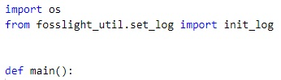
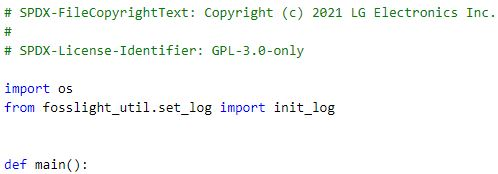

# FOSSLight Prechecker

   [](https://api.reuse.software/info/github.com/fosslight/fosslight_prechecker)
    

[**FOSSLight Prechecker**](https://github.com/fosslight/fosslight_prechecker) is a tool that can be used to comply with the [copyright/license writing rules][rule] in the source code using [reuse-tool][ret].

[ret]: https://github.com/fsfe/reuse-tool
[rule]: https://oss.lge.com/guide/process/osc_process/1-identification/copyright_license_rule.html

**Github Repository** : [https://github.com/fosslight/fosslight_prechecker]()  
**License** : [GPL-3.0-only](https://github.com/fosslight/fosslight_prechecker/blob/main/LICENSE)

## Contents
- [Prerequisite](#-prerequisite)
- [How to install](#-how-to-install)
- [How to run](#-how-to-run)
- [Result](#-result)
- [How it works](#-how-it-works)

## 📋 Prerequisite
[**FOSSLight Prechecker**](https://github.com/fosslight/fosslight_prechecker) needs a Python 3.7+.   

## 🎉 How to install
It can be installed using pip3.     
It is recommended to install it in the [python 3.7 + virtualenv](https://fosslight.org/fosslight-guide-en/scanner/etc/guide_virtualenv.html) environment.

```
$ pip3 install fosslight_prechecker
```

## 🚀 How to run
FOSSLight Prechecker has 3 modes as following:
1. `lint` --- Check whether the [source code's copyright and license writing rules][rule] are complied with.    
2. `convert` --- Convert [sbom-info.yaml](https://github.com/fosslight/fosslight_prechecker/blob/main/tests/convert/sbom-info.yaml) or [oss-pkg-info.yaml](https://github.com/fosslight/fosslight_prechecker/blob/main/tests/convert/oss-pkg-info.yaml) to [fosslight_report.xlsx](../learn/2_fosslight_report.md).
     - It converts yaml file to SRC Sheet of FOSSLight Report     
3. `add` --- Add copyright and license to source code which is missing copyright and license

``` 
fosslight_prechecker [Mode] [option1] <arg1> [option2] <arg2>...
```

### How to run by mode & Parameters
* Required parameter : **Mode**   
* Optional parameter : **Options**

```
Mode
    lint                  Check REUSE compliance
    convert               Convert sbom-info.yaml or oss_pkg_info.yaml -> fosslight_report.xlsx
    add                   Add missing license and copyright
 
Options:
    -h                    Print help message
    -p <path>             Path to check
    -f <format>           Output file format (yaml, xml, html)
    -o <file_name>        Output file name
    -n                    Don't exclude venv*, node_modules, and .*/ from the analysis
 
Options for only 'add' mode
    -l <license>          License name(SPDX format) to add
    -c <copyright>        Copyright to add(ex, 2015-2021 LG Electronics Inc.)
```

**(Only for Windows)** Run using executable file   
    1. Download fosslight_prechecker_windows.exe from [FOSSLight Prechecker](https://github.com/fosslight/fosslight_prechecker) - Release.   
    2. Move the executable file to the path where [sbom-info.yaml](https://github.com/fosslight/fosslight_prechecker/blob/main/tests/convert/sbom-info.yaml) or [oss-pkg-info.yaml](https://github.com/fosslight/fosslight_prechecker/blob/main/tests/convert/oss-pkg-info.yaml) file is located.   
    3. Double-click the executable file to run it.   


## 📁 Result
### 🔖 lint mode
**1) Analyze for specific folder**
```
(venv)$ fosslight_prechecker lint -p /home/tests -o result.yaml
```
- Result  
    <pre>
    Checking copyright/license writing rules:
        Compliant: Not OK
        Files without copyright:
        - add/test_no_copyright.py
        Files without license:
        - add/test_no_license.py
        Files without license and copyright: N/A
        Summary:
          Detected Licenses:
          - '-'
          - GPL-3.0-only
          - MIT
          Files without copyright / total: 1 / 14
          Files without license / total: 1 / 14
          Open Source Package File:
          - convert/oss-pkg-info.yaml
          - add/oss-pkg-info.yaml
        Tool Info:
          Analyze path: tests
          OS: Linux 4.15.0-144-generic
          Python version: 3
          fosslight_prechecker version: fosslight_prechecker v2.2.0 </pre>

**2) Analyze for specific files**
```
(venv)$ fosslight_prechecker lint -p "src/file1.py,src/file2.py"
```
- Result
    <pre>
      # src/file1.py
      * License: 
      * Copyright: 

      # src/file2.py
      * License: GPL-3.0-only
      * Copyright: Copyright (c) 2022 LG Electronics Inc.

      Checking copyright/license writing rules:
        Compliant: Not OK
        Files without copyright: N/A
        Files without license: N/A
        Files without license and copyright:
        - src/fosslight_prechecker/_precheck.py
        Summary:
          Detected Licenses: N/A
          Files without copyright / total: 1 / 2
          Files without license / total: 1 / 2
          Open Source Package File: []
        Tool Info:
          Analyze path: /home/jaekwonbang/tests
          OS: Linux 4.15.0-144-generic
          Python version: 3
          fosslight_prechecker version: fosslight_prechecker v2.2.0  </pre>

<details>
    <summary markdown="span" style="font-weight:bold">Demo Video (lint)</summary>
    
</details>


### 🔖 convert mode
**1) Convert all sbom-info.yaml or oss-pkg-info.yaml in the path recursively.**
```
$ fosslight_prechecker convert -p tests/
```

**2) Result file example**

{::options parse_block_html="true" /}
> <details>
> <summary markdown="span">oss-pkg-info.yaml</summary>
```yaml    
    glibc:
    - version: '2.3'
      source name or path:
      - tests/b.c
      - tests/a.c
      license:
      - GPL-3.0
      - LGPL-2.1
      download location: https://github.com/fsfe/glibc
    dbus:
    - version: '1.3'
      source name or path:
      - tests/src/*
      license:
      - GPL-2.0
      download location: https://github.com/fsfe/dbus
      copyright text: 'Copyright (c) 2020 Test Copyright (c) 2020 Sample'
    reuse-tool:
    - version: ''
      source name or path:
      - tests/
      license:
      - MIT
      download location: https://github.com/fsfe/reuse
      homepage: http://google.com
      copyright text: Copyright (c) 2020 Test
    build-tool:
    - version: ''
      source name or path:
      - tests/
      license:
      - Apache-2.0
      download location: http://gihub.com/bazel
      exclude: true
```
> </details>
> <details>
> <summary markdown="span">fosslight_report.xlsx</summary>

> </details>

<details>
<summary markdown="span" style="font-weight:bold">Demo Video (convert)</summary>

</details>
{::options parse_block_html="false" /}


### 🔖 add mode
**1) Add copyright and license to file(s) in the input path**
```
(venv)$ fosslight_prechecker add -p tests/add -c "2019-2021 LG Electronics Inc." -l "GPL-3.0-only"
```

**2) Add copyright and license to input file(s)**
```
(venv)$ fosslight_prechecker add -p "tests/add/test_both_have_1.py,tests/add/test_both_have_2.py,tests/add/test_no_copyright.py,tests/add/test_no_license.py" -c "2019-2021 LG Electronics Inc." -l "GPL-3.0-only"
```

**3) Result**
▪️ Changes in the file - Added copyright or license at the top of the file

|Before          |After          |
|:---------------|:--------------|
|||  

```bash    
    # File list that have both license and copyright : 3 / 7
    # __init__.py
    * License:
    * Copyright:

    # test_both_have_1.py
    * License: GPL-3.0-only
    * Copyright: SPDX-FileCopyrightText: Copyright 2019-2021 LG Electronics Inc.

    # test_both_have_2.py
    * License: MIT
    * Copyright: SPDX-FileCopyrightText: Copyright (c) 2011 LG Electronics Inc.

    # Missing license File(s)
    * test_no_license.py
    * Your input license : GPL-3.0-only
    Successfully changed header of tests/add_result/test_no_license.py

    # Missing Copyright File(s)
    * test_no_copyright.py
    * Your input Copyright : Copyright 2019-2021 LG Electronics Inc.
    Successfully changed header of tests/add_result/test_no_copyright.py
```

<details>
    <summary markdown="span" style="font-weight:bold">Demo Video (add)</summary>
    
</details>

## 🔍 How it works
### 🔖 lint mode
1. Find a OSS Package Information file.
    <details>
    <summary markdown="span">Check if at least one of the following files exists (case-free)</summary>
    <ul>
    <li>sbom-info.yaml (or .yml)</li>
    <li>oss-pkg-info.yaml (or .yml)</li>
    <li>requirement.txt</li>
    <li>requirements.txt</li>
    <li>package.json</li>
    <li>pom.xml</li>
    <li>build.gradle</li>
    <li>Podfile.lock</li>
    <li>Cartfile.resolved</li>
    <li>oss-package.info </li>
    <li>File started with "MODULE_LICENSE_ "</li>
    </ul>
    </details>

2. Run fsfe-reuse lint   
    2-1. When running on a project basis.      
    - If there is no ./reuse/dep5 file in the Root Path, it is created.   
    - If it already exists, copy it to bk file and append the default config value to the existing dep file.   
    - By creating dep5 files, exclude binary or .json, venv */*, node_modules/*,. */* from reuse.   
    - Run fsfe-reuse lint (If the OSS Package Information file exists, the list of missing license files is not printed.)   
    - Recover to existing dep5-related file if it originally existed, delete if it doesn't exist.
    
    2-2. When executing in file unit       
    - Print the copyright text and license text extraction by file.   
    - However, if the file does not exist or the file is binary or .json, copyright text and license text are not printed.   
3. Print the execution result and save it in xml format.   

### 🔖 convert mode
1. Check if there is an OSS Package Information or FOSSLight Report file.
    * file example : [sbom-info.yaml][sbom_info], [oss-pkg-info.yaml][oss_pkg_info]

[sbom_info]: https://github.com/fosslight/fosslight_prechecker/blob/main/tests/convert/sbom-info.yaml    
[oss_pkg_info]: https://github.com/fosslight/fosslight_prechecker/blob/main/tests/convert/oss-pkg-info.yaml    

2. Convert sbom-info.yaml or oss-pkg-info.yaml file to FOSSLight Report   
    2-1. When running on a project basis.      
    - Convert all files in the path (oss-pkg-info.yaml file -> fosslight_report.xlsx)    
    
    2-2. When running in file unit    
    - Convert the input yaml file    
    - However, if an output file name is specified with -o, a result file is created with that name.
    

### 🔖 add mode
1. Confirm to add copyright and license to missing file   
2. Add copyright and license to missing file(s) using -c and -l option   
    - Print file list that both has copyright and license(excluded from Adding)   
    - Add input copyright and license to missing file(s) using -c and -l option   
