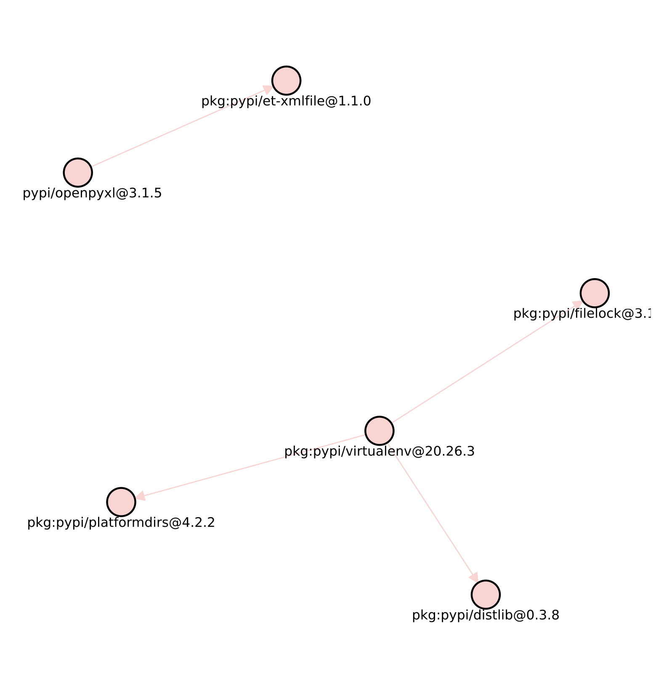

# FOSSLight Dependency Scanner

   [](https://api.reuse.software/info/github.com/fosslight/fosslight_dependency_scanner)
    
[**FOSSLight Dependency Scanner**](https://github.com/fosslight/fosslight_dependency_scanner) is the tool that supports the analysis of dependencies for multiple package managers. It detects the manifest file of package managers automatically and analyzes the dependencies with using open source tools. Then, it generates the report file that contains OSS information of dependencies.

{::options parse_block_html="true" /}
<details>
<summary markdown="span">Supported Package Managers</summary>
- [Gradle](https://gradle.org/) (Java/Android)
- [Maven](http://maven.apache.org/) (Java)
- [NPM](https://www.npmjs.com/) (Node.js)
- [PNPM](https://pnpm.io/) (Node.js)
- [Yarn](https://yarnpkg.com/) (Node.js)
- [PyPi](https://pip.pypa.io/) (Python)
- [Pub](https://pub.dev/) (Dart with flutter)
- [Cocoapods](https://cocoapods.org/) (Swift/Obj-C)
- [Swift](https://swift.org/package-manager/) (Swift)
- [Carthage](https://github.com/Carthage/Carthage) (Carthage)
- [Go](https://pkg.go.dev/) (Go)
- [Nuget](https://www.nuget.org/) (.NET)
- [Helm](https://helm.sh/) (Kubernetes)
- [Unity](https://unity.com/) (Unity)
- [Cargo](https://crates.io/) (Rust)
</details>
{::options parse_block_html="false" /}

**Github Repository** : [https://github.com/fosslight/fosslight_dependency_scanner](https://github.com/fosslight/fosslight_dependency_scanner)  
**License** : [Apache-2.0](https://github.com/fosslight/fosslight_dependency_scanner/blob/main/LICENSE)

## Contents
- [FOSSLight Dependency Scanner](#fosslight-dependency-scanner)
  - [Contents](#contents)
  - [📋 Prerequisite](#-prerequisite)
  - [🎉 How to install](#-how-to-install)
  - [🚀 How to run](#-how-to-run)
    - [Options](#options)
    - [Tips to run](#tips-to-run)
  - [📁 Result](#-result)
    - [Result Contents](#result-contents)
  - [🧐 How it works](#-how-it-works)
  - [👀 Package Support Level](#-package-support-level)


## 📋 Prerequisite
Because we utilize the different open source software to analyze the dependencies of each package manager, you need to set up the below Prerequisite steps according to package manager to analyze.

{::options parse_block_html="true" /}
<details>
<summary markdown="span">**Prerequisite for Npm or Yarn**</summary>
1. Install the NPM License Checker to analyze the dependencies.
```
$ npm install -g license-checker
```
 > To install license-checker globally, '-g' option is required. If you do not have 'sudo' access, then you can change default path to install global modules.
```
$ npm set prefix ~/.npm
$ PATH=~/.npm/bin:$PATH
```

2. Run the command to install the dependencies. (optional)
```
$ npm install
```
 > It can be skipped if the project meets any of the following cases.
 > - If the 'package.json' file exists in the input directory, it will be executed automatically by FOSSLight Dependency Scanner. So you can skip it.
 > - If the 'node_modules' directory already exists, you can run FOSSLight Dependency Scanner by setting the input directory to the path where node_modules is located.
</details>

<details>
<summary markdown="span">**Prerequisite for Pnpm**</summary>
```tip
FOSSLight Dependency Scanner checks the package list and OSS information such as license and repository through the 'pnpm install' and 'pnpm ls' command.
Therefore, you can execute the 'fosslight_dependency' command directly without prerequisite step.
```
</details>

<details>
<summary markdown="span">**Prerequisite for Gradle**</summary>
1. Add the License Gradle Plugin in build.gradle file.
```
plugins {
    id 'com.github.hierynomus.license' version '0.16.1' // If the gradle version is 6.x or lower, then add the '0.15.0' version instead of '0.16.1'.
}
downloadLicenses {
    includeProjectDependencies = true
    dependencyConfiguration = 'runtimeClasspath' // If the gradle version is 4.6 or lower, then add the 'runtime' instead of 'runtimeClasspath'.
}
```

2. Run the 'downloadLicenses' task.
```
$ gradlew downloadLicenses
```
</details>

<details>
<summary markdown="span">**Prerequisite for Android (gradle)**</summary>
```tip
If there is a 'gradlew' executable and a 'build.gradle' file in the input directory, FOSSLight Dependency Scanner will automatically add and execute the android-dependency-scanning plugin. So you can skip the prerequisites below.
```
##### java/groovy project
1. Add the android-dependency-scanning plugin in build.gradle file.
```
buildscript {
    repositories {
        mavenCentral()
    }
    dependencies {
        classpath 'org.fosslight:android-dependency-scanning:1.0.0'
    }
}
```

2. Add the below line in build.gradle file in the app(your application name, default : app) directory. It must be added to the subline of the plugins block (or apply plugin:'com.android.application') to prevent an error from occurring.
```
apply plugin: 'org.fosslight'
```

3. Run the 'generateLicenseTxt' task.
```
$ gradlew generateLicenseTxt
```

##### kotlin project
1. Add the android-dependency-scanning plugin in build.gradle.kts file.
```
buildscript {
    dependencies {
        classpath("org.fosslight:android-dependency-scanning:1.0.0")
    }
}
```

2. Add mavenCentral repository to the pluginManagement repositories section in your settings.gradle.kts file.
```
pluginManagement {
    repositories {
        mavenCentral()
    }
}
```

3. Add the below line in build.gradle.kts file in the app(your application name, default : app) directory.
```
plugins {
    id("org.fosslight")
}
```

4. Run the 'generateLicenseTxt' task.
```
$ gradlew generateLicenseTxt
```
</details>

<details>
<summary markdown="span">**Prerequisite for Pypi**</summary>
```tip
- You can run this tool with virtual environment for separating the project dependencies from system global dependencies.
- If the 'requirements.txt' file is located in the input path, FOSSLight Dependency Scanner can automatically install and analyze the dependencies. So you can skip from the prerequisite step2 for Pypi.
```

1. Install python3-venv.
```
$ sudo apt-get install python3-venv
```

2. Create and activate the virtual environment
```
// virtualenv example
$ virtualenv -p /usr/bin/python3.10 venv
$ source venv/bin/activate
// conda example
$ conda create --name {venv name}
$ conda activate {venv name}
```

2. Install the packages that you use in the virtual environment.
3. You can add activate, deactivate command with '-a', '-d' option to run FOSSLight Dependency Scanner.

</details>

<details>
<summary markdown="span">**Prerequisite for Maven**</summary>
```tip
If the 'pom.xml' is located in the input directory, FOSSLight Dependency Scanner will automatically add and execute the license-maven-plugin. So you can skip the prerequisites below.
```
<ol>
<li>Add the license-maven-plugin into pom.xml file.</li>
<pre>
&lt;project&gt;
  ...
  &lt;build&gt;
  ...
    &lt;plugins&gt;
    ...
      &lt;plugin&gt;
        &lt;groupId&gt;org.codehaus.mojo&lt;/groupId&gt;
        &lt;artifactId&gt;license-maven-plugin&lt;/artifactId&gt;
        &lt;version&gt;2.0.0&lt;/version&gt;
        &lt;executions&gt;
          &lt;execution&gt;
            &lt;id&gt;aggregate-download-licenses&lt;/id&gt;
            &lt;goals&gt;
              &lt;goal&gt;aggregate-download-licenses&lt;/goal&gt;
            &lt;/goals&gt;
          &lt;/execution&gt;
        &lt;/executions&gt;
      &lt;/plugin&gt;
    &lt;/plugins&gt;
    ...
  &lt;/build&gt;
  ...
&lt;/project&gt;
</pre>

<li>Run the license-maven-plugin task.</li>
<pre>
$ mvnw license:aggregate-download-licenses
</pre>
</ol>
</details>

<details>
<summary markdown="span">**Prerequisite for Pub**</summary>
> If the 'flutter pub' command is not available in the environment where FOSSLight Dependency Scanner is running, please perform the following steps in advance in the environment where 'flutter pub' is available.
1. Run flutter_oss_licenses with below command. (optional)
```
$ flutter pub add dev:flutter_oss_licenses:'^2.0.1'
$ flutter pub get
$ flutter pub deps --json > tmp_deps.json
$ flutter pub deps --no-dev -s compact > tmp_no_dev_deps.txt
$ flutter pub run flutter_oss_licenses:generate.dart -o tmp_flutter_oss_licenses.json --json
```
2. Run FOSSLight Dependency Scanner in the path where the file generated in the result of step 1 exists.
</details>

<details>
<summary markdown="span">**Prerequisite for Cocoapods**</summary>
1. Install the pod package through Podfile.
```
$ pod install
```
</details>

<details>
<summary markdown="span">**Prerequisite for Swift**</summary>
1. Create a github personal access token and use it with '-t' option when running the FOSSLight dependency scanner. It needs the Github API to get the license information of the github repository.  
Please refer the [github docs guide to create a token](https://docs.github.com/en/github/authenticating-to-github/keeping-your-account-and-data-secure/creating-a-personal-access-token).
</details>

<details>
<summary markdown="span">**Prerequisite for Carthage**</summary>
1. Create 'Cartfile.resolved' by running the package installation command.
```
$ carthage update
```
2. Create a github personal access token and use it with '-t' option when running the FOSSLight dependency scanner. It needs the Github API to get the license information of the github repository.  
Please refer the [github docs guide to create a token](https://docs.github.com/en/github/authenticating-to-github/keeping-your-account-and-data-secure/creating-a-personal-access-token).
</details>

<details>
<summary markdown="span">**Prerequisite for Go**</summary>
```tip
FOSSLight Dependency Scanner only supports for go modules. It automatically executes the 'go list -m all' command to obtain a list of dependencies, and then collects the open source software information such as license and repository. Therefore, you can execute the 'fosslight_dependency' command directly without prerequisite step.
```
</details>

<details>
<summary markdown="span">**Prerequisite for Nuget**</summary>
```tip
FOSSLight Dependency Scanner checks the package list through the packages.config file or obj/project.assets.json file in case of PackageReference, and then prints the OSS information of dependencies such as license and repository through nuget api.
 Therefore, you can execute the 'fosslight_dependency' command directly without prerequisite step.
```
</details>

<details>
<summary markdown="span">**Prerequisite for Helm**</summary>
```tip
FOSSLight Dependency Scanner checks the package list and OSS information such as license and repository through the Chart.yaml and 'helm dependency build' command.
Therefore, you can execute the 'fosslight_dependency' command directly without prerequisite step.
```
</details>

<details>
<summary markdown="span">**Prerequisite for Unity**</summary>
```tip
FOSSLight Dependency Scanner checks the package list and OSS information such as license and repository through the Library/PackageManager/ProjectCache file and each package directory within the Library/PackageCache directory. Therefore, you can execute the 'fosslight_dependency' command in an environment where the files exist.
```
</details>

<details>
<summary markdown="span">**Prerequisite for Cargo**</summary>
```tip
FOSSLight Dependency Scanner checks the package list and OSS information such as license and repository through the Cargo.toml and 'cargo metadata' command.
Therefore, you can execute the 'fosslight_dependency' command directly without prerequisite step.
```
</details>
{::options parse_block_html="false" /}


## 🎉 How to install
FOSSLight Dependency Scanner can be installed using pip3.    
It is recommended to install in the [python 3.10 + virtualenv](etc/guide_virtualenv.md) environment.

```
$ pip install fosslight-dependency
```

## 🚀 How to run

You can run the FOSSLight Dependency Scanner with options based on your package manager.
```
$ fosslight_dependency [option] <arg>
```
### Options
```
        Optional
            -h                              Print help message.
            -v                              Print the version of the script.
            -m <package_manager>            Enter the package manager.
                                                (npm, maven, gradle, pypi, pub, cocoapods, android, swift, carthage, go, nuget, helm, unity, cargo, pnpm, yarn)
            -p <input_path>                 Enter the path where the script will be run.
            -e <exclude_path>               Enter the path where the analysis will not be performed. (Pattern matching is available)
            -o <output_path>                Output path
                                                (If you want to generate the specific file name, add the output path with file name.)            
            -f <format> [<format> ...]      Output formats (excel, csv, opossum, yaml, spdx-tag, spdx-yaml, spdx-json, spdx-xml)
                                            Multiple formats can be specified separated by space.
            --graph-path <save_path>        Enter the path where the graph image will be saved
                                                (ex. /your/directory/path/filename.{pdf, jpg, png}) (recommend pdf extension)
            --graph-size <width> <height>   Enter the size of the graph image (The size unit is pixels)
                                                --graph-path option is required
            --direct                        Print the direct/transitive dependency type in comment.
                                                Choice 'True' or 'False'. (default:True)
            -r                              Recursive mode. Scan all subdirectories for manifest files.
            --notice                        Print the open source license notice text.

        Required only for swift, carthage
            -t <token>                      Enter the github personal access token.

        Optional only for pypi
            -a <activate_cmd>               Virtual environment activate command(ex, 'conda activate (venv name)')
            -d <deactivate_cmd>             Virtual environment deactivate command(ex, 'conda deactivate')

        Optional only for gradle, maven
            -c <dir_name>                   Enter the customized build output directory name
                                                -Default name : 'build' for gradle, 'target' for maven

        Optional only for android
            -n <app_name>                   Enter the application directory name where the plugin output file is located(default: app)

```
- Pattern Matching [Pattern matching guide](https://scancode-toolkit.readthedocs.io/en/stable/cli-reference/scan-options-pre.html?highlight=ignore#glob-pattern-matching) Guide for the -e Option
   - ⚠️ Make sure to use double quotes ("") when entering values.
      - Example) fosslight_dependency -e "dev/" "tests/"
   - ⚠️ File names and extensions are **case-sensitive**, so please enter them exactly as intended.

### Tips to run
When running the FOSSLight Dependency Scanner, it sequentially detects package manager manifest files starting from the input path (using the -p option). If a manifest file is detected, the scanner stops searching for additional manifest files in subdirectories and proceeds with dependency analysis.
(If you want the scanner to analyze dependencies for all manifest files found throughout the entire input path, please run it with the -r option.)
The manifest file of each package manager is as follows:
```
  - Npm : package.json
  - Pnpm : pnpm-lock.yaml
  - Yarn : package.json
  - Pypi : requirements.txt / setup.py / pyproject.toml
  - Maven : pom.xml
  - Gradle (Android) : build.gradle
  - Pub : pubspec.yaml
  - Cocoapods : Podfile
  - Swift : Package.resolved
  - Carthage : Cartfile.resolved
  - Go : go.mod
  - Nuget : packages.config / {project name}.csproj
  - Helm : Chart.yaml
  - Unity : Library/PackageManager/ProjectCache
  - Cargo : Cargo.toml
```

- Android (gradle)
  - If the module name is not the default 'app', you must run it by specifying the module name with the '-n' option. (fosslight_dependency -n {module_name})
- Swift package manager
  - Exceptionally, you can run "fosslight_dependency -m swift -t {token} command in the path where {Projectname}.xcodeproj file is located.
  - Then it can find the 'Package.resolved' file in {Projectname}.xcodeproj/project.xcworkspace/xcshareddata/swiftpm and run automatically.
- Unity
  - You can run "fosslight_dependency -m unity" command in the path where 'Library' folder is located.

## 📁 Result
```
$ tree
.
├── fosslight_report_dep_210503_0039.xlsx
├── fosslight_log_dep_210503_0039.txt
└── fosslight_opossum_dep_210503_0039.json
```
- fosslight_report_dep_[datetime].xlsx : FOSSLight Dependency Scanner result in spreadsheet format.
- fosslight_log_dep_[datetime].txt: The execution log.
- fosslight_opossum_dep_[datetime].json : FOSSLight Dependency Scanner result for [OpossumUI](https://github.com/opossum-tool/OpossumUI) (-f opossum)
- third_party_notice.txt : Created only when running with Unity, and collects and prints the third party notice for each package.

### Graph Network Creation Result
``` bash
# $ fosslight_dependency -p /project/path --graph-path ~/temp/graph.png --graph-size 1000 1000
$ cd ~/temp
$ tree
.
└── graph.png
```


- Saved an image of the dependency graph using the Depends On section from the fosslight_report_dep_[datetime].xlsx file

### Result Contents
It prints the OSS information based on manifest file(package.json, pom.xml) of dependencies (including transitive dependencies).
For a unique OSS name, OSS name is printed such as (package_manager):(oss name) or (group id):(artifact id).

| Package manager                | OSS Name                 | Download Location                                                                                  | Homepage                                            |
| ------------------------------ | ------------------------ | -------------------------------------------------------------------------------------------------- | --------------------------------------------------- |
| Npm, Pnpm, Yarn                      | npm:(oss name)           | npmjs.com/package/(oss name)/v/(oss version)                                                       | Priority1. repository in package.json <br> Priority2. npmjs.com/package/(oss name)                        |
| Pypi                           | pypi:(oss name)          | pypi.org/project/(oss name)/(version)                                                              | homepage in (pip show) information                  |
| Maven<br>& Gradle<br>& Android | (group_id):(artifact_id) | mvnrepository.com/artifact/(group id)/(artifact id)/(version)                                      | mvnrepository.com/artifact/(group id)/(artifact id) |
| Pub                            | pub:(oss name)           | pub.dev/packages/(oss name)/versions/(version)                                                     | homepage in (pub information)                       |
| Cocoapods                      | cocoapods:(oss name)     | source in (pod spec information)                                                                   | cocoapods.org/pods/(oss name)                       |
| Swift                          | swift:(oss name)         | repositoryURL in Package.resolved                                                                  | repositoryURL in Package.resolved                   |
| Carthage                       | carthage:(oss name)      | github repository in Cartfile.resolved                                                             | github repository in Cartfile.resolved              |
| Go                             | go:(oss name)            | pkg.go.dev/(oss name)@(oss version)                                                                | repository in pkg.go.dev/(oss name)@(oss version)   |
| Nuget                          | nuget:(oss name)         | Priority1. repository in nuget.org/packages/(oss name)/(oss version) <br> Priority2. projectUrl in nuget.org/packages/(oss name)/(oss version) <br> Priority3. nuget.org/packages/(oss name)/(oss version)  | nuget.org/packages/(oss name) |
| Helm                           | helm:(oss name)          | first url of sources in (Chart.yaml)                                                               | home in (Chart.yaml)                                |
| Unity                          | (oss name)               | url in repository in ProjectCache                                                                  | url in repository in ProjectCache                   |
| Cargo                          | cargo:(oss name)         | repository of the package in the result file for 'cargo metadata'                                  | crates.io/crates/(oss name)                        |


```warning
- The printed download location of npm, maven, gradle may be different from the url of actual package if installed through the local path or local repository (not distributed in npmjs.com or mvnrepository).
- For Helm, the dependencies of each dependency are not currently supported. And it obtains the OSS information of each dependency from the Chart.yaml file information in the .tgz file downloaded in the charts/ directory after executing the 'helm dependency build' command. Therefore, if information such as License or Homepage is missing in Chart.yaml, the information cannot be obtained, so the user needs to manually check and supplement it.
```

## 🧐 How it works
FOSSLight Dependency Scanner utilizes the open source software for analyzing each package manager dependencies. We choose the open source software for each package manager that shows not only the direct dependencies but also the transitive dependencies including the information of dependencies such as oss name, oss version and license name.

Each package manager uses the results of the following software:

- NPM : [NPM License Checker](https://github.com/davglass/license-checker)
- Gradle : [License Gradle Plugin](https://github.com/hierynomus/license-gradle-plugin)
- Maven : [license-maven-plugin](https://github.com/mojohaus/license-maven-plugin)
- Pub : [flutter_oss_licenses](https://github.com/espresso3389/flutter_oss_licenses)
- Android(gradle) : [android-dependency-scanning](https://github.com/fosslight/android-dependency-scanning)
- Pypi : [pipdeptree](https://pypi.org/project/pipdeptree/)

Because we utilizes the different open source software to analyze the dependencies of each package manager, you need to set up the **Prerequisite** steps according to package manager to analyze.

## 👀 Package Support Level
<table>
<thead>
  <tr>
    <th>Language/<br>Project</th>
    <th>Package Manager</th>
    <th>Manifest file</th>
    <th>Direct dependencies</th>
    <th>Transitive dependencies</th>
    <th>Relationship of dependencies<br>(Dependencies of each dependency)</th>
    <th>Internet Access<br>Required</th>
  </tr>
</thead>
<tbody>
  <tr>
    <td rowspan="3">Javascript</td>
    <td>Npm</td>
    <td>package.json</td>
    <td>O</td>
    <td>O</td>
    <td>O</td>
    <td>X</td>
  </tr>
  <tr>
    <td>Pnpm</td>
    <td>pnpm-lock.yaml</td>
    <td>O</td>
    <td>O</td>
    <td>O</td>
    <td>X</td>
  </tr>
  <tr>
    <td>Yarn</td>
    <td>package.json</td>
    <td>O</td>
    <td>O</td>
    <td>O</td>
    <td>X</td>
  </tr>
  <tr>
    <td rowspan="2">Java</td>
    <td>Gradle</td>
    <td>build.gradle</td>
    <td>O</td>
    <td>O</td>
    <td>O</td>
    <td>X</td>
  </tr>
  <tr>
    <td>Maven</td>
    <td>pom.xml</td>
    <td>O</td>
    <td>O</td>
    <td>O</td>
    <td>X</td>
  </tr>
  <tr>
    <td>Java (Android)</td>
    <td>Gradle</td>
    <td>build.gradle</td>
    <td>O</td>
    <td>O</td>
    <td>O</td>
    <td>X</td>
  </tr>
  <tr>
    <td rowspan="2">ObjC, Swift (iOS)</td>
    <td>Cocoapods</td>
    <td>Podfile.lock</td>
    <td>O</td>
    <td>O</td>
    <td>O</td>
    <td>X</td>
  </tr>
  <tr>
    <td>Carthage</td>
    <td>Cartfile.resolved</td>
    <td>O</td>
    <td>O</td>
    <td>X</td>
    <td>O</td>
  </tr>
  <tr>
    <td>Swift (iOS)</td>
    <td>Swift</td>
    <td>Package.resolved</td>
    <td>O</td>
    <td>O</td>
    <td>O</td>
    <td>O</td>
  </tr>
  <tr>
    <td>Dart, Flutter</td>
    <td>Pub</td>
    <td>pubspec.yaml</td>
    <td>O</td>
    <td>O</td>
    <td>O</td>
    <td>X</td>
  </tr>
  <tr>
    <td>Go</td>
    <td>Go</td>
    <td>go.mod</td>
    <td>O</td>
    <td>O</td>
    <td>O</td>
    <td>O</td>
  </tr>
  <tr>
    <td>Python</td>
    <td>Pypi</td>
    <td>requirements.txt,<br>setup.py,<br>pyproject.toml</td>
    <td>O</td>
    <td>O</td>
    <td>O</td>
    <td>X</td>
  </tr>
  <tr>
    <td>.NET</td>
    <td>Nuget</td>
    <td>packages.config,<br>obj/project.assets.json</td>
    <td>O</td>
    <td>O</td>
    <td>O</td>
    <td>O</td>
  </tr>
  <tr>
    <td>Kubernetes</td>
    <td>Helm</td>
    <td>Chart.yaml</td>
    <td>O</td>
    <td>X</td>
    <td>X</td>
    <td>X</td>
  </tr>
  <tr>
    <td>Unity</td>
    <td>Unity</td>
    <td>Library/PackageManager/ProjectCache</td>
    <td>O</td>
    <td>O</td>
    <td>X</td>
    <td>X</td>
  </tr>
  <tr>
    <td>Rust</td>
    <td>Cargo</td>
    <td>Cargo.toml</td>
    <td>O</td>
    <td>O</td>
    <td>O</td>
    <td>X</td>
  </tr>  
</tbody>
</table>

```tip
**Internet Access Requirements:** Internet access is required if license information, homepage, or other OSS details cannot be resolved using only local manifest/lock/cache/plugin output files.
```
