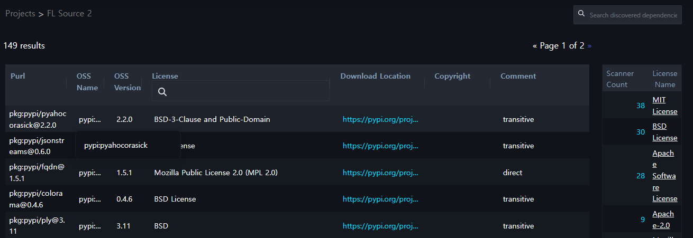
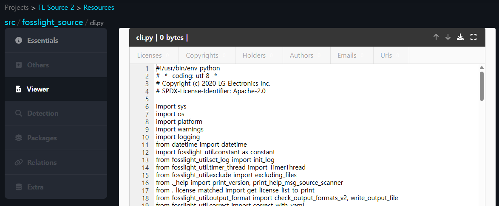

# (Enterprise Only) FOSSLight Scanner Service 

## Overview
{: .left-bar-title}
Source, binary and dependency analysis is performed using [FOSSLight Scanner](https://fosslight.org/fosslight-guide-en/scanner/)as a web service. Analysis results are generated in the form of a [FOSSLight Report](https://fosslight.org/hub-guide-en/learn/2_fosslight_report.html).    
- URL : [http://fs.lge.com](http://fs.lge.com)
- Supported items
    - [FOSSLight Source Scanner](https://fosslight.org/fosslight-guide-en/scanner/2_source.html)
    - [FOSSLight Binary Scanner](https://fosslight.org/fosslight-guide-en/scanner/4_binary.html)
    - [FOSSLight Dependency Scanner](https://fosslight.org/fosslight-guide-en/scanner/3_dependency.html)
        - Supported : npm, pypi, maven, pub, go, nuget, cargo, swift, carthage
          (Other package managers are currently undergoing verification)  
- Not supported items
    - [FOSSLight Android Scanner](https://fosslight.org/fosslight-guide-en/scanner/6_android.html)
    - [FOSSLight Yocto Scanner](https://fosslight.org/fosslight-guide-en/scanner/5_yocto.html)

## How to use
{: .left-bar-title}

### Login
{: .specific-title}
- You can access it by entering your AD account ID and password at [http://fs.lge.com](http://fs.lge.com) 
{: .styled-image}  

### Create a Project 
{: .specific-title} 
1. Click the "New Project" button in the upper right corner to create a project.  
{: .styled-image}  

2. Enter the contents in "Create a Project".  
{: .styled-image}  
    - **Name** :  Enter the Project name.
    - **Inputs** : Select sources to analyze.
        - **Upload files** : Compress and upload files to be analyzed. (Please upload only 1 file.)  
        - **Download URLs** :  Enter the source link to be analyzed (link that can be obtained through "wget" or "git clone")    
            - **Public** 
                - The example of input value
                    - wget : github.com/LGE-OSS/example/archive/refs/tags/v1.0.0.zip
                    - git clone : github.com/LGE-OSS/example
            - **Private Git** 
                - **http://** or **https://** : You must enter the user name and PAT value.
                - **ssh://** : Copy the provided ssh key value and register it in your private git repository. ⚠️ Please use PAT instead of ssh for github.    
                {: .styled-image}  
    - **Pipeline**
        - scan_all : Analyze source, binary, dependency.
        - source : Analyze only the source code.
        - binary : Analyze only binary.
        - dependency : Analyze only dependency.
    - **Permission**
        - Private : Only the creator can view.
        - Public : Other people can view the project and download analysis results through the link.

### Analysis Result
{: .specific-title} 
{: .styled-image}  
1. **Dependencies**
    - The number displayed under Dependencies indicates the count of dependency analysis results. Clicking this number allows you to view the list of open source packages detected through dependency analysis.
    {: .styled-image}
2. **Detected Open Source**
    - The number displayed under Detected Open Source indicates the count of source and binary analysis results. Clicking this number allows you to view the list of open source detected through source and binary analysis.
    {: .styled-image}  
        - When you click on the file name in the Path column, you can view the contents of that file.
        {: .styled-image}
3. **Download results**
    - You can download the analysis result file.
        - FOSSLight Scanner Result : This is a report that can be uploaded during the [Identification](https://fosslight.org/hub-guide-en/tutorial/1_project/2_Identification/) process in FOSSLight Hub.
4. **Files**
    - You can view the detection results for each analyzed file in File Tree format. (Since these are file-specific detection results, FOSSLight Dependency results are not included)  

