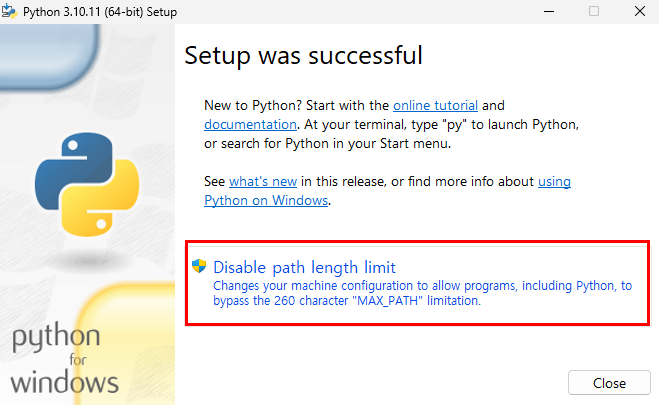
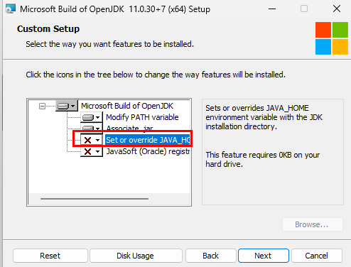
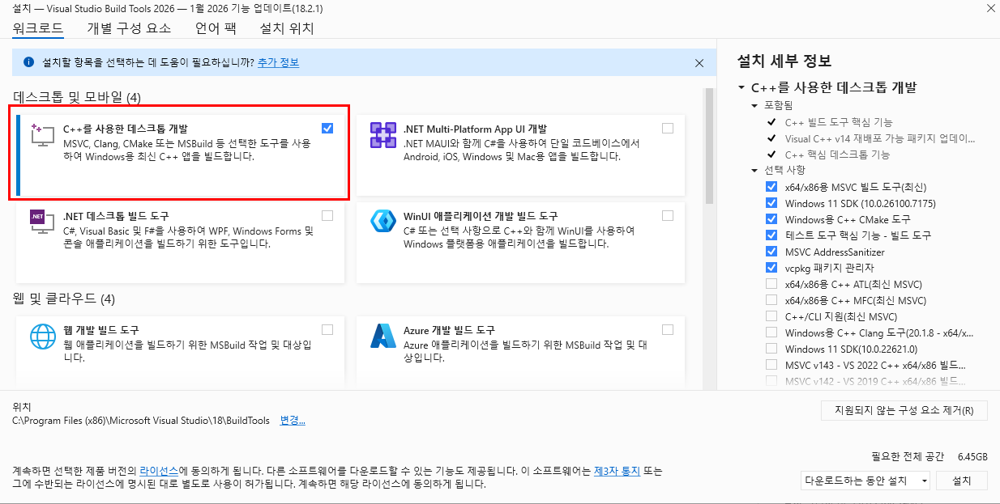

# Virtualenv Setup Guide

A guide for setting up a virtualenv environment to install and run Python packages.<br><br>  
## About Virtualenv  
{: .left-bar-title}  
- It is like a container where Python is newly installed and only the modules you want are used.  
- Virtualenv is a tool that creates an independent virtual environment so that it does not affect the Python environment installed on the system. This environment provides separate Python executable files and library paths, and installing packages does not affect the Python settings of the entire system. You can also install multiple versions of Python and select the desired version to configure the virtual environment. 
<br><br> 

## Prerequisites
{: .left-bar-title}  
### 1. Ubuntu  
{: .specific-title}
Example) Installing Python 3.10 (Recommended Python version: 3.10 ~ 3.12)
  ```
  $ sudo apt-get update
  $ sudo apt-get install python3.10 python3-pip python3.10-dev python3.10-distutils
  ```  

### 2. macOS
{: .specific-title}  
```
brew install openssl
brew install libmagic
brew install postgresql  
brew install python3 
```  

### 3. Windows  
{: .specific-title}  

<details>
  <summary markdown="span">Python installation (Recommended version: 3.10 ~ 3.12)</summary>
    Download and run the installer from https://www.python.org/downloads/windows/.<br> 
    1. Check "Add Python.exe to PATH" and then click "Install Now".<br>
    <br><br>
    2. Click "Disable path length limit".<br>
    <br>
</details>  


<details>
  <summary markdown="span">OpenJDK installation (Recommended version: 11)</summary>
    Download and run the appropriate .msi file from https://learn.microsoft.com/en-us/java/openjdk/download.<br>  
    1. Download and run the .msi file.<br>
    <br><br>
    2. Select 'Set or override JAVA_HOME...'.<br>
    <br>
</details>   


<details>
  <summary markdown="span">Microsoft Visual C++ installation (Recommended version: 14.0 or higher)</summary>
    Download and run the build tool from https://visualstudio.microsoft.com/visual-cpp-build-tools/.<br>
    1. Check "Desktop development with C++" and install.<br>
    <br><br>
</details>   

<details>
  <summary markdown="span">Git installation</summary>
    Download the appropriate Git installer from https://git-scm.com/download/win.<br> 
</details> 

<br><br>


## How to Create and Activate virtualenv  
{: .left-bar-title} 
- For detailed virtualenv information, please refer to the [Python virtualenv page](https://docs.python.org/3.10/library/venv.html).    

### 1. Ubuntu
{: .specific-title}
- Install and run virtualenv  
  ```
  $ pip3 install virtualenv
  $ virtualenv -p /usr/bin/python3.10 venv
  $ source venv/bin/activate
  ```
     
- virtualenv commands  

    | **Command Description** | **Command** |  
    |-------------------------|-------------|  
    | Create virtual environment | virtualenv -p [python_version] [env_name] |  
    | Activate virtual environment | source [env_name]/bin/activate |  
    | Deactivate virtual environment | deactivate |    
    

### 2. macOS
{: .specific-title}
- Install and run virtualenv  
```
# If pip does not exist
$ wget https://bootstrap.pypa.io/get-pip.py
$ python3 get-pip.py
$ pip install virtualenv
$ virtualenv -p /usr/bin/python3.10 venv
$ source venv/bin/activate
```     

### 3. Windows
{: .specific-title}  
- Install virtualenvwrapper   
```
$ pip install virtualenv
$ pip install virtualenvwrapper-win
$ mkvirtualenv venv
$ workon venv
``` 
  <details>
      <summary markdown="span">Errors that may occur during installation</summary>
      <pre>  
        1. Building wheel for py-tlsh (setup.py) error occurs <br>
          - Download and install Microsoft Visual C++ 14.0 or higher version.<br> 
        2. 'LINK : fatal error LNK1158: cannot execute 'rc.exe'.' error occurs <br>
        - Copy 'rc.exe' and 'rcdll.dll' files from C:\Program Files (x86)\Windows Kits\10\bin\10.xxx\x86 to C:\Program Files (x86)\Microsoft Visual Studio 14.0\Common7\Tools.<br>
      </pre>
  </details>    


- virtualenvwrapper-win commands    

    | **Command Description** | **Command** |  
    |-------------------------|-------------|  
    | Deactivate environment | deactivate |  
    | Create virtual environment | mkvirtualenv [virtual_env_name] |  
    | Activate environment | workon [virtual_env_name] |    
