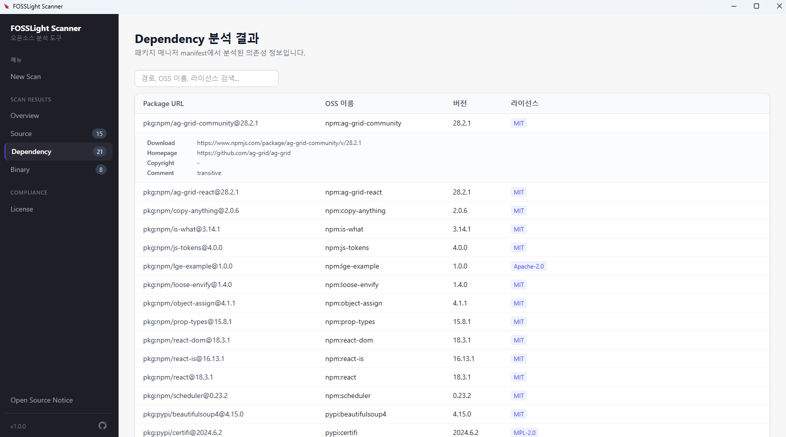

# FOSSLight Scanner GUI

[**FOSSLight Scanner GUI**](https://github.com/fosslight/fosslight_scanner_gui) is a Windows desktop app for running [FOSSLight Scanner](../scanner/README.md). The installer includes the analysis engine, so you can run Source, Dependency, and Binary analysis and review the results on screen without installing Python or the scanners separately.

The analysis result is also saved as an Excel file in [FOSSLight Report](https://fosslight.org/hub-guide-en/learn/2_fosslight_report.html) format.

## Overview
{: .left-bar-title}

- Repository: [fosslight/fosslight_scanner_gui](https://github.com/fosslight/fosslight_scanner_gui)
- Installer: `fosslight-scanner-gui-<version>-setup.exe` from [Releases](https://github.com/fosslight/fosslight_scanner_gui/releases)
- Supported analysis
    - [FOSSLight Source Scanner](../scanner/2_source.md)
    - [FOSSLight Dependency Scanner](../scanner/1_dependency.md)
    - [FOSSLight Binary Scanner](../scanner/3_binary.md)
- Analysis targets
    - A local folder
    - An archive (zip, tar, tar.gz, tgz, tar.bz2, tar.xz, bz2, jar, whl, rpm, src.rpm)
    - A URL (git clone, or a direct archive download)

## Supported environment
{: .left-bar-title}

- Windows 10 / 11 (64-bit)
- The installer already contains the analysis engine and does not download extra files during setup. You can install it on an offline PC.
- The installer is about 259MB. After installation the app uses about 1GB, most of which is the license data used for Source analysis.
- The default setup is per-user and does not require administrator rights. It does not register a service or change the system PATH.

## Installation
{: .left-bar-title}

1. Download `fosslight-scanner-gui-<version>-setup.exe` from [Releases](https://github.com/fosslight/fosslight_scanner_gui/releases).
2. Run the installer. If **Windows protected your PC (SmartScreen)** appears, click **More info** and then **Run anyway**. This warning is shown for installers that are not code-signed.
3. Confirm the install location and click **Install**. The default location is `%LOCALAPPDATA%\Programs\fosslight-scanner-gui\`. You can change it in the wizard.
4. When setup finishes, start **FOSSLight Scanner** from the desktop or the Start menu.

On startup the app checks GitHub Releases. If a newer version exists, it asks whether to download it. Choosing **Download** fetches the update, and restarting opens the installer. The app cannot be used while the download is in progress, and a scan that is still running is stopped on restart. If the update check fails (for example, while offline), the app continues on the current version without a message.

## Screens
{: .left-bar-title}

The left menu is organized as follows.

| Section | Menu | Description |
|:--------|:-----|:------------|
| Menu | New Scan | Starts a new analysis. |
| Scan Results | Overview | Summarizes detection counts, license risk, and scanner information. |
| Scan Results | Source / Dependency / Binary | Shows items found by each scanner. The number is the detection count. |
| Compliance | License | Shows the risk level and main obligations of each detected license. |
| Bottom | Open Source Notice | Opens the notice for open source included in this app. |
| Bottom | Version | Hover to see the GUI version and the bundled scanner versions. |
| Bottom | GitHub icon | Opens the [issue tracker](https://github.com/fosslight/fosslight_scanner_gui/issues). |

While a scan is running, **스캔 진행 중...** appears under the menu. When you start the app again, it opens the last successful scan result.

## Run a scan
{: .left-bar-title}

{: .styled-image}

On **New Scan**, fill in the fields below and click **스캔 시작** (Start scan).

### Analysis target
{: .specific-title}

Choose **폴더** (Folder), **압축파일** (Archive), or **URL**.

- **Folder**: click **폴더 선택** and choose the project folder. The report folder is set to that folder.
- **Archive**: choose a file with a supported extension such as zip, tar.gz, jar, whl, or rpm. The app extracts it and then analyzes it. The report folder is set to the folder that contains the archive.
- **URL**: enter an address that starts with `https://` or `git@`.
    - A git repository URL is cloned and then analyzed. [git](https://git-scm.com/download/win) must be installed on the PC.
    - If the address ends with an archive extension, the file is downloaded and extracted. git is not required.
    - For a git repository, you can enter a **Branch or Tag**. Leave it empty to use the default branch. When the field loses focus, the app checks that the branch or tag exists. An invalid name blocks the scan. If similar names exist, they are listed as suggestions.

Examples

- git clone: `https://github.com/fosslight/fosslight_scanner`
- a specific tag: use the URL above and enter `v2.1.25` in Branch or Tag
- an archive: `https://github.com/fosslight/fosslight_scanner/archive/refs/tags/v2.1.25.zip`

### Analysis type
{: .specific-title}

Select **Source Code**, **Dependency**, and **Binary**. All three are selected by default, and at least one must stay selected.

### Source analysis options
{: .specific-title}

These fields appear only when Source Code is selected. Both are optional.

- **KB URL**: KB server address used for Source analysis
- **KB Token**: KB authentication token

If both are empty, Source analysis runs without a KB.

### Exclude paths
{: .specific-title}

Enter a path to skip and click **추가** (Add). You can also press Enter. Example: `node_modules`

### Report output folder
{: .specific-title}

This is the folder for the Excel report and the log. It is required. Choosing a folder or an archive fills in a default. For a URL, choose the folder yourself with **폴더 선택**.

### Progress and cancel
{: .specific-title}

After the scan starts, the steps are shown as **다운로드 (Download) → 도구 설치 (Install tools) → 준비 (Prepare) → 분석 (Analyze) → 결과 정리 (Normalize results)**. Download and tool installation run only when they are needed. The on-screen log is also written to `fosslight_gui_<timestamp>.log` in the output folder.

Depending on the target size, a scan can take from several minutes to several tens of minutes. **취소** (Cancel) asks for confirmation and then stops the running work. The screen then shows that the scan was cancelled.

- Errors are shown in a red banner.
- A finished analysis that is missing a tool, or whose tool installation failed, is shown as a yellow warning. If there is only a warning, the scan completed, and a report file was created, that analysis finished.

## Review the results
{: .left-bar-title}

### Overview
{: .specific-title}

{: .styled-image}

- **Open Source 검출**: counts for Source, Dependency, and Binary. Click a card to open that result page.
- **License 정보**: number of distinct licenses, risk distribution, and the licenses with the most items. If a Strong Copyleft or Restricted license is present, a warning is shown. Clicking it opens the License page.
- **Result file**: opens the report folder in File Explorer.
- **스캐너 정보**: scanners that ran and the analysis environment.

Items marked Exclude are left out of the Overview statistics.

### Source / Dependency / Binary
{: .specific-title}

{: .styled-image}

Detected items are shown in a table. You can search by path, OSS name, or license, and sort by clicking a column header. Each page shows 50 rows.

Click a row to expand Download Location, Homepage, Copyright, and Comment. Excluded rows are dimmed.

- The path column for Source is **Source Path**.
- The path column for Dependency is **Package URL**.
- The path column for Binary is **Binary Path**.

### License
{: .specific-title}

{: .styled-image}

Detected licenses are grouped and sorted with higher risk first. Categories and the risk labels on screen are:

| Category | Risk |
|:---------|:-----|
| Restricted | High (높음) |
| Strong Copyleft | High (높음) |
| Weak Copyleft | Medium (중간) |
| Permissive | Low (낮음) |
| Unclassified (미분류) | Needs review (확인 필요) |

The main obligations of each license are shown with it. Click a row to expand the items where that license was found. Unclassified licenses are not hidden. A notice at the top of the page says that manual review is required.

## Output files
{: .left-bar-title}

The report folder contains the following files.

| File | Description |
|:-----|:------------|
| `fosslight_report_*.xlsx` | FOSSLight Report containing the Source, Dependency, and Binary results. It can be uploaded to FOSSLight Hub. |
| `fosslight_report_*.yaml` | The same analysis result in YAML. |
| `fosslight_gui_<timestamp>.log` | The log shown on the scan screen. |
| `gui_result.json` | The file the app reads when it opens the result again. |

The list used to reopen the last result is stored in `%APPDATA%\fosslight-scanner-gui\`.

## Tools required for dependency analysis
{: .left-bar-title}

When a scan includes Dependency and the matching tool for a project manifest is missing, the app prepares it before analysis starts. A URL or an archive is checked the same way after it has been downloaded and extracted. A failed install does not stop the whole scan. Only that package manager's analysis may fail, and the app reports it as a yellow warning.

| Detected file | Required tool | What the app does |
|:--------------|:--------------|:------------------|
| package.json | Node.js (npm) | Installs it if missing. If winget cannot be used, it downloads the official zip and uses it only for this scan. |
| pom.xml | Apache Maven, Java | Prepares Maven when neither the Maven Wrapper (`mvnw`) nor an installed `mvn` is available. Also prepares Java if it is missing. |
| build.gradle, build.gradle.kts | Java | Does not install Gradle. It uses the project's Gradle Wrapper. Prepares Java if it is missing. |
| requirements.txt, setup.py, setup.cfg, pyproject.toml, Pipfile | Python | Analyzes with the Python bundled in the app. A separate install is not required. |
| go.mod | Go | Installs it with winget if missing. |
| Chart.yaml | Helm | Installs it with winget if missing. |
| Cargo.toml | Rust (cargo) | Installs it with winget if missing. |
| Gemfile | Ruby | Installs it with winget if missing. |
| pubspec.yaml | Flutter | Does not install it automatically. Install Flutter using the [Windows install guide](https://docs.flutter.dev/get-started/install/windows), then scan again. |
| Podfile, Podfile.lock | CocoaPods | Not supported on Windows. Analyze on macOS. |

If Windows asks for permission while winget is installing, allow it. If winget is unavailable, the log says which tools you need to install yourself. Only Node.js can still be downloaded directly by the app.

## Uninstall
{: .left-bar-title}

Remove **FOSSLight Scanner** from Windows **Settings > Apps > Installed apps**, or run `Uninstall FOSSLight Scanner.exe` in the install folder.

## FAQ
{: .left-bar-title}

**Q. SmartScreen warns me during installation.**  
The installer is not code-signed, so Windows shows this warning. Continue with **More info → Run anyway**.

**Q. A git repository URL cannot be analyzed.**  
A git repository URL requires git on the PC. An archive download URL works without git.

**Q. The log contains WARNING. Did the scan fail?**  
No. Errors are shown separately in a red banner. If a report file was created, the analysis finished. A WARNING is a notice to check, such as a missing tool.

**Q. The dependency result is empty.**  
The package manager may be missing, or it may be a tool that is not installed automatically, such as Flutter or CocoaPods. Read the warning in the scan log, install the tool, and scan again.

**Q. The installed size is large.**  
The license data used for Source analysis accounts for most of the installed size. The installer ships that data compressed, and installation extracts it.

To report a problem, click the GitHub icon at the bottom left of the app or open an [issue](https://github.com/fosslight/fosslight_scanner_gui/issues).
