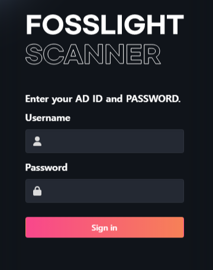
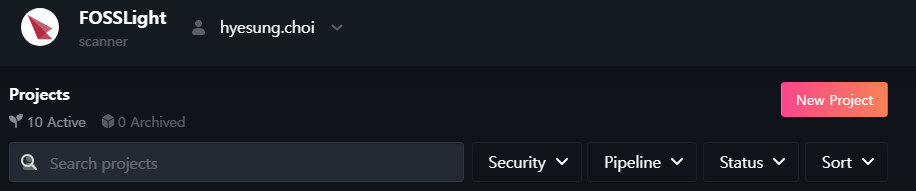
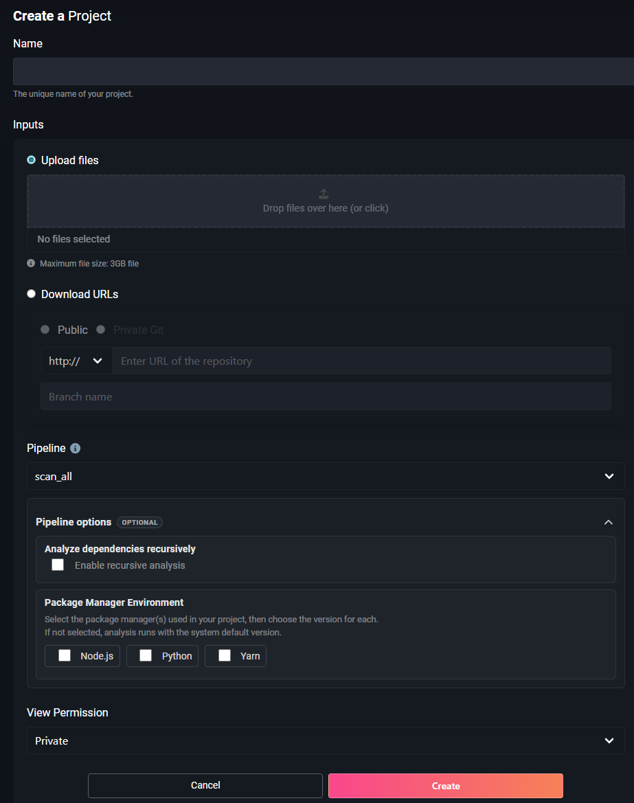
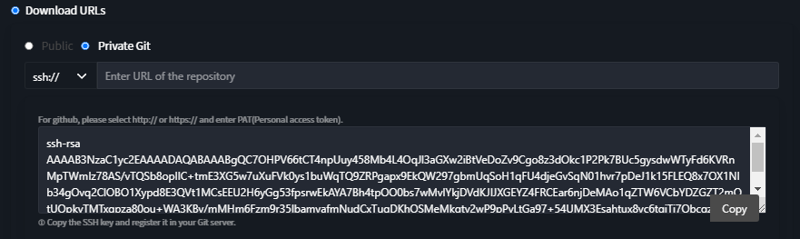
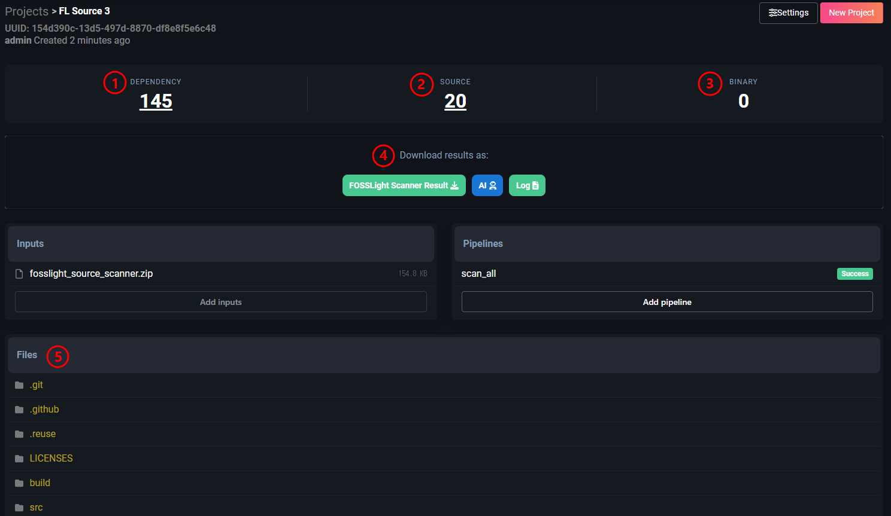
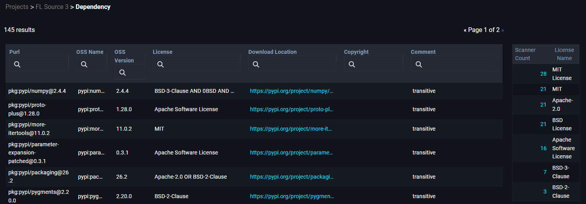
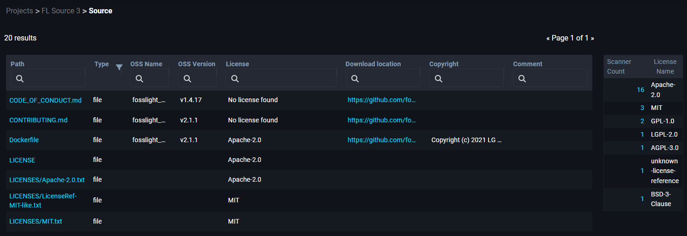
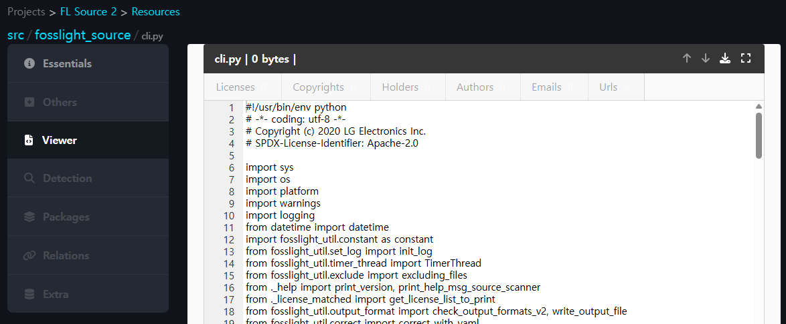

# (LGE Only) FOSSLight Scanner Service 

## Overview
{: .left-bar-title}
Source, binary and dependency analysis is performed using [FOSSLight Scanner](https://fosslight.org/fosslight-guide-en/scanner/) as a web service. Analysis results are generated in the form of a [FOSSLight Report](https://fosslight.org/hub-guide-en/learn/2_fosslight_report.html).    
- URL : [http://fs.lge.com](http://fs.lge.com)
- Supported items
    - [FOSSLight Source Scanner](https://fosslight.org/fosslight-guide-en/scanner/2_source.html)
    - [FOSSLight Binary Scanner](https://fosslight.org/fosslight-guide-en/scanner/3_binary.html)
    - [FOSSLight Dependency Scanner](https://fosslight.org/fosslight-guide-en/scanner/1_dependency.html)
        - Supported : npm, pypi, maven, pub, go, nuget, cargo, swift, carthage
          (Other package managers are currently undergoing verification)  
- Not supported items
    - [FOSSLight Android Scanner](https://fosslight.org/fosslight-guide-en/scanner/android/)
    - [FOSSLight Yocto Scanner](https://fosslight.org/fosslight-guide-en/scanner/yocto/)

## How to use
{: .left-bar-title}

### Login
{: .specific-title}
- You can access it by entering your AD account ID and password at [http://fs.lge.com](http://fs.lge.com) 
{: .styled-image}  

### Create a Project 
{: .specific-title} 
1. Click the "New Project" button in the upper right corner to create a project.  
{: .styled-image}  

2. Enter the contents in "Create a Project".  
{: .styled-image}  
    - **Name** :  Enter the Project name.
    - **Inputs** : Select sources to analyze.
        - **Upload files** : Compress and upload files to be analyzed. (Please upload only 1 file.)  
               ⚠️ You can upload up to 3GB.
        - **Download URLs** :  Enter the source link to be analyzed (link that can be obtained through "wget" or "git clone")    
            - **Public** 
                - The example of input value
                    - wget : github.com/LGE-OSS/example/archive/refs/tags/v1.0.0.zip
                    - git clone : github.com/LGE-OSS/example
            - **Private Git** 
                - **http://** or **https://** : You must enter the user name and PAT value.
                - **ssh://** : Copy the provided ssh key value and register it in your private git repository. ⚠️ Please use PAT instead of ssh for github.    
                {: .styled-image}  
    - **Pipeline**
        - scan_all : Analyze source, binary, dependency.
        - source : Analyze only the source code.
        - binary : Analyze only binary.
        - dependency : Analyze only dependency.
    - **Pipeline options (Optional)**
        - Analyze dependencies recursively : To analyze dependencies recursively by detecting manifest files in all subdirectories as well as the project's top-level directory, check the 'Enable recursive analysis' checkbox.
        - Package Manager Environment : If you want to use a specific version of a package manager during dependency analysis, select the language or package manager, and then choose your desired version from the version list.
    - **Permission**
        - Private : Only the creator can view.
        - Public : Other people can view the project and download analysis results through the link.

### Analysis Result
{: .specific-title} 
{: .styled-image}  
1. **Dependency**
    - The number displayed under Dependency indicates the count of dependency analysis results. Clicking this number allows you to view the list of open source packages detected through dependency analysis.
    {: .styled-image}
2. **Source**
    - The number displayed under Source indicates the count of source analysis results. Clicking this number allows you to view the list of open source detected through source analysis.
    {: .styled-image}  
        - When you click on the file name in the Path column, you can view the contents of that file.
        {: .styled-image}
3. **Binary**
    - The number displayed under Binary indicates the count of binary analysis results. Clicking this number allows you to view the list of open source detected through binary analysis.
4. **Download results**
    - FOSSLight Scanner Result : You can download the analysis result file in a report format that can be uploaded during the [Identification](https://fosslight.org/hub-guide-en/tutorial/1_project/2_Identification/) process in FOSSLight Hub.
    - AI : You can view an AI-generated summary of the FOSSLight Scanner analysis results, along with risk levels and recommended actions.
    - Log : You can download the FOSSLight Scanner execution log file.
5. **Files**
    - You can view the detection results for each analyzed file in File Tree format. (Since these are file-specific detection results, FOSSLight Dependency results are not included)  

