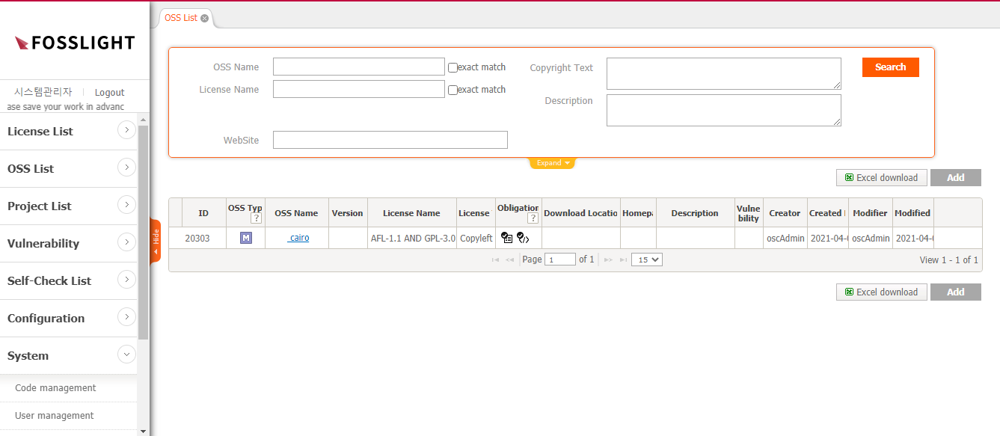

# OSS List
```note
등록된 OSS(Open Source Software) 정보를 확인하고, OSS를 추가할 수 있습니다.
```
  

## ID  
- OSS를 식별하는 숫자입니다.
- OSS의 버전이 여러 개 등록된 경우 '+'가 표시되며 최상위 버전이 표시됩니다. '+' 버튼을 클릭하면 하위 버전의 Open Source 정보를 확인할 수 있습니다.

## OSS Type  
- M : Multi License로 하나의 OSS에 여러 License의 Source Code가 포함된 경우입니다.
- D : Dual License로 여러 개의 OSS  License 중 하나를 선택할 수 있습니다.
- V : Version different License로 버전 별로 License가 다른 경우입니다.

## OSS Name 
- Nick 표시된 OSS는 하나의 OSS가 여러 개의 Name을 갖고 있습니다.    
    예) "bison"의 Nick name은 "Bison parser", "GNU bison" 로 모두 같은 OSS를 표현하고 있습니다.
      
## Version 
- OSS 버전을 의미합니다.

## License Name 
- OSS의 License 정보를 알 수 있습니다.  
- Multi License는 OSS에 포함되는 모든 License가 AND로 표시됩니다.
- Dual License는 OSS의 License를 복수 개 중 선택할 수 있고 OR로 표시됩니다.

## License Type
- Permissive : BSD-like 또는 BSD-style License로 불리며 Software 재배포 방법 관련 최소한의 요구사항이 있는 License입니다. 통상적으로 Copyright Notice 와 보증부인 문구를 유지할 것을 요구합니다.
- Weak Copyleft : 파생저작물에 동일한 권리가 유지된다는 조건으로 저작물의 복사본과 수정된 버전을 자유롭게 배포할 수 있습니다. 저작물의 복사본과 수정본의 Source Code를 공개해야 합니다.
- Copyleft : 파생저작물에 동일한 권리가 유지된다는 조건으로 저작물의 복사본과 수정된 버전을 자유롭게 배포할 수 있습니다. 저작물의 복사본과 수정본뿐만 아니라 이와 link되거나 함께 동작하는 프로그램 전체 Source Code를 공개해야 합니다.
- Proprietary : 3rd Party가 Open Source를 사용하지 않고 자체 개발한 Software로 해당 3rd Party와 계약된 경우에만 사용 가능합니다.
- Proprietary Free : 3rd Party가 Open Source를 사용하지 않고 자체 개발한 Software로 추가적인 계약을 필요로 하진 않지만 일부 제약된 형태로만 사용 가능합니다.

## Obligation 
- Notice Obligation : 고지 의무가 있습니다.
- Source Code Obligation : Source Code 공개 의무가 있습니다. 

## Download Location 
- Open Source를 다운로드 받을 수 있는 URL이 Link로 표시되며, 클릭 시 해당 사이트로 이동하거나 파일을 다운로드 받을 수 있습니다.

## Hoempage 
- Open Source 공식 Site가 있으면, 로 표시되며 클릭 시 해당 사이트로  이동합니다.
- 아이콘에 마우스 오버 시 상세주소를 확인할 수 있습니다.

## Description 
- Open Source 사용 시 주의 사항을 확인할 수 있습니다.

## Vulnerability 
- NIST에서 제공하는 CVE DB에서 해당 OSS가 검색되면 취약 정도 (CVE Score)에 따라 Vulnerability 아이콘 색깔로 구분되어 표시됩니다.

# OSS 추가
