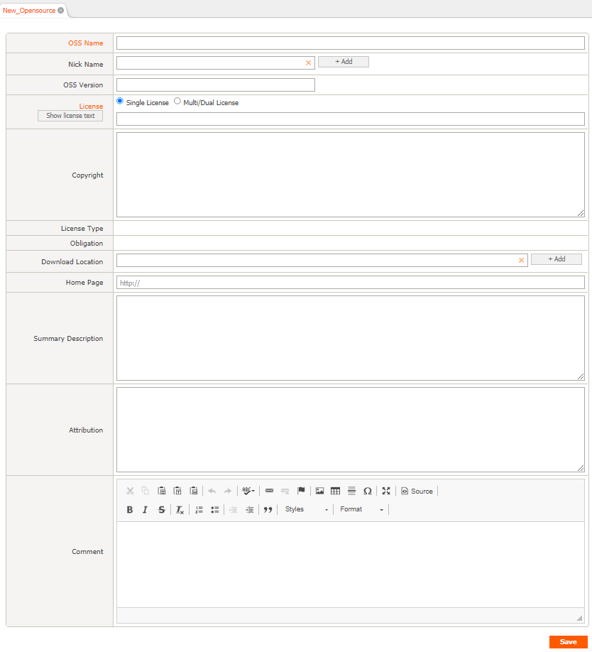
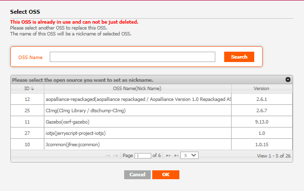

# OSS List
```note
Registered OSS (Open Source Software) information can be checked, and OSS can be added, modified, or deleted. 
You can check detailed information by clicking a cell in the OSS Name column of the OSS List.
```
## OSS List


### ID
- A number that identifies OSS.
- If multiple versions of OSS are registered,'+' is displayed and the highest version is displayed. If you click the '+' button, you can see the other version of same OSS 

### OSS Type
- M: This is a case where source codes of multiple licenses are included in one OSS as a multiple license.
- D: You can select one of several OSS Licenses with Dual License.
- V: Version different License. License is different for each version of OSS.

### OSS Name
- For OSS marked with Nick, one OSS has multiple names.  
    Ex) Nick name of "bison" is "Bison parser" and "GNU bison" all expressing the same OSS.
      
### Version
- It means the OSS version.

### License Name
- You can see the license information of OSS.
- In Multi License, all licenses included in OSS are marked with AND.
- Dual License allows you to select one of several OSS Licenses and is displayed as OR.

### License Type
- Permissive: It is a license that has minimum requirements. In general, it is required to maintain the copyright notice and disclaimer.
- Weak Copyleft: You can freely distribute copies and modified versions of the work on the condition that the same rights are maintained in the derivative work. Source codes of copies and revisions of the work must be disclosed.
- Copyleft: You can freely distribute copies and modified versions of the work on the condition that the same rights are maintained in the derivative work. You must disclose the source code of the entire program linked to or operated with, as well as copies and modifications of the work.
- Proprietary: Software developed by the 3rd party without using open source, and can be used only when contracted with the 3rd party.
- Proprietary Free: Software developed by the 3rd party without using Open Source, does not require an additional contract, but can only be used in a limited condition.

### Obligation
- Notice: You are obligated to notify.
- Source Code: You are obligated to disclose the source code.

### Download Location
- The URL where you can download the open source is displayed as a link.

### Hoempage
- If there is an open source official site, it will be displayed as a link.
- You can check the detailed address when you mouse over the icon.

### Description
- You can check the precautions when using Open Source.

### Vulnerability
- When the relevant OSS is searched in the CVE DB provided by NVD, it is displayed in a color of the Vulnerability icon according to the degree of vulnerability (CVE Score).

## (Admin Only) Add, modify, delete OSS 
### Add

1. Click the Add button in the upper right of the OSS List.
2. In the "New_Opensource" tab, fill in the information of the new OSS.
    - OSS Name and Nick Name cannot be duplicated.
    - Summary Description: Fill in information about the OSS.
    - Attribution: Fill in the phrase that must be included to issued OSS Notice.
3. Click the Save button at the bottom right.

### Modify
1. Click the OSS Name to be modified.
2. Modify the information in the OSS Details tab.
3. Click the Save button at the bottom right.

### Delete
1. Click the OSS Name to be deleted.
2. In the OSS Details tab, fill in the reason for deletion in the Comment column.
3. Click the Delete button at the bottom left.
    - 📢 If the relevant OSS is included in the project where the identification step is confirmed, a window for selecting another OSS to be renamed will pop up when clicking the Delete button.
    
        - If you select the OSS to be renamed, the OSS to be deleted is merged into the selected OSS. (Name and NickName of OSS to be deleted are moved to Nickname of OSS to be renamed.) 
