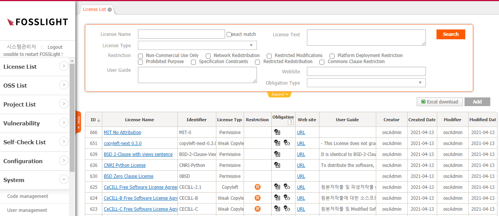
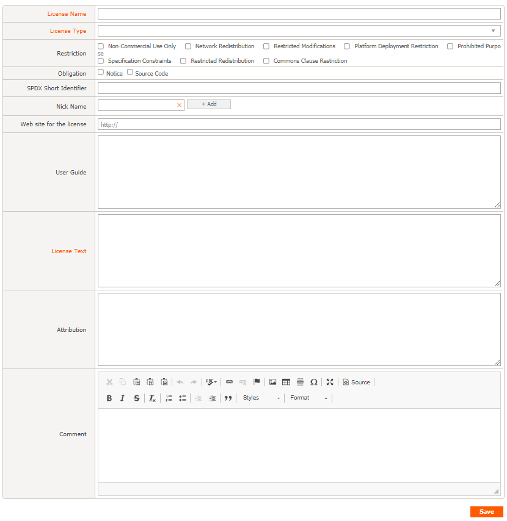

# License List
```note
You can check registered license information and add, modify, or delete licenses.
You can check detailed information by clicking a cell in the License Name Column of the License List.
```
## License List


### License Name
- It follows the method of notation SPDX (https://spdx.org/licenses/) as the license full name.
- If you click the value of the License Name column, you can check detailed information for each license.

### Identifier
- The standardized short identifier makes it easier to identify the license and follows the SPDX (https://spdx.org/licenses/) notation method.

### License Type
- Permissive : In general, it is required to maintain the copyright notice and disclaimer.
- Weak Copyleft : You can freely distribute copies and modified versions of the work on the condition that the same rights are retained in the derivative work. Source codes of copies and revisions of the work must be disclosed.
- Copyleft : You can freely distribute copies and modified versions of the work on the condition that the same rights are maintained in the derivative work. Not only copies and revisions of the work, but also the source code of the entire program linked to or operating with it must be disclosed.
- Proprietary : Since it cannot be used without the permission of the software right holder, be sure to check the contractual relationship with respect to the use of the source code before using it.
-Proprietary Free : No additional contract is required, but can be used in a restricted form, specific terms and conditions or conditions.

### Restriction
- Non-Commercial Use Only : Commercial use and distribution of software is prohibited.
- Network Redistribution : Just providing a service for use on a network is regarded as distribution, and the obligations of open source must be fulfilled.
- Restricted Modifications : You cannot distribute a modified version of the software. That is, it should be used without modifying the source code.
- Platform Deployment Restriction : Software distribution is restricted according to the operating system, technology, technology field used, and device type.
- Prohibited Purpose : Software cannot be used for a specific purpose (field).
- Specification Constraints : Software should be used in relation to a specific specification or standard.
- Restricted Redistribution : Restricted software sub-components (Source Code, Binary file, etc.) that can be redistributed.
- Common Clause Restriction : If all or a significant part of the product creates value from software under the Common Clause License, it cannot be sold.

### Obligation
- Notice : You are obligated to notify.
- Source Code : You are obligated to disclose the source code.

### Web site
- Provides web site information of the original license. Click the URL to go to the site.

### User Guide
- You can see the precautions when using the license.

## (Admin Only) Add, Modify, Delete License
### Add

1. Click the Add button in the upper right of the License List.
2. In the "New_License" tab, enter the information of the new OSS.
    - License Name and Nick Name cannot be duplicated.
    - Obligation :
        - If Notice is checked, it is included in the OSS Notice.
        - If Source Code is checked, it is displayed as a list of source code collection OSS in the Packaging tab.
    - User Guide : Enter information about the OSS.
    - Attribution : When issuing an OSS Notice, enter the phrase that must be included separately.
3. Click the Save button at the bottom right.

### Modify
1. In the License List, click the License Name to be modified.
2. Make modifications on the License Details tab.
3. Click the Save button at the bottom right.

### Delete
1. In the License List, click the license name you want to delete.
2. In the License Details tab, enter the reason for deletion in the Comment field.
3. Click the Delete button at the bottom left.