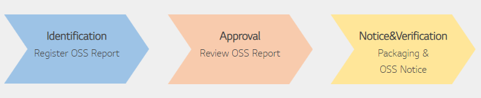
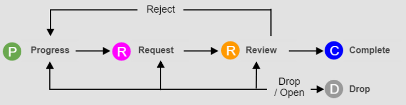
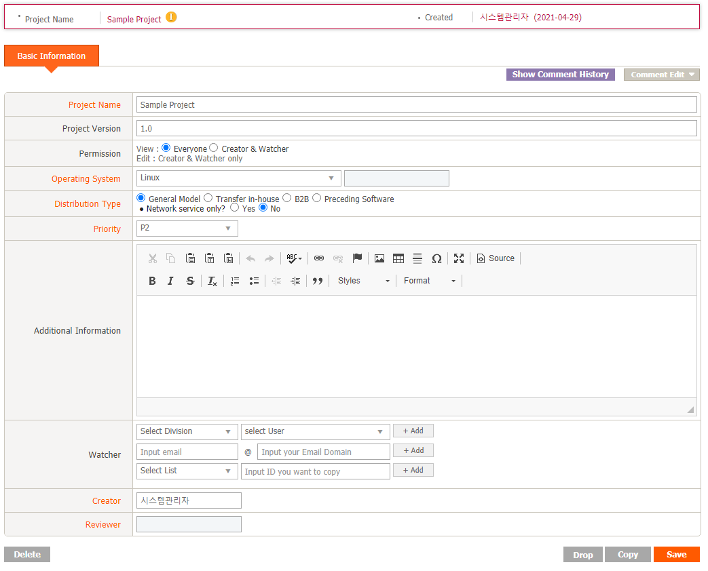
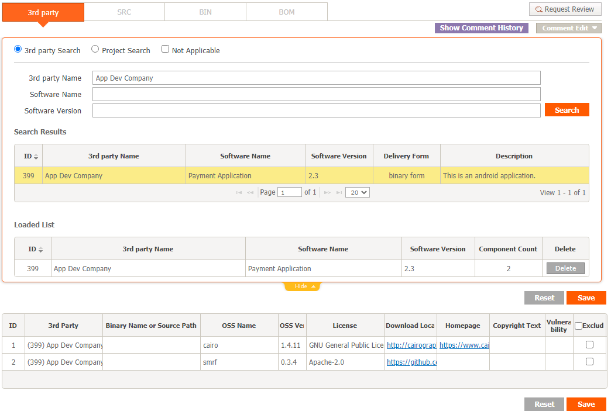
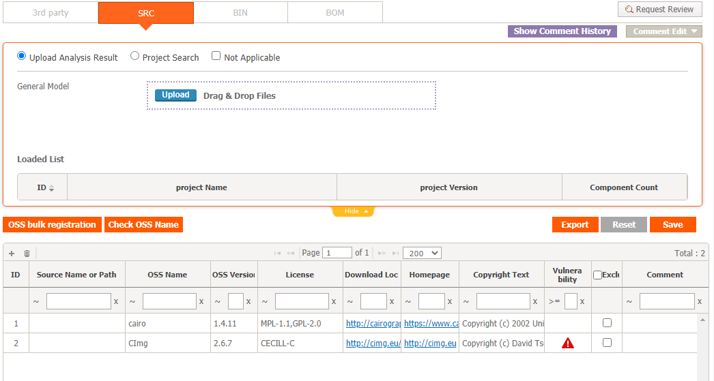
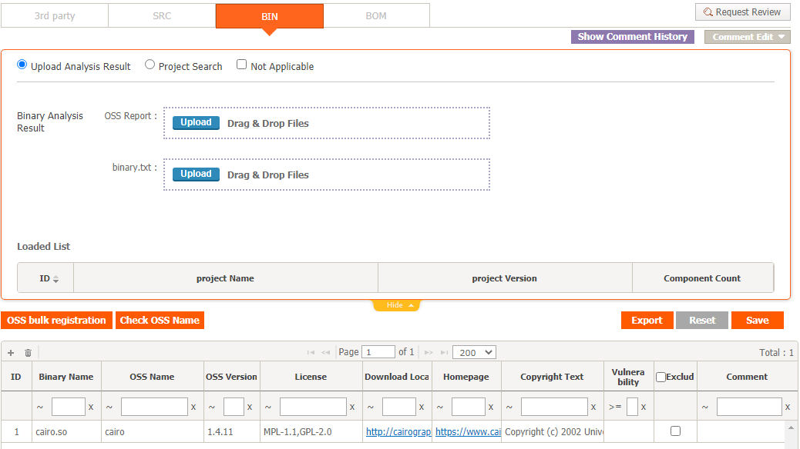
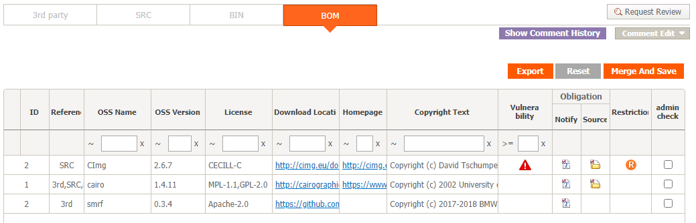
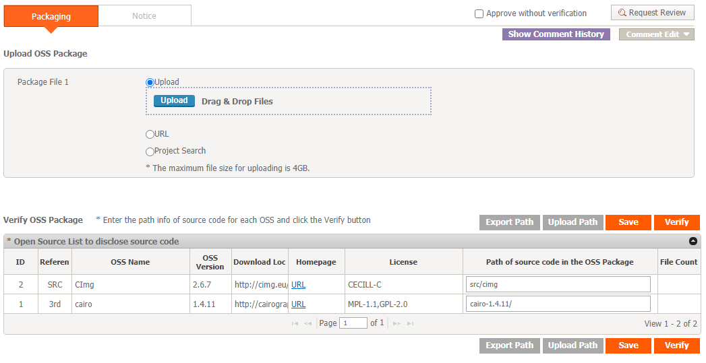
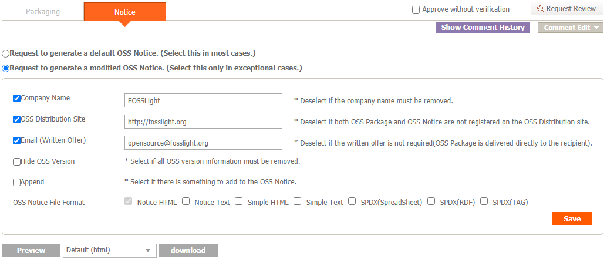

# Project
```note
The process that must be performed for the development and distribution of software including open source software is performed sequentially.

```

## Project List

You can search for a project, check the overall information of the project, and download the FOSSLight Report, OSS Notice, and OSS Package.

- Search : You can search for a project by basic information of the project, status, license, OSS name, etc.
- Project Name (Version) : Double-clicking a row moves to the project detail screen.
- Status : Displays the status information of the project.
- Identification, Packaging : Click each item to move to the Identification and Packaging details.
- Download : Click each icon to download the file.
    - FOSSLight Report : You can download the list entered in Identification in FOSSLight Report format.
    - OSS Notice : Displayed when the packaging step is completed, and issued OSS Notices can be downloaded.
    - Packaging file : Displayed when the source code to be published in Packaging is uploaded, and packaging files can be downloaded.
- Vulnerability : Displays the highest Critical Level among Vulnerability information of the entire Open Source List (excluding Exclude) included in the identification of the project.
    - Critical (Critical Score 9.0 ~ 10.0)
    - High (Critical Score 7.0 ~ 8.9)
    - Medium (Critical Score 4.0 ~ 6.9)
    - Low (Critical Score 0.1 ~ 3.9)

### Project Status


| Status | Description |
| ------------- | ------------- |
|Progress| Creator is working. |
|Request|Identification or Packaging phase, the Creator has requested a review from the Reviewer. You can change to Progress status through the reject button in the upper right of the tab. |
|Review|The Reviewer is in the status of being reviewed during the Identification or Packaging phase. At this time, the Creator cannot modify the identification or packaging information. If correction is required, leave a [Comment](#comment) and request a Reject from Reviewer. |
|Complete|It means that Project Review has been completed. Creators cannot modify the information in Identification or Packaging. If modifications are needed, click Request to Open on the Project Basic Information tab. |
| Drop|It means that the OSC process of the project is no longer in progress. If it is not Complete, you can set Drop, and if necessary, you can open it directly by clicking Open. |


## Project's Process

### 1. Create a Project
Create a project for the software to be distributed.
1. Click the Add button in the Project List.
2. In the New_Project tab, enter project related information.
3. Click the Save button at the bottom right.

#### Basic Information tab
This is a tab to modify basic information about the project or change the status.

Double-click the Project Name in the Project List.
- Delete : Delete the project.
- Drop : Changes the status of the project to Drop. To proceed with the process again, you need to click the Open button.
- Copy : Copy a project and create a new project.
- Save : After modifying basic information, click to save.
- Open : Displayed when the Status is Drop, and when clicked, the Status is changed to Progress.
- Request to Open : It is displayed when the status is Complete, and the process can be re-executed by changing the status to Progress.
- (Admin Only)
    - Complete : Changes the status of the project where all processes have been completed.
    - Open : Displayed when the Status is Complete or Drop, and the Status is changed to Progress.

### 2. Identification
Enter the Open Source Software analysis result for the project to be distributed.
- Click the button in the Identification column of the Project List to enter.

#### 2-1. 3rd Party Tab

*3rd Party Tab Creation Process*  
- In case 3rd party software is included : Load → Save 3rd party reviewed in advance
- If 3rd Party Software is not included : Check Not Applicable → Save

*How to load a reviewed 3rd party*  
You can call up the 3rd Party Software information by selecting one of the following methods.  
(💁 3rd Pary can be loaded multiple times.)
1. 3rd Party Search : Search and load 3rd Party Software with Status : Confirm in the 3rd Party List menu.
2. Project Search : Load the 3rd Party tab of another project.

#### 2-2. SRC Tab

*SRC tab creation process*  
- When OSS by source code is included : Write OSS information by source code -> Save
- If the source code is not subject to OSS analysis : Check Not Applicable → Save

*How to write OSS information by source code*  
- Written by hand in the OSS Table
    - Click the + button at the top left of the OSS Table to enter the OSS information.
- How to batch load OSS information
    1. Upload the FOSSLight Report with the OSS List created in the Upload Analysis Result column.
        - The loadable FOSSLight Report form can be downloaded by clicking the "Export" button in the upper right corner.
    2. Project Search : Loads the SRC tab of another project.

#### 2-3. BIN Tab

*BIN tab creation process*  
- When binary is included : Write OSS information for each binary -> Save
- When Binary is not included : Check Not Applicable → Save
  
*How to write OSS information by binary*  
- Written by hand in the OSS Table
    - Click the + button at the top left of the OSS Table to enter the OSS information.
- How to batch load OSS information
    1. Upload the FOSSLight Report with the OSS List created in the Upload Analysis Result column.
        - The loadable FOSSLight Report form can be downloaded by clicking the "Export" button in the upper right corner.
    2. Project Search : Load the BIN tab of another project.

#### 2-1. BOM Tab
Merge the list of OSS written in 3rd Party, SRC, BIN tab and request review.


##### How to request a review
1. Click the "Merge And Save" button.
    - Collect OSS List created in 3rd Party, SRC, BIN tab.
2. [Review items by warning message](#warning)  
3. Click the Request Review button to request a review.
    - However, if there is a red warning message, you cannot request a review.

##### (Admin only) How to review
1. Click the Review Start button on the top right of the BOM tab.
2. [Review items by warning message](#warning)     
3. Click Merge And Save and click Confirm to activate the Packaging tab.
    - If the creator needs reconfirmation, click Reject to change the Status to Progress.

### 3. Packaging
```note
- In the packaging stage, if an open source that is obligated to disclose the source code is used, source codes to be disclosed are collected (OSS Package) and registered in the OSC System.
- OSS notice is automatically generated when the packaging step is confirmed. If you need to change the contents of the OSS notice, you can modify it on the Notice tab.
- Click the button in the Packaging column of the Project List to enter.
```

<iframe width="560" height="315" src="https://www.youtube.com/embed/45voRAZC7n4" title="YouTube video player" frameborder="0" allow="accelerometer; autoplay; clipboard-write; encrypted-media; gyroscope; picture-in-picture" allowfullscreen></iframe>

#### 3-1. Packaging Tab

On the Packaging tab, OSS Package files are uploaded and verified. (However, if you have not used Open Source under a license that requires disclosure of the source code, this tab is disabled.)
1. OSS Package Upload
    - Upload the packaging file (compressed file) that has collected the source code.
2. Fill in the "Path of source code in the OSS Package" column.
    - If there are many types of open sources to be disclosed and it is difficult to fill in the paths individually, download the Packaging OSS List file with the'Export Path' button, fill in the path and upload with the'Upload Path' button to register the path information.
    - You can save the path information entered with the'Save' button.
    - Path information is case sensitive, so be careful when entering it.
3. Click the'Verify' button to perform the verification process.
    - After verifying, the number of files found in the OSS Package is displayed in the File Count column. If there is an open source that was not found, it displays "path not found".
    - You can check the README, File List and Banned List found in the OSS Package.
        - README : README file included in OSS Package
        - File List : List of files in OSS Package
        - Banned List : List of files that should not be disclosed such as "Proprietary", "Commercial"


#### 3-2. Notice Tab

OSS Notice is automatically generated based on Identification > BOM tab. At this time, you can modify the format or contents of the issued OSS Notice.

#### 3-3. How to request a review
- Click the "Request Review" button on the top right of the Packaging tab to request a review.

#### 3-4. (Admin only) How to review
- Click the "Review Start" button on the top right of the Packaging tab.
- If you click "Confirm" on the upper right, Packaging is confirmed and OSC Process is completed.
- You can download the OSS Notice issued from the Project List for the project whose packaging has been confirmed.
     - If the creator needs reconfirmation, click "Reject" to change the Status to Progress.

## ⭐ Tips for Project
### Check OSS Name button (SRC, BIN Tab)
It automatically changes to the OSS Name stored in FOSSLight based on the Download location written in the OSS Table.
- A list of OSS to be automatically converted is displayed in the pop-up.
    - Change OSS Name button : The OSS Name of the OSS Table is changed for the checked row.
    - (Admin Only) Add Nickname button : OSS Name written in OSS Table is added as Nickname to OSS stored in FOSSLight for the checked row.

### <a name="comment"></a> Leave a Comment
- If you click the Comment Edit button at the top right of each tab, you can leave a comment and send the comment to the reviewer, watcher, or creator by e-mail.

### <a name="warning"></a> OSS Table's Warning message
#### Warning message meaning by color
- Red : You cannot request a review or confirm. Correction is required after review.
- Blue : Review request or confirmation is possible, but it is a matter that needs to be reviewed.
- Gray : This message is for information delivery.

#### Review items according to Warning message

| Message | Description |
| ------------- | ------------- |
|This field is required| You need to enter the contents.|
|Unconfirmed open source|New OSS that is not registered.|
|Unconfirmed version|This is a new version that has not been registered.|
|Unconfirmed license|This is a new license that has not been registered.|
|Dual license: Select a license|Dual license is written as being used. In case of Dual License, select only the license to be used.|
|Specify OSS Name or put 1 license in a row|OSS Name is-or blank, and multiple licenses are written in one row. If the OSS Name is-or blank, separate the row for each license and write it.|
|The address should be started with www|The address format is not correct.|
|Formatting error|Contains a newline character. If you need to write multiple lines, please add a row to write it.|
|Not the same as property|The URL entered is different from the URL of the corresponding OSS registered in FOSSLight.|
