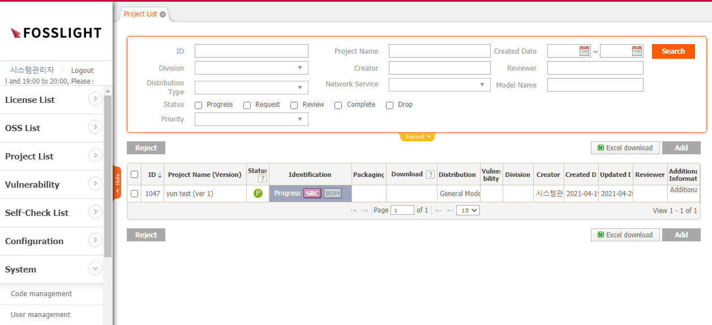
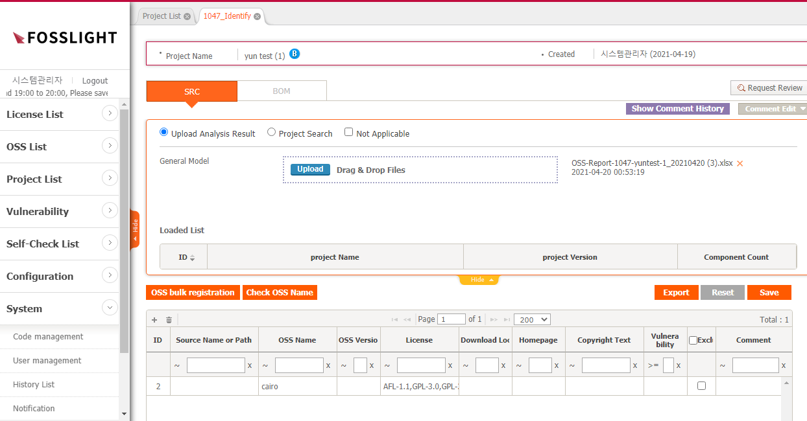

# Project
```note
FOSSLight 메뉴별 기능을 설명합니다.
```
  

## Project List
Project를 검색하고, 해당 Project의 전체적인 정보를 확인하고 OSS Report, OSS Notice, OSS Package를 다운로드할 수 있습니다.

## Create a Project
배포하는 Software에 대하여 Project를 생성합니다.
1. Project 생성 : Project List에서 Add 버튼을 클릭합니다.
2. New_Project 탭에서 Project 관련 정보를 입력합니다.
3. 우측 하단의 Save 버튼을 클릭합니다.

## Project의 Process


### Identification
배포하는 Project에 대하여 Open Source Software 분석 결과를 작성합니다.

- Identification 작성 Process : 1. 

#### SRC Tab
1. SRC 탭 작성 Process
Open Source Software 분석 결과 작성 -> Warning message 검토 -> Save

#### BOM Tab

### Packaging

#### Packaging Tab

#### Notice Tab
OSS Notice는 Identification > BOM 탭을 기준으로 자동 생성됩니다. 이 때, 발행하는 OSS Notice의 포맷이나 Contents를 수정할 수 있습니다.
