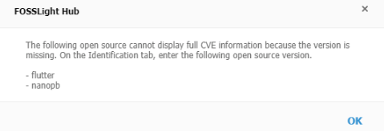
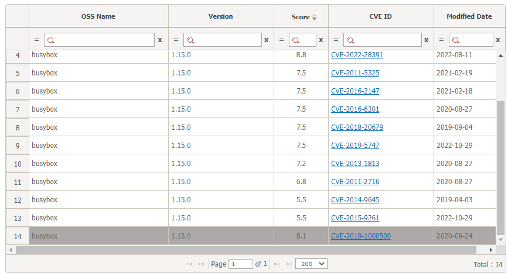

# Security
```note
You can check the vulnerability information by each CVE ID of OSS whose vulnerability score is higher than a reference score based on the BOM tab of the Identification step and manage it.
- The reference vulnerability score can be set at Code Management > 760 (Security Vulnerability Score).
```

## Column information
- OSS Name, OSS version
    - The OSS information in the BOM tab of the Identification step is automatically printed.
- CVE ID, CVSS Score, Published Date
    - The CVE ID and the corresponding CVSS score, published date are automatically printed.
- Vulnerability Resolution
    - Unresolved is printed as default, and you can select and change it from Fixed. 

### If OSS version is not written
- The Security tab does not display a full list of CVE IDs, as it is difficult to determine the exact vulnerability of CVE ID that is not written to the OSS version.
- When the pop-up screen as shown below appears when entering the Security tab, check the OSS list whose version has not been written,
Enter the OSS version used for OSS in the Identification tab, and then save and merge in the BOM tab.
You can check the vulnerability of the written OSS version on the Security tab.  


## Reflect on resolution of vulnerabilities with the Identification
When checking the vulnerability score in the SRC, BIN and BOM tabs in the Identification step,
you can check the max score except for the CVE ID that changed the value of the vulnerability resolution to 'Fixed' in the Security tab.
If you click vulnerability icon on the SRC, BIN and BOM tabs, the CVE ID which has the resolution of 'Fixed' in the entire CVE ID list window for the corresponding OSS name and version is deactivated as follows.  

