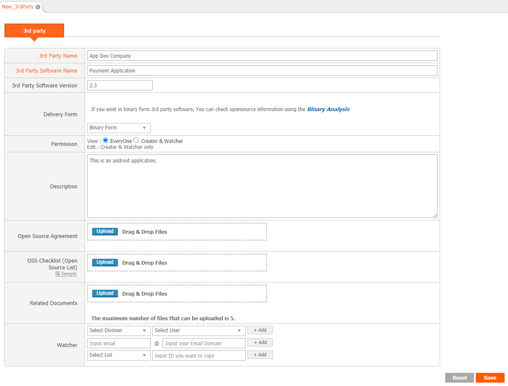

# 3rd Party
```note
- Registers and manages the software's open source information received from the 3rd party.
- Status: Only the 3rd party, which is Confirm, can be loaded from the Project > Identification - 3rd Party tab.
```
<iframe width="400" src="https://www.youtube.com/embed/FxQlpnaCO2Q" title="YouTube video player" frameborder="0" allow="accelerometer; autoplay; clipboard-write; encrypted-media; gyroscope; picture-in-picture" allowfullscreen></iframe>

## 3rd Party Project
### 1. Creating a 3rd Party Project
1. Click the Add button at the top right of the 3rd Party List.
2. In the New_3rdParty tab, enter 3rd party information and click Save.
    

### 2. Open Source Information Registration
Register OSS (Open Source Software) information in the OSS Table at the bottom of the 3rd Party Details tab.
There are two ways to register OSS information.
1. Click the + button at the top left of the OSS Table to add a row and enter the OSS information.
2. Upload the report with the OSS List written to the "OSS Checklist".
    - Attachable OSS Checklist form can be downloaded by clicking OSS Checklist > Sample link.

### 3. Request Review
1. Save after creating OSS Table.
2. Click the "Request Review" button in the upper right corner to request a review.

## (Admin Only) 3rd Party Review
1. In the 3rd Party List, double-click the 3rd Party, which is Status: Request.
2. Click Review Start at the top right.
    - Status: Changed to Review.
3. Review the red warning message in the OSS table.
    - If there is a red warning message on the OSS table, confirmation is not possible.
    - To register as a new OSS, double-click the row and a new OSS registration pop-up filled in with the information of the row appears.
4. When confirmation is complete, click the Confirm button.
    - Click the Reject button to request confirmation from the user again. 
