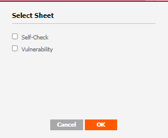
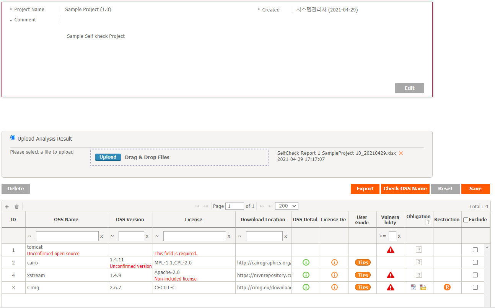
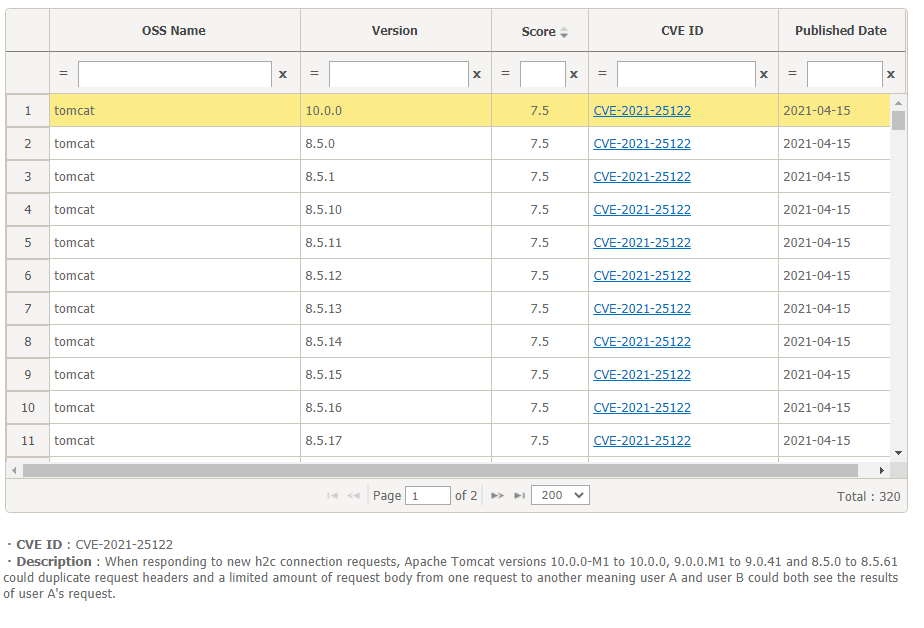
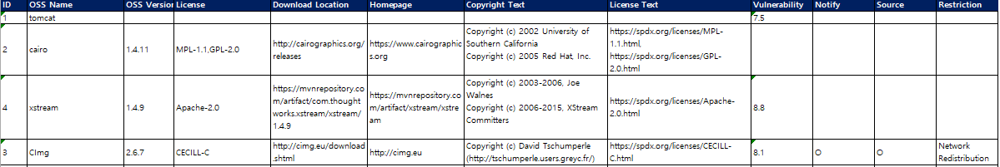
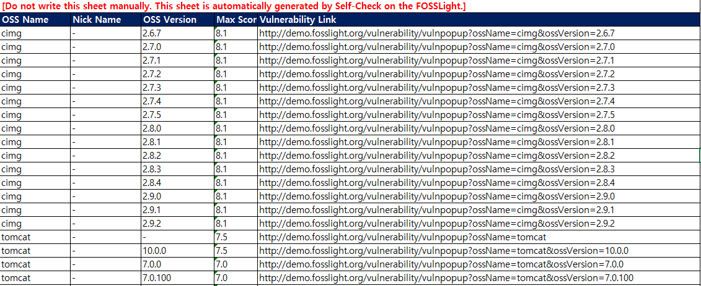

# Self-Check
```note
In Self-Check, you can easily check information such as licenses and vulnerabilities for the OSS(Open Source Software) to be reviewed without the review process.
```
<iframe width="560" height="315" src="https://www.youtube.com/embed/ihldFWFIbrM" title="YouTube video player" frameborder="0" allow="accelerometer; autoplay; clipboard-write; encrypted-media; gyroscope; picture-in-picture" allowfullscreen></iframe>

## Information that can be checked through Self-Check

You can check the information below by creating a Self-Check Project and entering the OSS to be reviewed.
- OSS detailed information: Registered Version, License by Version, Copyright, Homepage, Download Location, etc.
- License details: Type of license, obligations, restrictions, full license, etc.
- User Guide: Precautions when using the relevant OSS, etc.
- Vulnerability: Security vulnerability information provided by NVD (National Vulnerability Database)

## Verification procedure through Self-Check
Self-Check can be done through the following procedure.

### 1. Self-Check Project creation
1. Click the Add button at the top right of the Self-Check List.
2. Enter the relevant information and click Save.
3. You can check the newly created Self-Check Project in the Self-Check List, and double-click the list to check the details.

### 2. OSS information input
1. Enter OSS information on OSS Table
    - Click the + button to add a row, enter the OSS you want to check, and save.
2. Load OSS information from FOSSLight Report file
    1. Upload the FOSSLight Report containing the OSS list in the Upload Analysis Result column.
        - Uploadable FOSSLight Report form can be downloaded by clicking the Export button.
    2. Select the sheet to load and click OK.  
    
    3. Click the Save button.
 
### 3. Check OSS and License information

#### Warning Messages
- Unconfirmed open source: Displayed when the same OSS Name is not registered in the OSC System.
- Unconfirmed version: Displayed when there is the same OSS Name in the OSC System, but the same version is not registered.
- This field is required: Displayed when license information is not entered. (Not required for Self-Check.)
- Non-included license: Displayed when the same OSS Name and OSS Version are registered in the OSC system, but different from the existing registered license.

#### OSS and License information
If you click the icon in the column below, detailed information of registered OSS, detailed information about the license, and guide for the corresponding license are provided.
However, even for registered OSS, User Guide may not be provided.
- OSS Detail: Detailed information such as multiple versions of registered OSS, each license, and copyright are provided in a pop-up window.
- License Detail: Detailed information of the license used by the relevant OSS and license text are provided in a pop-up window.
- User Guide: Links to information that can be referenced when using the license are provided.

#### Obligations/restrictions according to the use of OSS
❕ Details can be checked in the License List.
- Obligation > Notify icon: indicates that you are obligated to notify copyright or license (or both).
- Obligation > Source icon: It means you are obligated to disclose the source code.
- Restriction icon: It means that there are restrictions on using the OSS.  
(E.g., restrictions on modification, restrictions on commercial use, etc.)

### 4. Vulnerability information check
```note
- Check in the Vulnerability column: When the OSS is searched in the CVE DB provided by NIST, the Vulnerability icon is displayed in color according to the CVSS Score.
- Confirmation with an export file (.xlsx): An Excel file containing a list of all described OSS and vulnerability information is downloaded.
- Detailed information related to Vulnerability can be found in [Vulnerability](7_vulnerability.md).
```
1. Check in OSC System UI

When you click the Vulnerability icon, the vulnerability information of the corresponding OSS Name and OSS Version is provided in a pop-up window.

2. Confirm with export file
    - Self-Check Sheet
    
    The OSS list entered by the user is described in accordance with the FOSSLight Report form.  
    The information in this tab can be used later in Identification of [Project](4_project.md).
    - Vulnerability Sheet
    
    The entered version and higher version information of the OSS where vulnerability information was found are described.  
    At this time, if you click the Vulnerability Link, you can check the CVE-ID of the corresponding OSS Name and OSS Version. 
