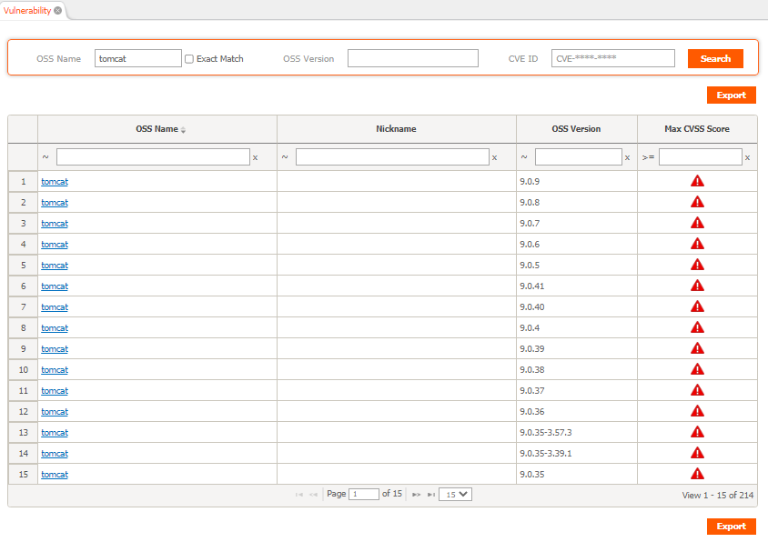
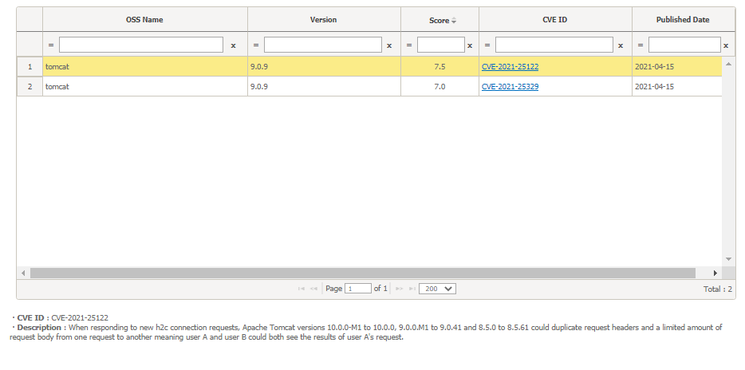
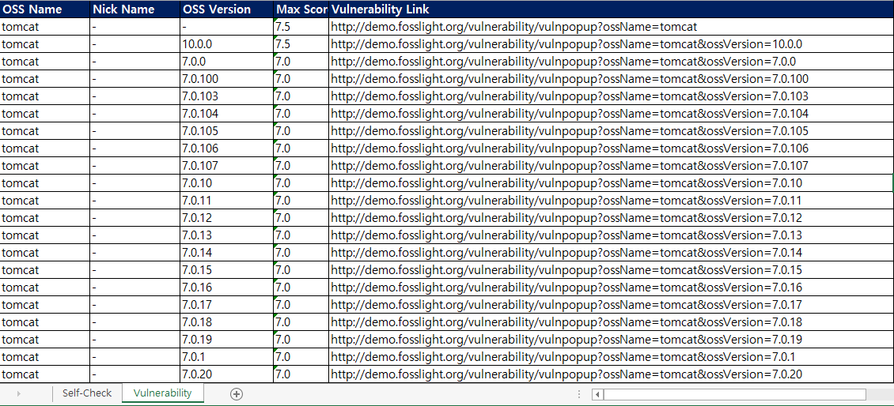

# Vulnerability
```note
You can check the vulnerabilities in Open Source and related information (CVE ID, CVSS Score).
```

## Vulnerability List

You can check and search information on the highest vulnerability by version of Open Source provided in NVD Data Feeds of NVD (NATIONAL VULNERABILITY DATABASE).
1. You can search by setting the search conditions (OSS Name, OSS Version, CVE ID).
    - OSS Name and OSS Version are irrelevant to the OSS registered in the OSS List, and mean NVD Data Feeds Product Name and Version.
    - When searching after checking exact match, only results that match the search term in the OSS Name field are searched.
    - In the case of CVE ID, only exact match results are searched.
2. Search Results
    - When clicking the OSS Name link : All CVE results searched for each version of the OSS name and nickname of the row are displayed in a pop-up.
        - Exact match search result for OSS Name, nickname, and version.
        - However, if version : -, all versions are retrieved.
    - When clicking the Nickname link : All CVE results of the corresponding version searched only by nickname are displayed in a popup.
        - Search results for exact matches for nickname and version.
        - However, if version : -, all versions are retrieved.
    - Max CVSS Score : The highest Critical Level for each version of OSS is displayed.
        - Critical : CVSS Score 9.0 ~ 10.0
        - High : CVSS Score 7.0 ~ 8.9
        - Medium : CVSS Score 4.0 ~ 6.9
        - Low : CVSS Score 0.1 ~ 3.9

## Vulnerability details
### Detailed information popup

- Click the Vulnerability Icon on the [Project](4_project.md)> Identification or [Self-Check](6_self-check.md) screen.
- After searching in Vulnerability List, click the link of OSS Name or Nickname.

### Vulnerability information export
Click the Export button in [Self-Check](6_self-check.md).

- OSS Name : OSS Name written on the OSS Table
- Nick Name : When Vulnerability is searched with the nickname of the OSS written in the OSS table, the matched nickname is displayed. (If no nickname is matched, it is marked as -)
- OSS Version : Vulnerability searched version
    - If the OSS version is blank, information about all versions that exist in Vulnerability will be displayed.
    - If the OSS Version is set, the lower version of the corresponding version is not included in the CSV. (All upper versions are included)
- Max Score : Vulnerability Max Score for the relevant OSS, Version
- Vulnerability Link : A pop-up link to check the Vulnerability list inquired by the corresponding OSS Name and OSS Version

## Collect & notify Vulnerability
### Vulnerability information collection
- Vulnerability information is downloaded daily from [NVD Data Feed](https://nvd.nist.gov/vuln/data-feeds) and stored in FOSSLight.
- FOSSLight's Vulnerability Score is basically based on the CVSS v3 Base Score, and if there is no v3 Score, it is displayed instead of the CVSS v2 Base Score.

### Vulnerability information notification
When a Vulnerability Score of 9.0 or higher is registered for the first time, or the Vulnerability Score is changed from 9.0 or higher to less than 9.0, a notification email will be sent.
- If the OSS that satisfies the above conditions is included in the BOM in the project whose identification is confirmed, the change of the Vulnerability Score will be sent to the creator, watcher, and reviewer of the project.