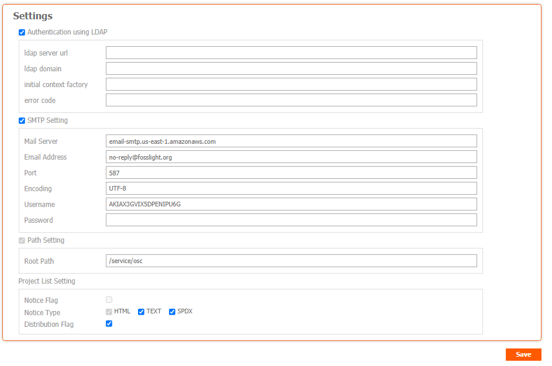

# Configuration
```note
 
```



## Authentication using LDAP

- ldap server url
- ldap domain
- initial context factory
- error code

## SMTP Setting

- Mail Server
- Email Address
- Port
- Encoding
- Username
- Password

## Path Setting
- Root Path

## Project List Setting
- Notice Flag
- Notice Type
- Distribution Flag
