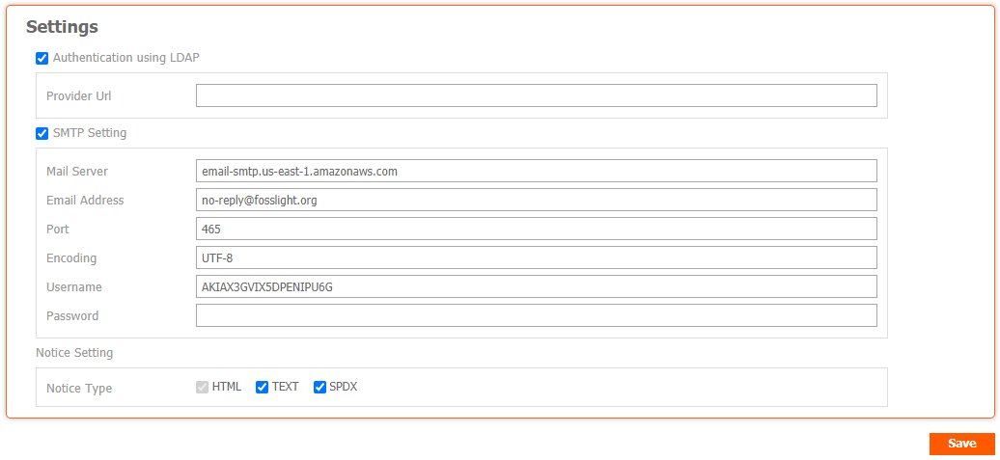

# Configuration
```note
(Admin Only) Change the setting values ​​for FOSSLight.
```


## Authentication using LDAP
FOSSLight uses JNDI to support user password authentication using LDAP in an environment where LDAP such as Active Directory can be used.
- Provider Url: Set the LDAP server information in the format ldap://<AD_SERVER_IP>:<LDAP_PORT>. (javax.naming.Context.PROVIDER_URL)

## SMTP Setting

- Mail Server: SMTP Host (e.g. smtp.gmail.com)
- Email Address: Sender email address (e.g. no-reply@fosslight.org)
- Port: SMTP Port number (e.g. 25 or 587)
- Encoding: Default UTF-8 (Change only if necessary)
- Username: SMTP username (usually the same as the sender's email address)
- Password: SMTP user password (Password is encrypted and stored, if blank, existing password is not changed.)

## Workspace Path Setting
- Root Path: Top workspace path of upload/download file storage

## Notice Setting
- Notice Type: Set the type of OSS notice that can be issued.
