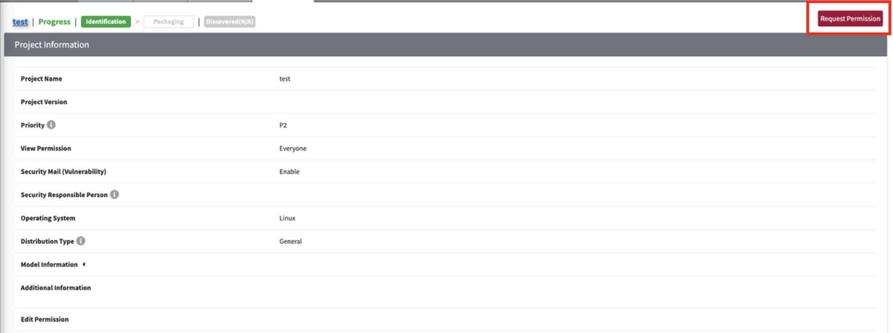
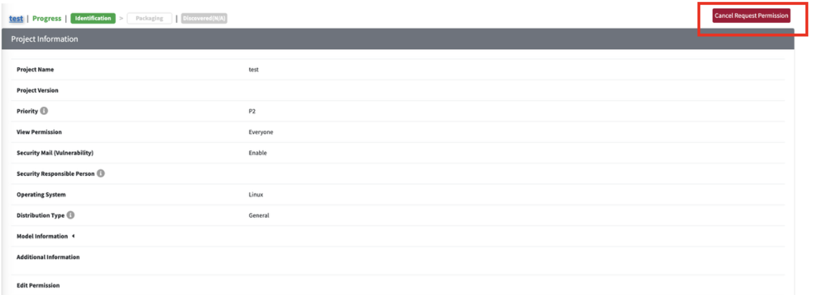
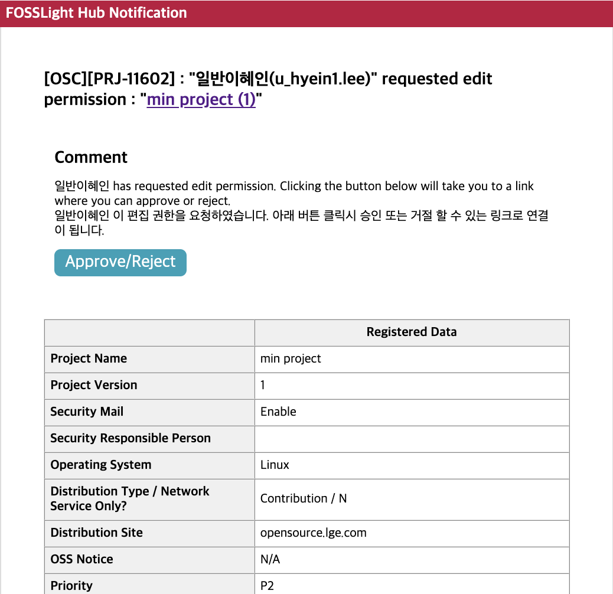
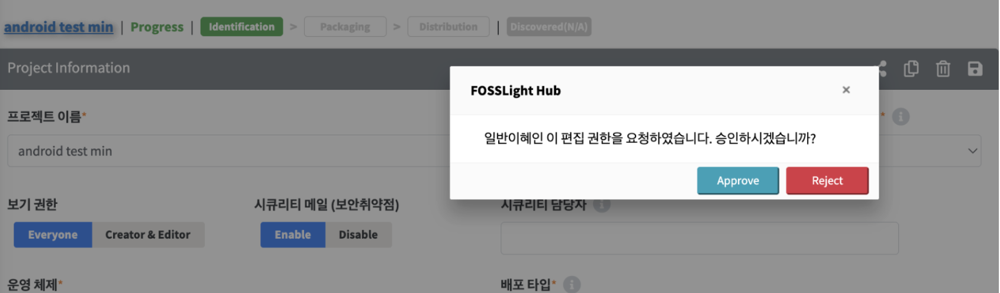

# Edit Permission Request

## User Requesting Permission
{: .left-bar-title }
1. Click the "Request Permission" button at the top right of the Project Information or 3rd Party Information page for the Project or 3rd Party that requires permission.

2. If the permission request is no longer needed, you can cancel it before the Creator/Editor approves by clicking the "Cancel Request Permission" button.

## Creator/Editor of the Project or 3rd Party
{: .left-bar-title }
1. When a user requests permission, a permission request email is sent.

2. By clicking Approve or Reject in the email, or by entering the corresponding Project or 3rd Party Information page, a popup like the one below will appear.

3. Clicking Approve grants Edit permission, while clicking Reject denies the request.