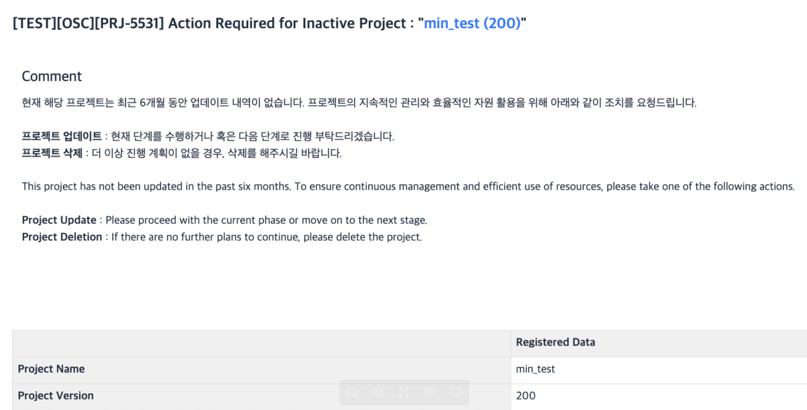
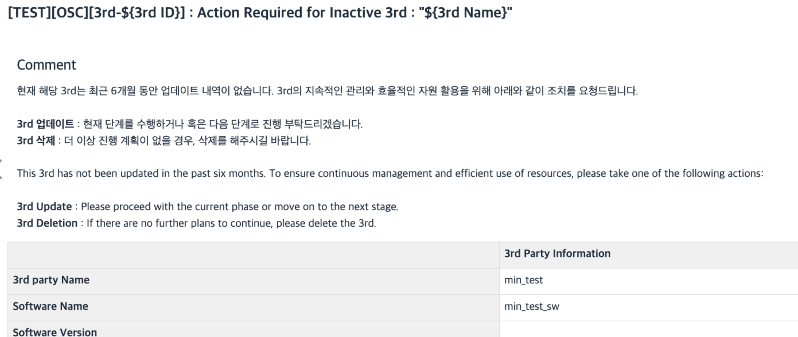
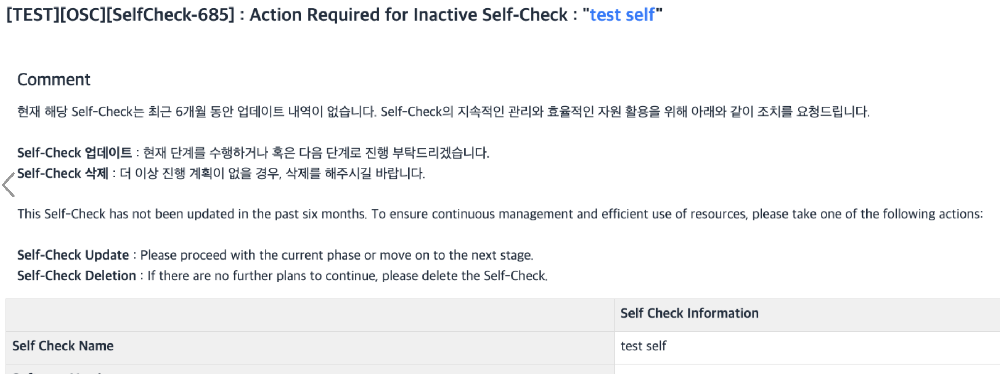

# Update Notification Email

## Target
{: .left-bar-title }
- Projects, 3rd Parties, and Self-Checks that have not been updated in the past six months.
- Only Projects and 3rd Parties with a Progress status are included.

## Sending Schedule
{: .left-bar-title }
- The email is sent on the 1st day of every month.

## Mail Contents
{: .left-bar-title }
- Project

- 3rd Party

- Self-Check

