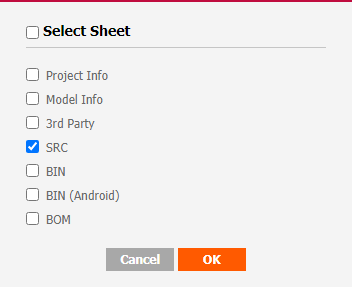
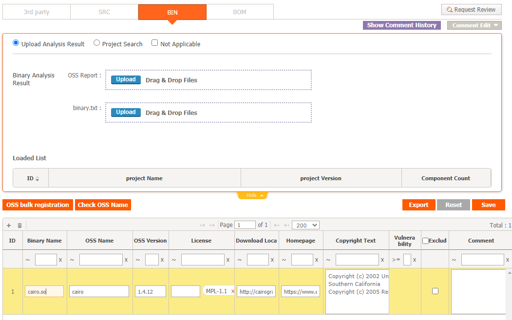
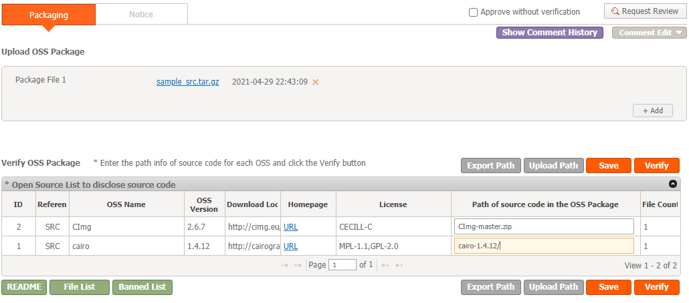
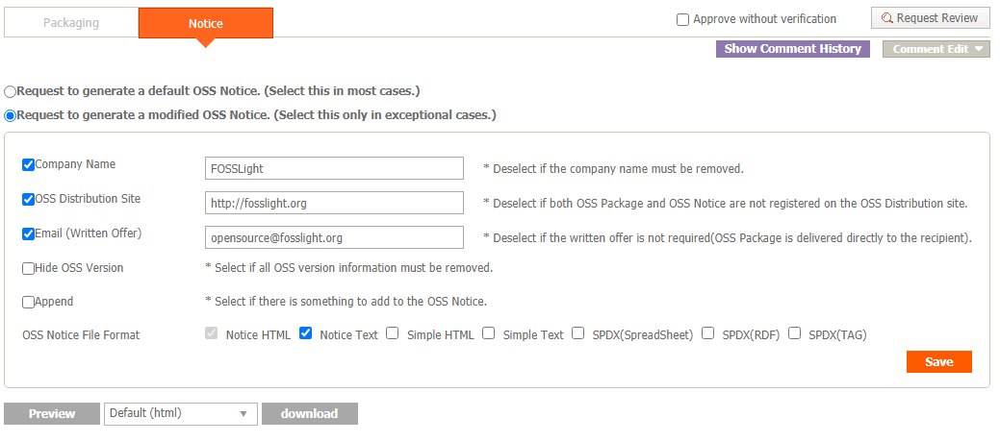
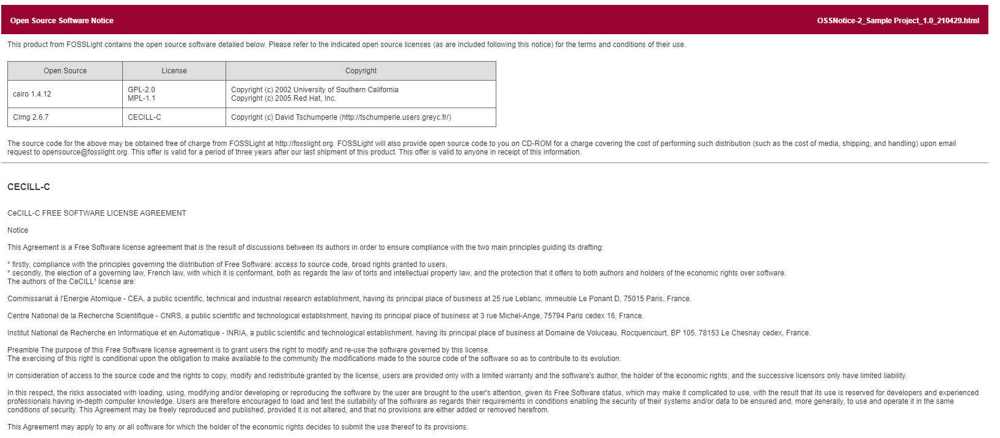

# Create a Project
```note
Create a project and perform the OSC (Open Source Compliance) process.
1. Project creation
2. Identification
3. Packaging 
4. Download OSS Notice
```

## 1. Project creation
1-1. Click the Add button in the Project List.  
1-2. Enter the project information in the New_Project tab.  
1-3. Check that the project has been created in the Project List.

## 2. Identification
Click the button in the Identification Column of the project created in the Project List.

### 2-1. Go to the 3rd Party Tab.
- Check "Not Applicable" and click Save.

### 2-2. Go to SRC Tab.
- Download Sample [FOSSLight Report](result_files/FOSSLight-Report_SampleProject.xlsx) with OSS List written.
- Click the Upload button to upload the FOSSLight Report file. At this time, select SRC Sheet as the sheet to be loaded.
    
- Confirm that the SRC Sheet of the FOSSLight Report is loaded and click Save.

### 2-3. Go to BIN Tab.

- Click the + button at the top left of the OSS Table.
- Write OSS information in the added row.
- Click the Save button.

### 2-4. Go to the BOM Tab.
- Click the "Merge And Save" button.
- Click the "Request Review" button to request a review.

### 2-5. (Admin Only) Review
- Log in as ID : admin, PSWD : admin.
- Project List > Status : Move to the BOM of the project.
- Review [Waring Message](../started/2_try/4_project.html#warning).
- Click Confirm at the top right.

## 3. Packaging
### 3-1. Packaging Tab
- Download [Sample Source code](result_files/sample_src.tar.gz).
    ```
    $ ls sample_src
    CImg-master.zip cairo-1.4.12/
    ```
- Click the Upload button to upload the packaging file.
- Fill in "Path of source code in the OSS Package" as shown below and click Save.

- If you click Verify, you can see that the README, File List, and Banned List buttons are activated.

### 3-2. Notice Tab

- Click "Request to generate a modified OSS Notice." to customize the OSS Notice.
- OSS Notice File Format is additionally checked. (The OSS Notice can be issued in several formats.)
- Click the Preview button to check the OSS Notice in advance, and then click the OK button at the bottom right.
- If you click the Download button, you can download the OSS Notice file in advance.
- Click Save.

### 3-3. Click the "Request Review" button in the upper right corner to request a review.
### 3-4. (Admin Only) Review
- Log in as ID : admin, PSWD : admin.
- Click the "Review Start" button on the top right of the Packaging tab.
- Click "Confirm" in the upper right corner.

## 4. Download OSS Notice
Click the icon in the Download column of the Project List.
- Click the OSS Notice icon to download the issued OSS Notice.  
    At this time, if OSS Notice are issued in various formats, it is downloaded as a compressed file.
- ex. Part of OSS Notice (html format) :

