# 3rd Party/DEP/SRC/BIN Tab

Upload the analysis report or load a confirmed third-party or project.

  

## Process
{: .left-bar-title }
- Upload the result of [FOSSLight Scanner](https://fosslight.org/fosslight-guide-en/scanner/) analysis
- [**Check Warning message**](https://fosslight.org/hub-guide-en/tips/1_common/5_warning_message)

## Upload Anlaysis Report
{: .left-bar-title }
1. If there are already loaded items, click the + button in the upload area. (If you are uploading for the first time, screen 2 will be displayed.)
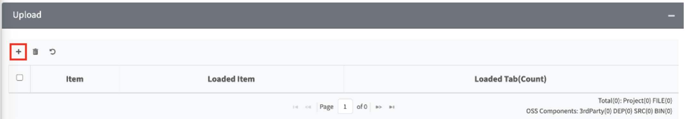
2. Select the report file to upload
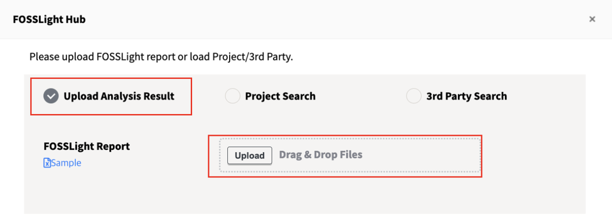
3. The list of sheets in the selected report file will appear on the left, and on the right, you can select the tab to which each sheet will be uploaded.
Each sheet can be assigned to only one tab, and by default, sheets whose names start with the tab name are automatically selected.
If there are sheets you do not want to load, simply uncheck the corresponding boxes on the left.
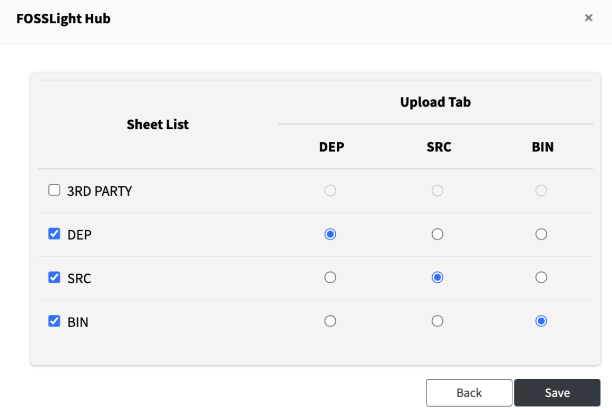
4. When you click Save, the data from the uploaded report file will be loaded into the OSS Table at the bottom and saved.

## Project/3rd Party Search
{: .left-bar-title }
Load a confirmed third-party or project.

1. If there are already loaded items, click the + button in the upload area. (If you are loading for the first time, screen 2 will be displayed.)

2. Search for the project or 3rd party you want to load.
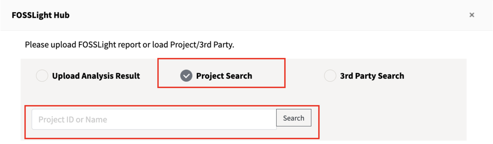
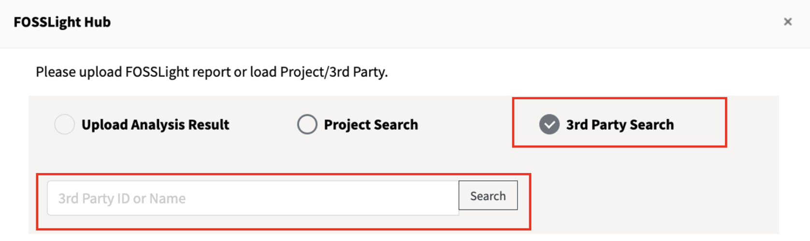
3. The selected tab can only load data into the tab with the same name.(For example, if you select SRC, the data will be loaded only into the SRC tab and not into other tabs.)
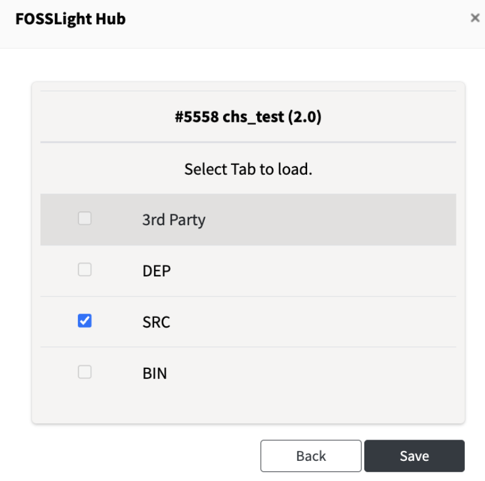
4. When you click Save, the data of the selected project or 3rd party will be loaded into the OSS Table at the bottom and saved.

## Display of Uploaded / Loaded Data
{: .left-bar-title }
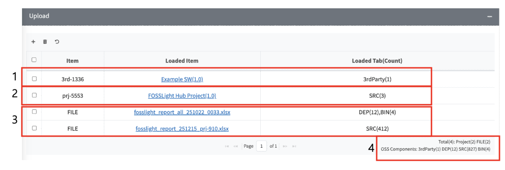
1. Loaded 3rd party
2. Loaded project
3. Uploaded Report file
4. Total : Displays the total number of uploaded report files and loaded projects/3rd parties.
OSS Components : Displays the number of OSS components loaded in each tab.

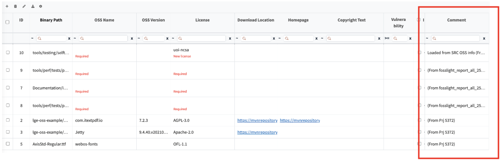
- The source of each item is displayed in the Comment column of the OSS Table.

## Delete
{: .left-bar-title }
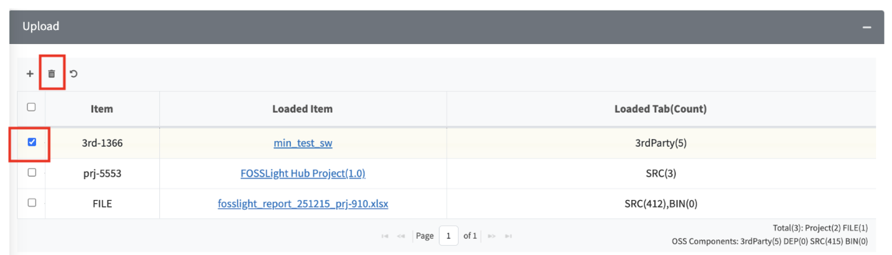

1. Select a single row you want to delete and click the trash can icon. A confirmation pop-up will appear.
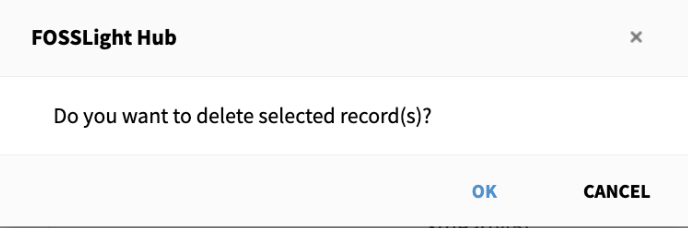
2. When you click OK, the selected row and all OSS Table data loaded from that row will be deleted and saved.
3. If no row or more than one row is selected, a warning pop-up will appear.
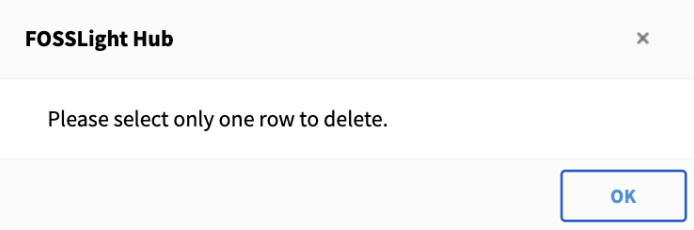

## Reset
{: .left-bar-title }
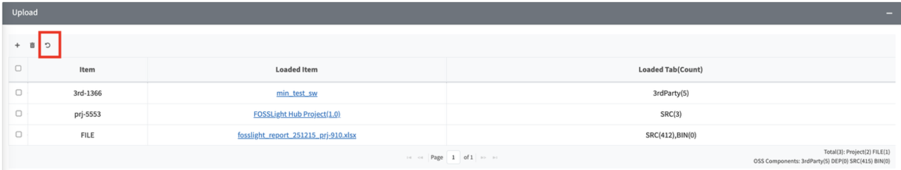
1. Click the Reset button.
2. A pop-up will appear indicating that all uploaded and loaded rows will be selected and all data will be deleted.
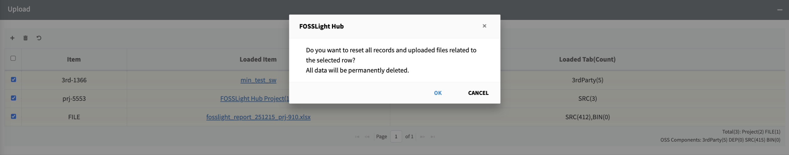
3. When you click OK, all selected rows will be deleted, and all data in the OSS Table will be deleted and saved.
4. If you want to reset each tab individually, click the reset button located within the corresponding tab
