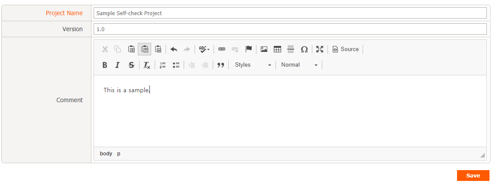
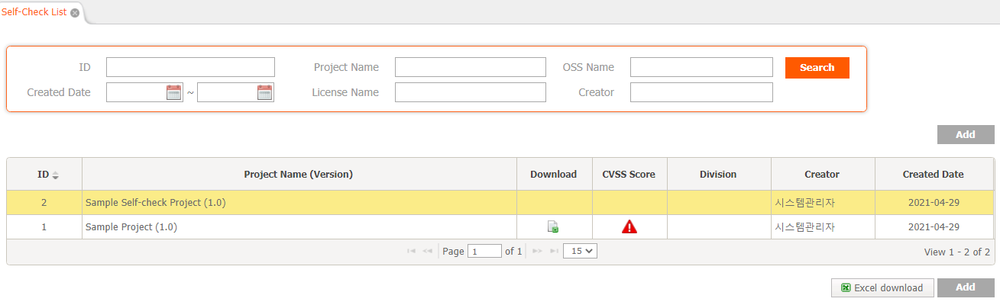
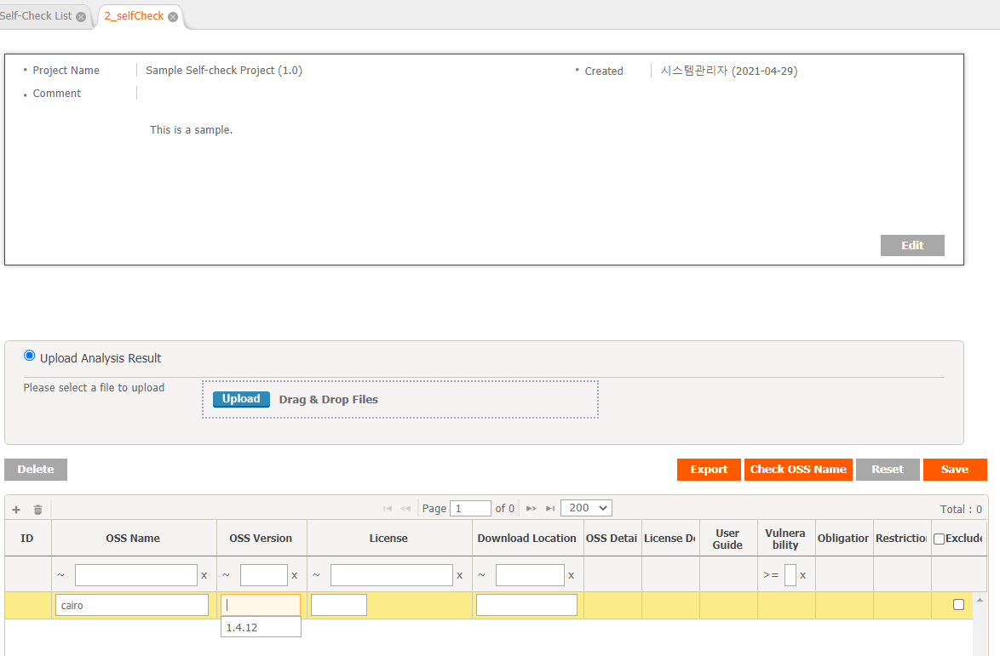
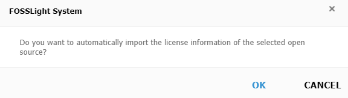
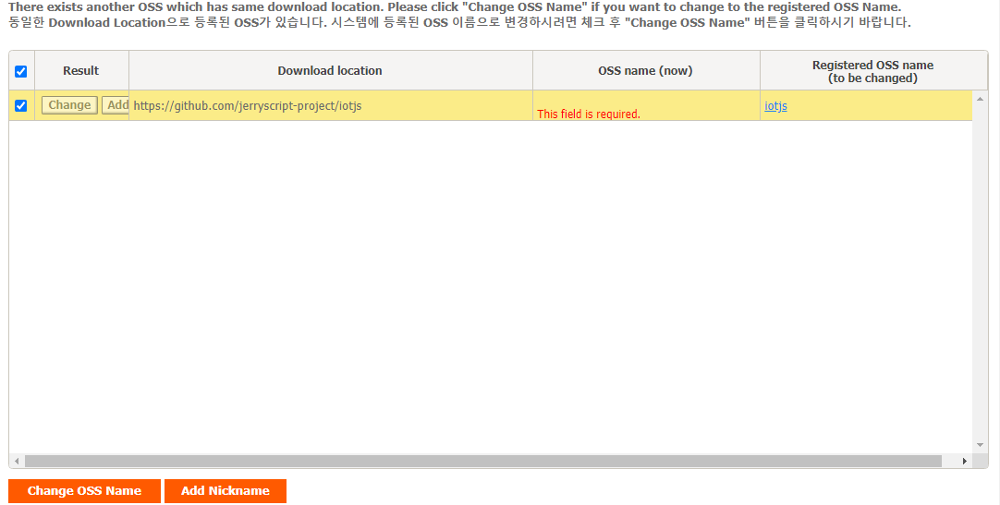
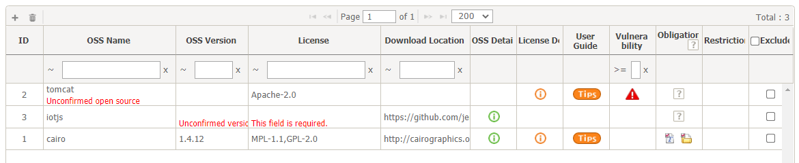
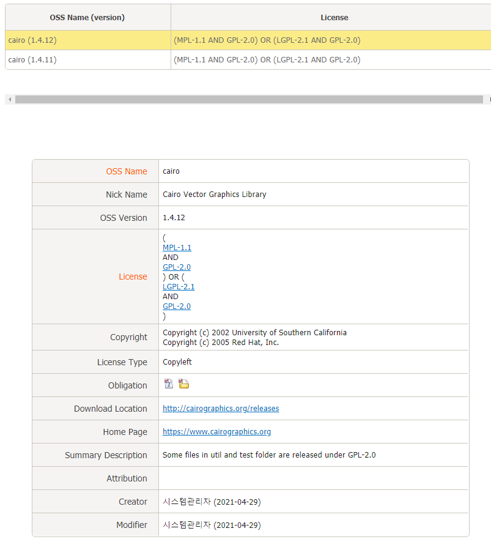
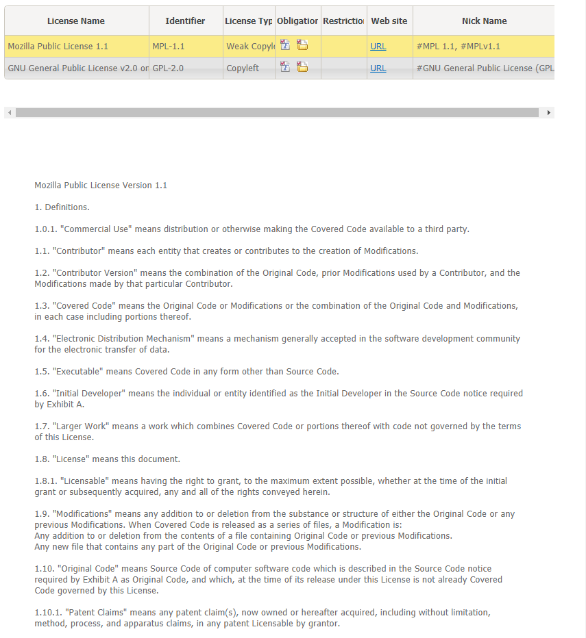
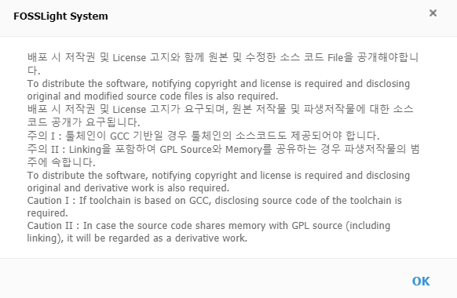
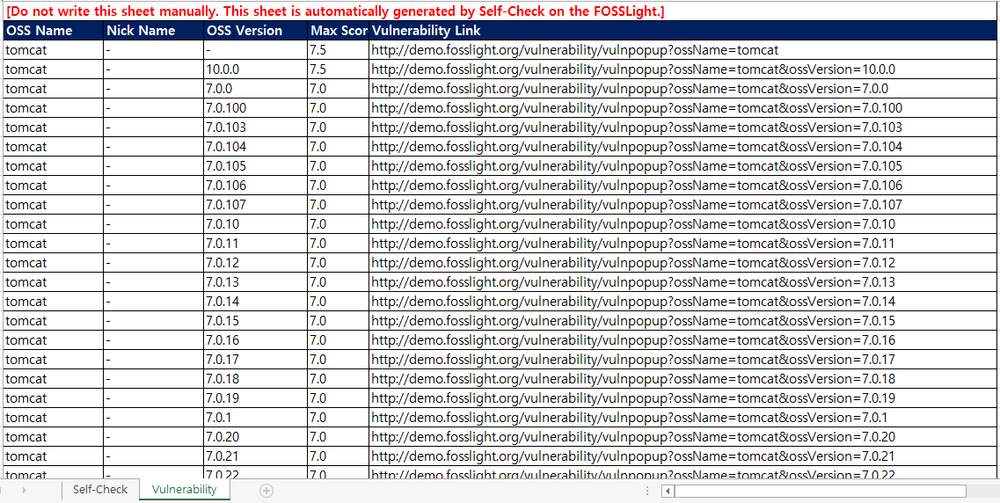

# Create a Self-Check
```note
Create a Self-Check and check OSS (Open Source Software) information.
1. Create a Self-Check
2. Fill in OSS list
3. Check OSS information
4. Download the result
```

## 1. Create a Self-Check
1. Click the Add button in the Self-Check List.
2. Enter the Self-Check information.
    
3. Check the created Self-Check.
    

## 2. Fill in OSS list
1. Double-click the created Self-Check.
2. Fill in the OSS information in the Self-Check Details tab.
    
    1. Click the + button at the top left of the OSS Table.
    2. Enter information (OSS Name, OSS Version, License) in the added row.
        - If you enter the OSS Name and OSS Version, the following pop-up appears if the information is stored in FOSSLight. At this time, if you click OK, the information stored in FOSSLight (License, Download location) is automatically loaded.
        
    3. You can add a row by clicking the + button at the top left of the OSS Table.
    4. Click Save.
3. Click the Check OSS Name button.

Based on the created Download location, it is automatically changed to the OSS Name stored in FOSSLight.
- A list of OSS to be automatically converted is displayed in the pop-up.
    - Change OSS Name button: The OSS Name of the OSS Table is changed for the checked row.
    - Add Nickname button: OSS Name written in OSS Table as Nickname is added to OSS stored in FOSSLight for the checked row.

## 3. Check OSS information

- Click the OSS Detail icon: Check the pop-up window for detailed information such as License and Copyright for each version of the OSS.
    
- Click the License Detail icon: License information and License Text are provided in a pop-up window.
    
- Click the User Guide icon: Check the User Guide for the license in a pop-up window.
    

## 4. Download the result

- Self-Check Sheet: Prints the information written on the OSS Table. You can upload this sheet to the Identification tab of [Project](../started/2_try/4_project.md).
- Vulnerability Sheet: Prints vulnerability information for each OSS.
    - OSS Name: OSS Name written in the OSS Table
    - Nick Name: When Vulnerability is searched with the nickname of the OSS written in the OSS table, the matched nickname is displayed. (If no nickname is matched, it is marked as -)
    - OSS Version: Vulnerability searched version
    - Max Score: Vulnerability Max Score for the relevant OSS, Version
    - Vulnerability Link: Displays a pop-up link that allows you to check the list of Vulnerability searched by the OSS Name and OSS Version.
