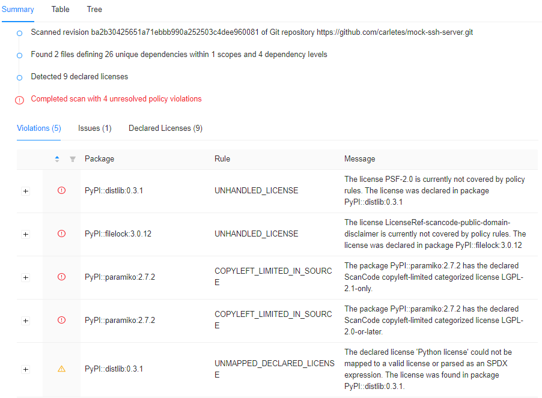
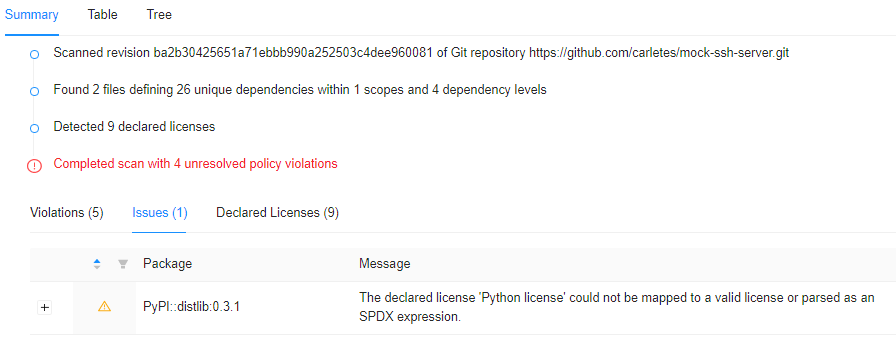
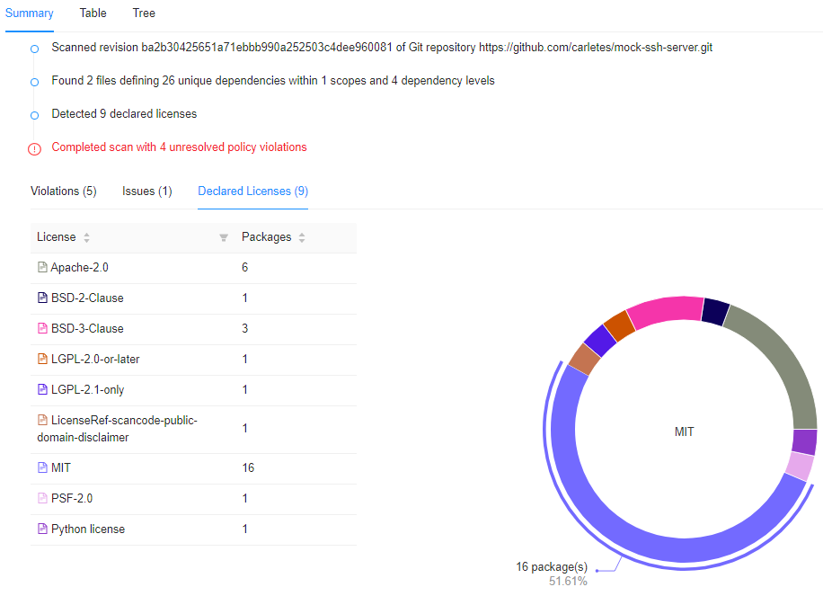
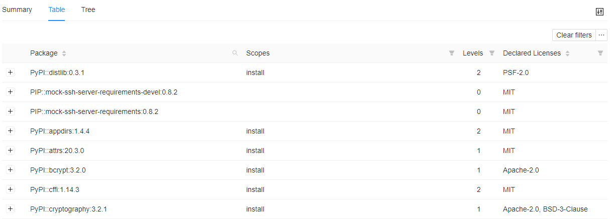
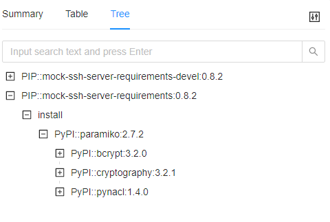

# 실행 결과
OSS Review Toolkit를 [실행 방법 가이드](https://lge-oss.github.io/oss-review-toolkit-guide/use/1_analyze.html)에 따라 수행한 결과 파일을 살펴봅니다.   
단, 보안 취약점을 조회하는 Advisor의 경우 [Nexus IQ Server](https://help.sonatype.com/iqserver)의 License가 필요한 기능으로 무료로 사용 불가합니다. 따라서 실행 결과에 포함되지 않습니다.

```note
실행 예제 Project : https://github.com/carletes/mock-ssh-server
- pypi 배포 링크 : https://pypi.org/project/mock-ssh-server
- Version: 0.8.2
- License : MIT
- Python 3.6 환경에서 Dependency로 Pypi에 배포되는 [paramiko](https://pypi.org/project/paramiko/)를 설치합니다.
```

## 0. 실행 환경
1. git repository에서 Source code를 다운로드 받습니다.  
```
$git clone https://github.com/carletes/mock-ssh-server -b 0.8.2
```
2. [anaconda](https://www.anaconda.com/products/individual)를 이용하여 Python 3.6으로 환경 세팅합니다.
3. Source Code를 기반으로 ORT를 실행합니다.

## 1. Analyzer 실행 결과
```note
Project의 Dependency정보와 metadata를 출력합니다.
```
```
$ tree -L 1 analyzer/
analyzer/
└── analyzer-result.yml
```
- [analyzer-result.yml](https://github.com/LGE-OSS/oss-review-toolkit-guide/blob/master/use/result_files/analyzer/analyzer-result.yml)

### 추출 정보

|Key|Description|
|--|--|
| repository > vcs |Version Control System 기반 추출된 정보를 표시합니다.| 
| repository > vcs_processed | Version Control System URL 또는 Fallback URL에서 추출된 정보를 표시합니다.|
| analyzer > result |depedency 관련 추출된 정보를 표시합니다. | 
| analyzer > result > projects |상위 project의 정보가 출력됩니다.|
| analyzer > result > packages |Project별 depdency에 따른 package 정보가 출력됩니다.|


## 2. Scanner 실행 결과
```note
Analyzer 출력 결과에 따라 Dependency가 있는 Package를 다운로드 받은 후,Default Scanner인 ScanCode로 Source Code에 작성된 License text를 분석한 결과와 Copyright text가 출력됩니다.
```
```
$ tree -L 1 scan/
scan/
├── downloads
├── native-scan-results
└── scan-result.yml
```
- [downloads](https://github.com/LGE-OSS/oss-review-toolkit-guide/blob/master/use/result_files/scan/downloads)
- [native-scan-results](https://github.com/LGE-OSS/oss-review-toolkit-guide/blob/master/use/result_files/scan/native-scan-results)
- [scan-result.yml](https://github.com/LGE-OSS/oss-review-toolkit-guide/blob/master/use/result_files/scan/scan-result.yml)

### Output 정보

|File or Directory|Description|
|--|--|
|downloads|Analyzer 결과에 따라 Dependency가 있는 Package를 다운로드 받은 폴더|
|native-scan-results|각 Package별 Scanner 분석 결과 파일이 위치한 폴더|
|scan-result.yml| Analyzer 결과에 Scanner 분석 결과가 추가된 파일. Scanner 분석 결과에는 검출된 License, Copyright text가 포함됩니다.|

## 3. Evaluator 실행 결과
```note
[License별 Category를 정의한 파일](https://github.com/oss-review-toolkit/ort/blob/master/examples/license-classifications.yml "license-classifications.yml")과 [분석할 Rule을 정의한 파일](https://github.com/oss-review-toolkit/ort/blob/master/examples/rules.kts "rules.kts")을 기반으로 이슈가 있는 사항을 검사하여 출력합니다.
```
```
$ tree -L 1 evaluate/
evaluate/
└── evaluation-result.yml
```
- [evaluation-result.yml](https://github.com/LGE-OSS/oss-review-toolkit-guide/blob/master/use/result_files/evaluate/evaluation-result.yml)

### Output 정보

|File|Description|
|--|--|
|scan-result.yml| Analyzer, Scanner 분석 결과에 Evaluator 출력 결과가 추가된 파일. Evaluator 출력 결과에는 rules.kts 파일에 정의된 Rule에 따라 분석 결과가 출력됩니다.|


## 4. Reporter 실행 결과
```note
분석한 결과를 여러 가지 형태로 변환합니다.
```
```
$ tree -L 1 report/
report/
   ├── NOTICE_default
   ├── scan-report-web-app.html
   └── scan-report.html
```
- [NOTICE_default](https://github.com/LGE-OSS/oss-review-toolkit-guide/blob/master/use/result_files/report/evaluate/NOTICE_default)
- [scan-report-web-app.html](https://github.com/LGE-OSS/oss-review-toolkit-guide/blob/master/use/result_files/report/evaluate/scan-report-web-app.html)
- [scan-report.html](https://github.com/LGE-OSS/oss-review-toolkit-guide/blob/master/use/result_files/report/evaluate/scan-report.html)

### Output 정보

|File|Description|
|--|--|
|NOTICE_default|프로젝트 자체에서 찾은 모든 License의 Summary를 출력하고 모든 Dependency에 대한 License를 별도로 나열합니다.|
|scan-report-web-app.html| web app 형태의 report 파일 |
|scan-report.html| html 형태의 report 파일|

### Example
- scan-report-web-app.html

1.Summary  
- Violations : Evaluator 분석 결과, 정의된 Rule별 검출된 Package 목록  
   
- Issues : 이슈가 검출된 Package 정보 
  
- Declared Licenses : Declared License별 검출된 Package의 수
  

2.Table  
- Dependency 정보를 List 형태로 출력합니다.   
  

3.Tree  
- Project별 depedency 정보가 tree 형태로 출력합니다.  

